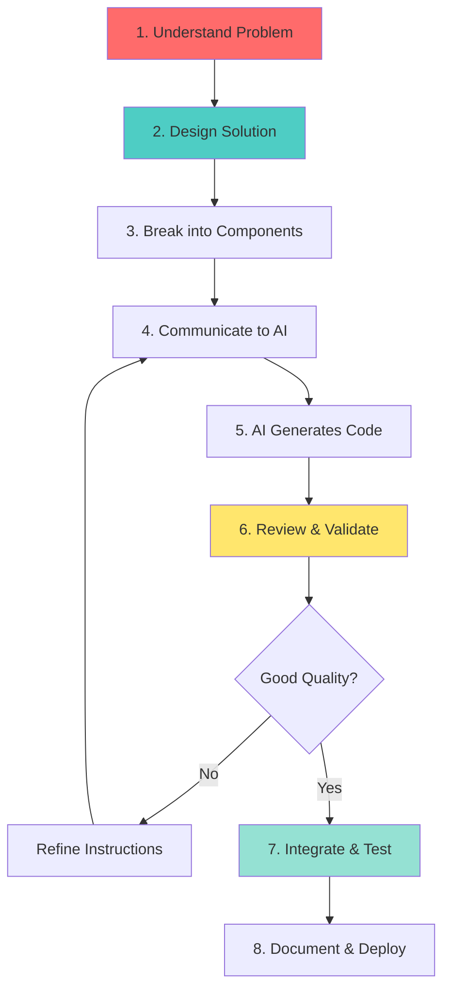
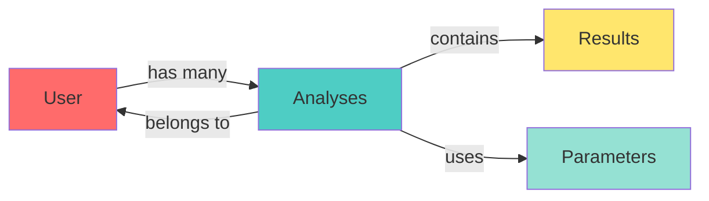
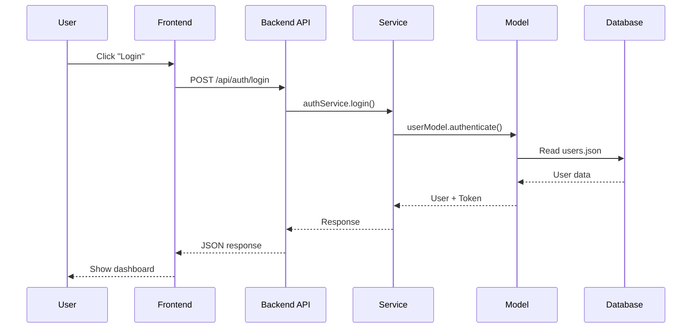

# 🎓 Software Design & Architecture for the AI Era

## Engineering Fundamentals for Human-AI Collaboration

**Target Audience:** Junior Software Engineers, New Graduates  
**Prerequisites:** Basic programming knowledge, OOP concepts  
**Learning Time:** 5-7 days  
**Difficulty:** Intermediate  
**Focus:** Design thinking, not just coding

---

## 📋 Table of Contents

### Part 1: Foundation
1. [Why Design Matters in the AI Era](#why-design-matters-in-the-ai-era)
2. [The Human-AI Collaboration Model](#the-human-ai-collaboration-model)
3. [Thinking Like an Architect](#thinking-like-an-architect)

### Part 2: Core Design Principles
4. [SOLID Principles](#solid-principles)
5. [DRY, KISS, YAGNI](#dry-kiss-yagni)
6. [Separation of Concerns](#separation-of-concerns)
7. [Dependency Injection](#dependency-injection)

### Part 3: Essential Design Patterns
8. [Creational Patterns](#creational-patterns)
9. [Structural Patterns](#structural-patterns)
10. [Behavioral Patterns](#behavioral-patterns)

### Part 4: Architecture Patterns
11. [Layered Architecture](#layered-architecture)
12. [MVC and Variants](#mvc-and-variants)
13. [Microservices Concepts](#microservices-concepts)
14. [API Design Principles](#api-design-principles)

### Part 5: AI-Era Best Practices
15. [Communicating with AI Assistants](#communicating-with-ai-assistants)
16. [Code Review in AI Era](#code-review-in-ai-era)
17. [Refactoring AI-Generated Code](#refactoring-ai-generated-code)
18. [Building Maintainable Systems](#building-maintainable-systems)

---

## Why Design Matters in the AI Era

### The Paradigm Shift

**Before AI:**
```
Engineer → Writes Code → Tests → Deploys
```

**With AI:**
```
Engineer → Designs Solution → AI Generates Code → Engineer Reviews/Refines → Tests → Deploys
```

### The New Role of Engineers

AI can generate code, but **YOU** must:

1. ✅ **Define the problem** clearly
2. ✅ **Design the architecture** properly
3. ✅ **Choose the right patterns** for the situation
4. ✅ **Review and validate** AI-generated code
5. ✅ **Ensure maintainability** and scalability
6. ✅ **Make architectural decisions** that AI cannot

### What AI Does Well

- ✅ Generate boilerplate code
- ✅ Implement known patterns
- ✅ Write unit tests
- ✅ Refactor existing code
- ✅ Explain code functionality
- ✅ Suggest improvements

### What AI Cannot Do (Yet)

- ❌ Understand business context deeply
- ❌ Make strategic architectural decisions
- ❌ Balance trade-offs (performance vs maintainability)
- ❌ Anticipate future requirements
- ❌ Understand team dynamics and constraints
- ❌ Take responsibility for failures

### The Critical Insight

> **"AI is a powerful tool, but YOU are the architect. Your design thinking determines whether the system succeeds or fails."**


---

## The Human-AI Collaboration Model

### The Effective Workflow



### Your Responsibilities as an Engineer

#### 1. Problem Analysis (Human)
```
❓ What problem are we solving?
❓ Who are the users?
❓ What are the constraints?
❓ What are the non-functional requirements?
```

#### 2. Solution Design (Human)
```
🎯 Choose architecture pattern
🎯 Define components and their relationships
🎯 Identify design patterns to use
🎯 Plan data flow
```

#### 3. Implementation (Human + AI)
```
👤 Human: Provide clear specifications
🤖 AI: Generate code based on specs
👤 Human: Review and refine
```

#### 4. Quality Assurance (Human)
```
✓ Does it meet requirements?
✓ Is it maintainable?
✓ Is it secure?
✓ Is it performant?
✓ Does it follow best practices?
```

### Example: Building a User Authentication System

**❌ Poor Approach (Just asking AI):**
```
"Create a login system"
```
*Result: AI generates basic code without considering security, scalability, or your specific needs*

**✅ Good Approach (Design-First):**

**Step 1: Design (Human)**
```
Requirements:
- JWT-based authentication
- Role-based access control (admin, user)
- Password hashing with bcrypt
- Token expiration (24 hours)
- Refresh token mechanism

Architecture:
- Separate authentication logic from routes
- Use decorator pattern for protected routes
- Store users in JSON file (for now, DB later)
- Service layer for business logic

Components:
1. UserModel - Data access
2. AuthService - Business logic
3. AuthRoutes - HTTP endpoints
4. Decorators - @token_required, @admin_required
```

**Step 2: Communicate to AI (Human)**
```
"Create a UserModel class in Python that:
- Stores users in JSON file
- Has methods: create_user, authenticate, get_user
- Uses bcrypt for password hashing
- Returns (data, error) tuple pattern
- Includes proper error handling"
```

**Step 3: Review AI Output (Human)**
```python
# AI generates code...
# You review:
✓ Is bcrypt used correctly?
✓ Are passwords never returned?
✓ Is error handling comprehensive?
✓ Is the file path handling secure?
✓ Are there any security vulnerabilities?
```

**Step 4: Refine (Human)**
```
"Add input validation for email format"
"Add check to prevent duplicate emails"
"Add last_login timestamp tracking"
```

---

## Thinking Like an Architect

### The Architect's Mindset

#### 1. Think in Layers

```
┌─────────────────────────────────┐
│     Presentation Layer          │  ← User Interface
│  (React Components, Pages)      │
└─────────────────────────────────┘
           ↓ ↑
┌─────────────────────────────────┐
│     Application Layer           │  ← Business Logic
│  (Services, Controllers)        │
└─────────────────────────────────┘
           ↓ ↑
┌─────────────────────────────────┐
│     Data Access Layer           │  ← Data Operations
│  (Models, Repositories)         │
└─────────────────────────────────┘
           ↓ ↑
┌─────────────────────────────────┐
│     Data Storage                │  ← Database/Files
│  (JSON, SQL, NoSQL)             │
└─────────────────────────────────┘
```

**Why Layers Matter:**
- Each layer has a single responsibility
- Changes in one layer don't affect others
- Easy to test each layer independently
- Easy to replace implementations

#### 2. Think in Components

**Bad Thinking:**
```
"I need to build a user management system"
→ One big file with everything
```

**Good Thinking:**
```
"I need to build a user management system"
→ Break down:
  - User data model
  - Authentication service
  - Authorization middleware
  - User routes/endpoints
  - User interface components
```

#### 3. Think About Relationships



#### 4. Think About Data Flow



### The Five Questions Every Architect Asks

Before writing ANY code, ask:

#### 1. **What is the purpose?**
```
Example: "Provide secure user authentication for the platform"
Not: "Make a login page"
```

#### 2. **Who will use it?**
```
Example: "Engineers and managers with varying technical skills"
Not: "Users"
```

#### 3. **How will it grow?**
```
Example: "Start with 50 users, may grow to 500 in 2 years"
Consider: Scalability, performance, maintainability
```

#### 4. **What can go wrong?**
```
Example: 
- User forgets password
- Token expires during session
- Concurrent login attempts
- Database unavailable
```

#### 5. **How will we test it?**
```
Example:
- Unit tests for authentication logic
- Integration tests for API endpoints
- Security tests for vulnerabilities
- Load tests for performance
```

### Real Example: VSMC Litho Platform

Let's analyze how the VSMC project demonstrates good architecture:

#### Problem Statement
```
Engineers need to analyze lithography data (Bossung curves)
to determine optimal process parameters for semiconductor manufacturing.
```

#### Architectural Decisions

**1. Separation of Frontend and Backend**
```
Why? 
- Different teams can work independently
- Frontend can be updated without backend changes
- Can scale frontend and backend separately
- Can reuse backend for mobile app later
```

**2. Service Layer Pattern**
```python
# backend/app/services/bossung_service.py
class BossungService:
    def analyze(self, filepath, target_cd, tolerance):
        # Business logic here
        pass
```
```
Why?
- Business logic separate from HTTP handling
- Can test without Flask
- Can reuse in CLI tools or batch jobs
- Easy to modify algorithm without touching routes
```

**3. Blueprint Pattern for Routes**
```python
# backend/app/routes/auth.py
auth_bp = Blueprint('auth', __name__)

# backend/app/routes/edforest.py
edforest_bp = Blueprint('edforest', __name__)
```
```
Why?
- Organize related endpoints together
- Easy to add new feature modules
- Clear separation of concerns
- Team members can work on different blueprints
```

**4. Component-Based Frontend**
```jsx
// frontend/src/components/BossungChart.jsx
// frontend/src/components/ProcessWindowChart.jsx
// frontend/src/pages/EDForest.jsx
```
```
Why?
- Reusable UI components
- Easy to maintain and test
- Clear component hierarchy
- Can update charts without touching pages
```

**5. Context for Global State**
```jsx
// frontend/src/context/AuthContext.jsx
// frontend/src/context/ThemeContext.jsx
```
```
Why?
- Avoid prop drilling
- Centralized state management
- Easy to access user info anywhere
- Clean component code
```

---

## SOLID Principles

### The Foundation of Good Design

SOLID is an acronym for five design principles that make software more maintainable and flexible.

### S - Single Responsibility Principle

**Definition:** A class should have only ONE reason to change.

**❌ Bad Example:**
```python
class User:
    def __init__(self, username, email, password):
        self.username = username
        self.email = email
        self.password = password
    
    def save_to_database(self):
        # Database logic
        pass
    
    def send_welcome_email(self):
        # Email logic
        pass
    
    def hash_password(self):
        # Hashing logic
        pass
    
    def generate_report(self):
        # Reporting logic
        pass
```

**Problem:** This class has FOUR reasons to change:
1. User data structure changes
2. Database changes
3. Email service changes
4. Reporting requirements change

**✅ Good Example:**
```python
# User data only
class User:
    def __init__(self, username, email, password_hash):
        self.username = username
        self.email = email
        self.password_hash = password_hash

# Database operations
class UserRepository:
    def save(self, user):
        # Database logic
        pass
    
    def find_by_username(self, username):
        # Database logic
        pass

# Email operations
class EmailService:
    def send_welcome_email(self, user):
        # Email logic
        pass

# Password operations
class PasswordService:
    def hash_password(self, password):
        # Hashing logic
        pass
    
    def verify_password(self, password, hash):
        # Verification logic
        pass

# Reporting operations
class UserReportService:
    def generate_report(self, user):
        # Reporting logic
        pass
```

**Benefits:**
- Each class has ONE clear purpose
- Easy to test each class independently
- Changes in one area don't affect others
- Easy to understand and maintain

### O - Open/Closed Principle

**Definition:** Software entities should be OPEN for extension but CLOSED for modification.

**❌ Bad Example:**
```python
class ReportGenerator:
    def generate(self, data, format):
        if format == 'pdf':
            # PDF generation logic
            pass
        elif format == 'excel':
            # Excel generation logic
            pass
        elif format == 'csv':
            # CSV generation logic
            pass
        # Adding new format requires modifying this class!
```

**✅ Good Example:**
```python
from abc import ABC, abstractmethod

# Base class (closed for modification)
class ReportGenerator(ABC):
    @abstractmethod
    def generate(self, data):
        pass

# Extensions (open for extension)
class PDFReportGenerator(ReportGenerator):
    def generate(self, data):
        # PDF generation logic
        pass

class ExcelReportGenerator(ReportGenerator):
    def generate(self, data):
        # Excel generation logic
        pass

class CSVReportGenerator(ReportGenerator):
    def generate(self, data):
        # CSV generation logic
        pass

# Usage
def create_report(data, generator: ReportGenerator):
    return generator.generate(data)

# Adding new format doesn't modify existing code
class JSONReportGenerator(ReportGenerator):
    def generate(self, data):
        # JSON generation logic
        pass
```

### L - Liskov Substitution Principle

**Definition:** Objects of a superclass should be replaceable with objects of a subclass without breaking the application.

**❌ Bad Example:**
```python
class Bird:
    def fly(self):
        return "Flying"

class Penguin(Bird):
    def fly(self):
        raise Exception("Penguins can't fly!")
        # Breaks LSP - can't substitute Penguin for Bird
```

**✅ Good Example:**
```python
class Bird:
    def move(self):
        pass

class FlyingBird(Bird):
    def move(self):
        return "Flying"

class Penguin(Bird):
    def move(self):
        return "Swimming"

# Now all birds can be used interchangeably
def make_bird_move(bird: Bird):
    print(bird.move())

make_bird_move(FlyingBird())  # Works
make_bird_move(Penguin())     # Works
```

### I - Interface Segregation Principle

**Definition:** Clients should not be forced to depend on interfaces they don't use.

**❌ Bad Example:**
```python
class Worker:
    def work(self):
        pass
    
    def eat(self):
        pass
    
    def sleep(self):
        pass

class Robot(Worker):
    def work(self):
        return "Working"
    
    def eat(self):
        raise Exception("Robots don't eat!")
        # Forced to implement unnecessary method
    
    def sleep(self):
        raise Exception("Robots don't sleep!")
        # Forced to implement unnecessary method
```

**✅ Good Example:**
```python
class Workable:
    def work(self):
        pass

class Eatable:
    def eat(self):
        pass

class Sleepable:
    def sleep(self):
        pass

class Human(Workable, Eatable, Sleepable):
    def work(self):
        return "Working"
    
    def eat(self):
        return "Eating"
    
    def sleep(self):
        return "Sleeping"

class Robot(Workable):
    def work(self):
        return "Working"
    # Only implements what it needs
```

### D - Dependency Inversion Principle

**Definition:** High-level modules should not depend on low-level modules. Both should depend on abstractions.

**❌ Bad Example:**
```python
class MySQLDatabase:
    def save(self, data):
        # MySQL specific code
        pass

class UserService:
    def __init__(self):
        self.db = MySQLDatabase()  # Tightly coupled!
    
    def create_user(self, user):
        self.db.save(user)
        # If we want to switch to PostgreSQL, we must modify this class
```

**✅ Good Example:**
```python
from abc import ABC, abstractmethod

# Abstraction
class Database(ABC):
    @abstractmethod
    def save(self, data):
        pass

# Low-level modules
class MySQLDatabase(Database):
    def save(self, data):
        # MySQL specific code
        pass

class PostgreSQLDatabase(Database):
    def save(self, data):
        # PostgreSQL specific code
        pass

class JSONDatabase(Database):
    def save(self, data):
        # JSON file specific code
        pass

# High-level module depends on abstraction
class UserService:
    def __init__(self, database: Database):
        self.db = database  # Depends on abstraction!
    
    def create_user(self, user):
        self.db.save(user)

# Usage - easy to switch implementations
mysql_service = UserService(MySQLDatabase())
postgres_service = UserService(PostgreSQLDatabase())
json_service = UserService(JSONDatabase())
```

**Real Example from VSMC Project:**
```python
# Our UserModel uses JSON file storage
# But it's designed so we can easily switch to SQL later

class UserModel:
    def __init__(self, storage):
        self.storage = storage
    
    def create_user(self, username, email, password):
        return self.storage.save(user_data)

# Current implementation
json_storage = JSONStorage('users.json')
user_model = UserModel(json_storage)

# Future: Switch to SQL without changing UserModel
sql_storage = SQLStorage('postgresql://...')
user_model = UserModel(sql_storage)
```


---

## DRY, KISS, YAGNI

### Three Principles for Clean Code

### DRY - Don't Repeat Yourself

**Principle:** Every piece of knowledge should have a single, unambiguous representation in the system.

**❌ Bad Example:**
```python
# auth.py
@app.route('/login', methods=['POST'])
def login():
    data = request.get_json()
    if 'username' not in data or 'password' not in data:
        return jsonify({'error': 'Missing fields'}), 400
    # ... rest of login logic

# register.py
@app.route('/register', methods=['POST'])
def register():
    data = request.get_json()
    if 'username' not in data or 'password' not in data:
        return jsonify({'error': 'Missing fields'}), 400
    # ... rest of register logic

# change_password.py
@app.route('/change-password', methods=['POST'])
def change_password():
    data = request.get_json()
    if 'username' not in data or 'password' not in data:
        return jsonify({'error': 'Missing fields'}), 400
    # ... rest of change password logic
```

**✅ Good Example:**
```python
# utils/validation.py
def validate_required_fields(data, required_fields):
    """Reusable validation function"""
    missing = [field for field in required_fields if field not in data]
    if missing:
        return False, f"Missing fields: {', '.join(missing)}"
    return True, None

# auth.py
@app.route('/login', methods=['POST'])
def login():
    data = request.get_json()
    is_valid, error = validate_required_fields(data, ['username', 'password'])
    if not is_valid:
        return jsonify({'error': error}), 400
    # ... rest of login logic

@app.route('/register', methods=['POST'])
def register():
    data = request.get_json()
    is_valid, error = validate_required_fields(data, ['username', 'email', 'password'])
    if not is_valid:
        return jsonify({'error': error}), 400
    # ... rest of register logic
```

**Benefits:**
- Change validation logic in ONE place
- Consistent error messages
- Less code to maintain
- Easier to test

### KISS - Keep It Simple, Stupid

**Principle:** Simplicity should be a key goal. Avoid unnecessary complexity.

**❌ Bad Example (Over-engineered):**
```python
class AbstractUserFactoryBuilderSingletonProxy:
    """
    A factory builder singleton proxy for creating user instances
    with dependency injection and aspect-oriented programming support
    """
    _instance = None
    _builders = {}
    _interceptors = []
    
    def __new__(cls):
        if cls._instance is None:
            cls._instance = super().__new__(cls)
        return cls._instance
    
    def register_builder(self, user_type, builder):
        self._builders[user_type] = builder
    
    def add_interceptor(self, interceptor):
        self._interceptors.append(interceptor)
    
    def create_user(self, user_type, **kwargs):
        builder = self._builders.get(user_type)
        if not builder:
            raise ValueError(f"No builder for {user_type}")
        
        user = builder.build(**kwargs)
        
        for interceptor in self._interceptors:
            user = interceptor.intercept(user)
        
        return user

# Just to create a user! 😱
```

**✅ Good Example (Simple):**
```python
class User:
    def __init__(self, username, email, role='user'):
        self.username = username
        self.email = email
        self.role = role

# Create a user - simple and clear
user = User('john', 'john@example.com', 'admin')
```

**When to Add Complexity:**
- Only when you have a REAL need
- When simplicity would cause more problems
- When you're sure the complexity is justified

### YAGNI - You Aren't Gonna Need It

**Principle:** Don't add functionality until you actually need it.

**❌ Bad Example:**
```python
class User:
    def __init__(self, username, email):
        self.username = username
        self.email = email
        self.phone = None  # Might need this later
        self.address = None  # Might need this later
        self.company = None  # Might need this later
        self.department = None  # Might need this later
        self.manager = None  # Might need this later
        self.preferences = {}  # Might need this later
        self.settings = {}  # Might need this later
        # Adding fields "just in case"
```

**✅ Good Example:**
```python
class User:
    def __init__(self, username, email):
        self.username = username
        self.email = email
        # Only what we need NOW

# When we actually need phone numbers:
class User:
    def __init__(self, username, email, phone=None):
        self.username = username
        self.email = email
        self.phone = phone  # Added when needed
```

**Why YAGNI Matters:**
- Less code to maintain
- Faster development
- Easier to understand
- Avoid premature optimization
- Reduce technical debt

---

## Separation of Concerns

### The Core Principle of Good Architecture

**Definition:** Different concerns should be handled by different parts of the system.

### Example: User Authentication System

**❌ Bad - Everything Mixed Together:**
```python
@app.route('/login', methods=['POST'])
def login():
    # HTTP handling
    data = request.get_json()
    username = data['username']
    password = data['password']
    
    # Database access
    with open('users.json', 'r') as f:
        users = json.load(f)
    
    # Business logic
    if username not in users:
        return jsonify({'error': 'Invalid credentials'}), 401
    
    # Password hashing
    import bcrypt
    if not bcrypt.checkpw(password.encode(), users[username]['password'].encode()):
        return jsonify({'error': 'Invalid credentials'}), 401
    
    # Token generation
    import jwt
    token = jwt.encode({
        'username': username,
        'exp': datetime.utcnow() + timedelta(hours=24)
    }, 'secret-key', algorithm='HS256')
    
    # Update last login
    users[username]['last_login'] = datetime.now().isoformat()
    with open('users.json', 'w') as f:
        json.dump(users, f)
    
    # Response formatting
    return jsonify({
        'success': True,
        'token': token,
        'user': {
            'username': username,
            'email': users[username]['email']
        }
    }), 200
```

**Problems:**
- Hard to test
- Hard to modify
- Hard to reuse
- Hard to understand
- Violates multiple principles

**✅ Good - Separated Concerns:**

```python
# models/user.py - Data Access Layer
class UserModel:
    def __init__(self, storage_path='users.json'):
        self.storage_path = storage_path
    
    def find_by_username(self, username):
        """Find user by username"""
        users = self._load_users()
        return users.get(username)
    
    def update_last_login(self, username):
        """Update user's last login time"""
        users = self._load_users()
        users[username]['last_login'] = datetime.now().isoformat()
        self._save_users(users)
    
    def _load_users(self):
        with open(self.storage_path, 'r') as f:
            return json.load(f)
    
    def _save_users(self, users):
        with open(self.storage_path, 'w') as f:
            json.dump(users, f)

# services/auth_service.py - Business Logic Layer
class AuthService:
    def __init__(self, user_model, password_service, token_service):
        self.user_model = user_model
        self.password_service = password_service
        self.token_service = token_service
    
    def authenticate(self, username, password):
        """Authenticate user and return token"""
        # Find user
        user = self.user_model.find_by_username(username)
        if not user:
            return None, "Invalid credentials"
        
        # Verify password
        if not self.password_service.verify(password, user['password']):
            return None, "Invalid credentials"
        
        # Update last login
        self.user_model.update_last_login(username)
        
        # Generate token
        token = self.token_service.generate(user)
        
        return {'user': user, 'token': token}, None

# services/password_service.py - Password Handling
class PasswordService:
    def hash(self, password):
        """Hash password"""
        import bcrypt
        return bcrypt.hashpw(password.encode(), bcrypt.gensalt()).decode()
    
    def verify(self, password, hashed):
        """Verify password against hash"""
        import bcrypt
        return bcrypt.checkpw(password.encode(), hashed.encode())

# services/token_service.py - Token Handling
class TokenService:
    def __init__(self, secret_key, expiration_hours=24):
        self.secret_key = secret_key
        self.expiration_hours = expiration_hours
    
    def generate(self, user):
        """Generate JWT token"""
        import jwt
        from datetime import datetime, timedelta
        
        payload = {
            'username': user['username'],
            'email': user['email'],
            'exp': datetime.utcnow() + timedelta(hours=self.expiration_hours)
        }
        return jwt.encode(payload, self.secret_key, algorithm='HS256')
    
    def verify(self, token):
        """Verify JWT token"""
        import jwt
        try:
            return jwt.decode(token, self.secret_key, algorithms=['HS256']), None
        except jwt.ExpiredSignatureError:
            return None, "Token expired"
        except jwt.InvalidTokenError:
            return None, "Invalid token"

# routes/auth.py - HTTP Layer
@app.route('/login', methods=['POST'])
def login():
    """Login endpoint"""
    try:
        # Parse request
        data = request.get_json()
        username = data.get('username')
        password = data.get('password')
        
        # Validate input
        if not username or not password:
            return jsonify({'error': 'Username and password required'}), 400
        
        # Authenticate
        result, error = auth_service.authenticate(username, password)
        
        if error:
            return jsonify({'error': error}), 401
        
        # Return response
        return jsonify({
            'success': True,
            'token': result['token'],
            'user': {
                'username': result['user']['username'],
                'email': result['user']['email']
            }
        }), 200
        
    except Exception as e:
        return jsonify({'error': str(e)}), 500
```

**Benefits of Separation:**

1. **Testability**
```python
# Can test each component independently
def test_password_service():
    service = PasswordService()
    hashed = service.hash('password123')
    assert service.verify('password123', hashed)

def test_auth_service():
    # Mock dependencies
    mock_user_model = MockUserModel()
    mock_password_service = MockPasswordService()
    mock_token_service = MockTokenService()
    
    service = AuthService(mock_user_model, mock_password_service, mock_token_service)
    result, error = service.authenticate('test', 'password')
    assert error is None
```

2. **Reusability**
```python
# Use PasswordService in multiple places
password_service = PasswordService()

# In registration
hashed = password_service.hash(new_password)

# In password change
if password_service.verify(old_password, current_hash):
    new_hash = password_service.hash(new_password)

# In password reset
new_hash = password_service.hash(temp_password)
```

3. **Maintainability**
```python
# Switch from bcrypt to argon2
class PasswordService:
    def hash(self, password):
        import argon2
        return argon2.hash(password)
    
    def verify(self, password, hashed):
        import argon2
        return argon2.verify(password, hashed)

# No changes needed in AuthService or routes!
```

4. **Flexibility**
```python
# Switch from JSON to SQL
class SQLUserModel:
    def find_by_username(self, username):
        return db.query(User).filter_by(username=username).first()
    
    def update_last_login(self, username):
        user = db.query(User).filter_by(username=username).first()
        user.last_login = datetime.now()
        db.commit()

# Use SQL model instead
auth_service = AuthService(
    SQLUserModel(),
    password_service,
    token_service
)
```

### Layers in VSMC Project

```
┌─────────────────────────────────────────────┐
│         Frontend (React)                    │
│  - Components (UI)                          │
│  - Pages (Views)                            │
│  - Context (State)                          │
└─────────────────────────────────────────────┘
                    ↓ HTTP/JSON ↑
┌─────────────────────────────────────────────┐
│         Backend Routes (Flask)              │
│  - auth.py (Authentication endpoints)       │
│  - edforest.py (Analysis endpoints)         │
│  - history.py (History endpoints)           │
└─────────────────────────────────────────────┘
                    ↓ ↑
┌─────────────────────────────────────────────┐
│         Services (Business Logic)           │
│  - BossungService (Analysis logic)          │
│  - AuthService (Authentication logic)       │
└─────────────────────────────────────────────┘
                    ↓ ↑
┌─────────────────────────────────────────────┐
│         Models (Data Access)                │
│  - UserModel (User data operations)         │
│  - HistoryModel (History data operations)   │
└─────────────────────────────────────────────┘
                    ↓ ↑
┌─────────────────────────────────────────────┐
│         Storage (Data)                      │
│  - users.json                               │
│  - history/*.json                           │
│  - uploads/*.csv                            │
└─────────────────────────────────────────────┘
```


---

## Dependency Injection

### What is Dependency Injection?

**Definition:** Instead of a class creating its dependencies, they are "injected" from outside.

### Why It Matters

**❌ Without Dependency Injection (Tight Coupling):**
```python
class EmailService:
    def send(self, to, subject, body):
        # Send email via SMTP
        pass

class UserService:
    def __init__(self):
        self.email_service = EmailService()  # Created inside!
    
    def register_user(self, user):
        # Save user
        # Send welcome email
        self.email_service.send(user.email, "Welcome", "Welcome to our platform")
```

**Problems:**
- Hard to test (can't mock EmailService)
- Hard to change email provider
- UserService is tightly coupled to EmailService
- Can't reuse UserService with different email service

**✅ With Dependency Injection (Loose Coupling):**
```python
class EmailService:
    def send(self, to, subject, body):
        # Send email via SMTP
        pass

class UserService:
    def __init__(self, email_service):
        self.email_service = email_service  # Injected from outside!
    
    def register_user(self, user):
        # Save user
        # Send welcome email
        self.email_service.send(user.email, "Welcome", "Welcome to our platform")

# Usage
email_service = EmailService()
user_service = UserService(email_service)  # Inject dependency
```

**Benefits:**
- Easy to test with mocks
- Easy to swap implementations
- Loose coupling
- Flexible and maintainable

### Testing with Dependency Injection

```python
# Mock email service for testing
class MockEmailService:
    def __init__(self):
        self.sent_emails = []
    
    def send(self, to, subject, body):
        self.sent_emails.append({'to': to, 'subject': subject, 'body': body})

# Test
def test_user_registration():
    mock_email = MockEmailService()
    user_service = UserService(mock_email)  # Inject mock
    
    user_service.register_user(User('john', 'john@example.com'))
    
    # Verify email was sent
    assert len(mock_email.sent_emails) == 1
    assert mock_email.sent_emails[0]['to'] == 'john@example.com'
    assert mock_email.sent_emails[0]['subject'] == 'Welcome'
```

### Real Example from VSMC Project

```python
# app/services/bossung_service.py
class BossungService:
    def __init__(self, data_loader=None, plotter=None):
        self.data_loader = data_loader or CSVDataLoader()
        self.plotter = plotter or MatplotlibPlotter()
    
    def analyze(self, filepath, target_cd, tolerance):
        # Load data using injected loader
        data = self.data_loader.load(filepath)
        
        # Perform analysis
        results = self._calculate_metrics(data, target_cd, tolerance)
        
        # Generate plots using injected plotter
        plots = self.plotter.create_plots(data, results)
        
        return results, plots

# Production usage
service = BossungService()

# Testing usage
mock_loader = MockDataLoader()
mock_plotter = MockPlotter()
service = BossungService(mock_loader, mock_plotter)

# Different implementation
excel_loader = ExcelDataLoader()
plotly_plotter = PlotlyPlotter()
service = BossungService(excel_loader, plotly_plotter)
```

---

## Creational Patterns

### Patterns for Object Creation

### 1. Factory Pattern

**Problem:** Creating objects with complex initialization logic.

**Solution:** Use a factory to create objects.

**Example:**
```python
# Without Factory
def create_user(user_type, username, email):
    if user_type == 'admin':
        user = User(username, email)
        user.role = 'admin'
        user.permissions = ['read', 'write', 'delete', 'manage_users']
        user.dashboard = 'admin_dashboard'
        return user
    elif user_type == 'manager':
        user = User(username, email)
        user.role = 'manager'
        user.permissions = ['read', 'write', 'manage_team']
        user.dashboard = 'manager_dashboard'
        return user
    elif user_type == 'user':
        user = User(username, email)
        user.role = 'user'
        user.permissions = ['read']
        user.dashboard = 'user_dashboard'
        return user

# With Factory
class UserFactory:
    @staticmethod
    def create_admin(username, email):
        user = User(username, email)
        user.role = 'admin'
        user.permissions = ['read', 'write', 'delete', 'manage_users']
        user.dashboard = 'admin_dashboard'
        return user
    
    @staticmethod
    def create_manager(username, email):
        user = User(username, email)
        user.role = 'manager'
        user.permissions = ['read', 'write', 'manage_team']
        user.dashboard = 'manager_dashboard'
        return user
    
    @staticmethod
    def create_user(username, email):
        user = User(username, email)
        user.role = 'user'
        user.permissions = ['read']
        user.dashboard = 'user_dashboard'
        return user

# Usage
admin = UserFactory.create_admin('admin', 'admin@example.com')
manager = UserFactory.create_manager('manager', 'manager@example.com')
user = UserFactory.create_user('john', 'john@example.com')
```

### 2. Singleton Pattern

**Problem:** Need exactly ONE instance of a class.

**Example:**
```python
class DatabaseConnection:
    _instance = None
    
    def __new__(cls):
        if cls._instance is None:
            cls._instance = super().__new__(cls)
            cls._instance._initialize()
        return cls._instance
    
    def _initialize(self):
        # Initialize database connection
        self.connection = self._create_connection()
    
    def _create_connection(self):
        # Create database connection
        pass

# Usage
db1 = DatabaseConnection()
db2 = DatabaseConnection()
assert db1 is db2  # Same instance!
```

**When to Use:**
- Configuration managers
- Database connections
- Logging services
- Cache managers

**⚠️ Warning:** Singletons can make testing difficult. Use sparingly!

### 3. Builder Pattern

**Problem:** Creating complex objects step by step.

**Example:**
```python
class QueryBuilder:
    def __init__(self):
        self._select = []
        self._from = None
        self._where = []
        self._order_by = []
        self._limit = None
    
    def select(self, *fields):
        self._select.extend(fields)
        return self
    
    def from_table(self, table):
        self._from = table
        return self
    
    def where(self, condition):
        self._where.append(condition)
        return self
    
    def order_by(self, field, direction='ASC'):
        self._order_by.append(f"{field} {direction}")
        return self
    
    def limit(self, count):
        self._limit = count
        return self
    
    def build(self):
        query = f"SELECT {', '.join(self._select)} FROM {self._from}"
        
        if self._where:
            query += f" WHERE {' AND '.join(self._where)}"
        
        if self._order_by:
            query += f" ORDER BY {', '.join(self._order_by)}"
        
        if self._limit:
            query += f" LIMIT {self._limit}"
        
        return query

# Usage
query = (QueryBuilder()
    .select('username', 'email')
    .from_table('users')
    .where('role = "admin"')
    .where('active = true')
    .order_by('created_at', 'DESC')
    .limit(10)
    .build())

# Result: SELECT username, email FROM users WHERE role = "admin" AND active = true ORDER BY created_at DESC LIMIT 10
```

---

## Structural Patterns

### Patterns for Object Composition

### 1. Decorator Pattern

**Problem:** Add functionality to objects without modifying their structure.

**Example:**
```python
# Base component
class DataProcessor:
    def process(self, data):
        return data

# Decorators
class LoggingDecorator:
    def __init__(self, processor):
        self.processor = processor
    
    def process(self, data):
        print(f"Processing data: {data}")
        result = self.processor.process(data)
        print(f"Result: {result}")
        return result

class ValidationDecorator:
    def __init__(self, processor):
        self.processor = processor
    
    def process(self, data):
        if not data:
            raise ValueError("Data cannot be empty")
        return self.processor.process(data)

class CachingDecorator:
    def __init__(self, processor):
        self.processor = processor
        self.cache = {}
    
    def process(self, data):
        if data in self.cache:
            print("Returning cached result")
            return self.cache[data]
        
        result = self.processor.process(data)
        self.cache[data] = result
        return result

# Usage
processor = DataProcessor()
processor = ValidationDecorator(processor)
processor = LoggingDecorator(processor)
processor = CachingDecorator(processor)

result = processor.process("test data")
```

**Real Example: Flask Decorators**
```python
@app.route('/api/users')
@token_required
@admin_required
@rate_limit(requests=100, window=3600)
def get_users():
    return jsonify(users)
```

### 2. Adapter Pattern

**Problem:** Make incompatible interfaces work together.

**Example:**
```python
# Old system
class OldPaymentSystem:
    def make_payment(self, amount, account):
        print(f"Old system: Paying ${amount} from account {account}")

# New system interface
class PaymentProcessor:
    def process_payment(self, amount, card_number):
        pass

# Adapter
class PaymentAdapter(PaymentProcessor):
    def __init__(self, old_system):
        self.old_system = old_system
    
    def process_payment(self, amount, card_number):
        # Convert new interface to old interface
        account = self._convert_card_to_account(card_number)
        self.old_system.make_payment(amount, account)
    
    def _convert_card_to_account(self, card_number):
        # Conversion logic
        return f"ACC-{card_number[:4]}"

# Usage
old_system = OldPaymentSystem()
adapter = PaymentAdapter(old_system)
adapter.process_payment(100, "1234567890123456")
```

### 3. Facade Pattern

**Problem:** Simplify complex subsystems with a simple interface.

**Example:**
```python
# Complex subsystems
class AuthenticationSystem:
    def authenticate(self, username, password):
        # Complex authentication logic
        pass

class AuthorizationSystem:
    def check_permission(self, user, resource):
        # Complex authorization logic
        pass

class AuditSystem:
    def log_access(self, user, resource, action):
        # Complex audit logging
        pass

class SessionManager:
    def create_session(self, user):
        # Complex session management
        pass

# Facade - Simple interface
class SecurityFacade:
    def __init__(self):
        self.auth = AuthenticationSystem()
        self.authz = AuthorizationSystem()
        self.audit = AuditSystem()
        self.session = SessionManager()
    
    def login(self, username, password):
        """Simple login method that handles everything"""
        # Authenticate
        user = self.auth.authenticate(username, password)
        if not user:
            return None, "Invalid credentials"
        
        # Create session
        session = self.session.create_session(user)
        
        # Log access
        self.audit.log_access(user, "system", "login")
        
        return session, None
    
    def access_resource(self, user, resource):
        """Simple method to check access"""
        # Check permission
        if not self.authz.check_permission(user, resource):
            self.audit.log_access(user, resource, "denied")
            return False
        
        # Log access
        self.audit.log_access(user, resource, "granted")
        return True

# Usage - Much simpler!
security = SecurityFacade()
session, error = security.login('john', 'password123')
if session:
    can_access = security.access_resource(session.user, 'admin_panel')
```

---

## Behavioral Patterns

### Patterns for Object Interaction

### 1. Strategy Pattern

**Problem:** Select algorithm at runtime.

**Example:**
```python
from abc import ABC, abstractmethod

# Strategy interface
class SortStrategy(ABC):
    @abstractmethod
    def sort(self, data):
        pass

# Concrete strategies
class QuickSort(SortStrategy):
    def sort(self, data):
        # Quick sort implementation
        print("Using Quick Sort")
        return sorted(data)

class MergeSort(SortStrategy):
    def sort(self, data):
        # Merge sort implementation
        print("Using Merge Sort")
        return sorted(data)

class BubbleSort(SortStrategy):
    def sort(self, data):
        # Bubble sort implementation
        print("Using Bubble Sort")
        return sorted(data)

# Context
class DataSorter:
    def __init__(self, strategy: SortStrategy):
        self.strategy = strategy
    
    def set_strategy(self, strategy: SortStrategy):
        self.strategy = strategy
    
    def sort_data(self, data):
        return self.strategy.sort(data)

# Usage
data = [5, 2, 8, 1, 9]

sorter = DataSorter(QuickSort())
result = sorter.sort_data(data)

# Change strategy at runtime
sorter.set_strategy(MergeSort())
result = sorter.sort_data(data)
```

**Real Example: Payment Processing**
```python
class PaymentStrategy(ABC):
    @abstractmethod
    def pay(self, amount):
        pass

class CreditCardPayment(PaymentStrategy):
    def pay(self, amount):
        print(f"Paying ${amount} with credit card")

class PayPalPayment(PaymentStrategy):
    def pay(self, amount):
        print(f"Paying ${amount} with PayPal")

class CryptoPayment(PaymentStrategy):
    def pay(self, amount):
        print(f"Paying ${amount} with cryptocurrency")

class ShoppingCart:
    def __init__(self):
        self.items = []
        self.payment_strategy = None
    
    def set_payment_method(self, strategy: PaymentStrategy):
        self.payment_strategy = strategy
    
    def checkout(self):
        total = sum(item.price for item in self.items)
        self.payment_strategy.pay(total)

# Usage
cart = ShoppingCart()
cart.set_payment_method(CreditCardPayment())
cart.checkout()

# User changes mind
cart.set_payment_method(PayPalPayment())
cart.checkout()
```

### 2. Observer Pattern

**Problem:** Notify multiple objects when something changes.

**Example:**
```python
class Subject:
    def __init__(self):
        self._observers = []
        self._state = None
    
    def attach(self, observer):
        self._observers.append(observer)
    
    def detach(self, observer):
        self._observers.remove(observer)
    
    def notify(self):
        for observer in self._observers:
            observer.update(self._state)
    
    def set_state(self, state):
        self._state = state
        self.notify()

class Observer(ABC):
    @abstractmethod
    def update(self, state):
        pass

# Concrete observers
class EmailNotifier(Observer):
    def update(self, state):
        print(f"Email: State changed to {state}")

class SMSNotifier(Observer):
    def update(self, state):
        print(f"SMS: State changed to {state}")

class LogNotifier(Observer):
    def update(self, state):
        print(f"Log: State changed to {state}")

# Usage
subject = Subject()

email = EmailNotifier()
sms = SMSNotifier()
log = LogNotifier()

subject.attach(email)
subject.attach(sms)
subject.attach(log)

subject.set_state("Order Shipped")
# All observers are notified!
```

### 3. Template Method Pattern

**Problem:** Define skeleton of algorithm, let subclasses override specific steps.

**Example:**
```python
from abc import ABC, abstractmethod

class DataProcessor(ABC):
    def process(self, filepath):
        """Template method"""
        # Step 1: Load data
        data = self.load_data(filepath)
        
        # Step 2: Validate data
        if not self.validate_data(data):
            raise ValueError("Invalid data")
        
        # Step 3: Transform data
        transformed = self.transform_data(data)
        
        # Step 4: Save results
        self.save_results(transformed)
        
        return transformed
    
    @abstractmethod
    def load_data(self, filepath):
        """Subclasses must implement"""
        pass
    
    @abstractmethod
    def validate_data(self, data):
        """Subclasses must implement"""
        pass
    
    @abstractmethod
    def transform_data(self, data):
        """Subclasses must implement"""
        pass
    
    def save_results(self, data):
        """Default implementation, can be overridden"""
        print(f"Saving results: {data}")

# Concrete implementations
class CSVProcessor(DataProcessor):
    def load_data(self, filepath):
        import pandas as pd
        return pd.read_csv(filepath)
    
    def validate_data(self, data):
        return len(data) > 0
    
    def transform_data(self, data):
        return data.dropna()

class JSONProcessor(DataProcessor):
    def load_data(self, filepath):
        import json
        with open(filepath) as f:
            return json.load(f)
    
    def validate_data(self, data):
        return isinstance(data, dict)
    
    def transform_data(self, data):
        return {k: v for k, v in data.items() if v is not None}

# Usage
csv_processor = CSVProcessor()
csv_processor.process('data.csv')

json_processor = JSONProcessor()
json_processor.process('data.json')
```


---

## Layered Architecture

### The Foundation of Scalable Systems

### What is Layered Architecture?

**Definition:** Organize code into horizontal layers, where each layer has a specific responsibility and only communicates with adjacent layers.

### The Classic 3-Tier Architecture

```
┌─────────────────────────────────────────┐
│     Presentation Layer                  │
│  (UI, Views, Controllers)               │
│  - Handles user interaction             │
│  - Displays data                        │
│  - Validates input                      │
└─────────────────────────────────────────┘
              ↓ ↑
┌─────────────────────────────────────────┐
│     Business Logic Layer                │
│  (Services, Domain Logic)               │
│  - Implements business rules            │
│  - Processes data                       │
│  - Coordinates operations               │
└─────────────────────────────────────────┘
              ↓ ↑
┌─────────────────────────────────────────┐
│     Data Access Layer                   │
│  (Models, Repositories)                 │
│  - Interacts with database              │
│  - CRUD operations                      │
│  - Data persistence                     │
└─────────────────────────────────────────┘
```

### Rules of Layered Architecture

1. **Each layer depends only on the layer below it**
2. **Never skip layers** (Presentation → Data Access ❌)
3. **Each layer has a single responsibility**
4. **Layers are replaceable** (swap implementations)

### VSMC Project Architecture

```
┌──────────────────────────────────────────────────────┐
│              Frontend (React)                        │
│  ┌────────────────────────────────────────────────┐  │
│  │  Presentation Layer                            │  │
│  │  - Pages (Home, EDForest, History, Login)      │  │
│  │  - Components (Charts, Forms, Cards)           │  │
│  └────────────────────────────────────────────────┘  │
│                      ↓ ↑                             │
│  ┌────────────────────────────────────────────────┐  │
│  │  State Management                              │  │
│  │  - AuthContext (User state)                    │  │
│  │  - ThemeContext (Theme state)                  │  │
│  └────────────────────────────────────────────────┘  │
│                      ↓ ↑                             │
│  ┌────────────────────────────────────────────────┐  │
│  │  API Layer                                     │  │
│  │  - api.js (HTTP requests)                      │  │
│  └────────────────────────────────────────────────┘  │
└──────────────────────────────────────────────────────┘
                       ↓ HTTP/JSON ↑
┌──────────────────────────────────────────────────────┐
│              Backend (Flask)                         │
│  ┌────────────────────────────────────────────────┐  │
│  │  Presentation Layer (Routes)                   │  │
│  │  - auth.py (Authentication endpoints)          │  │
│  │  - edforest.py (Analysis endpoints)            │  │
│  │  - history.py (History endpoints)              │  │
│  └────────────────────────────────────────────────┘  │
│                      ↓ ↑                             │
│  ┌────────────────────────────────────────────────┐  │
│  │  Business Logic Layer (Services)               │  │
│  │  - BossungService (Analysis logic)             │  │
│  │  - AuthService (Authentication logic)          │  │
│  └────────────────────────────────────────────────┘  │
│                      ↓ ↑                             │
│  ┌────────────────────────────────────────────────┐  │
│  │  Data Access Layer (Models)                    │  │
│  │  - UserModel (User operations)                 │  │
│  │  - HistoryModel (History operations)           │  │
│  └────────────────────────────────────────────────┘  │
│                      ↓ ↑                             │
│  ┌────────────────────────────────────────────────┐  │
│  │  Data Storage                                  │  │
│  │  - users.json                                  │  │
│  │  - history/*.json                              │  │
│  │  - uploads/*.csv                               │  │
│  └────────────────────────────────────────────────┘  │
└──────────────────────────────────────────────────────┘
```

### Benefits of Layered Architecture

1. **Separation of Concerns**
   - Each layer has clear responsibility
   - Easy to understand and maintain

2. **Testability**
   - Test each layer independently
   - Mock dependencies easily

3. **Flexibility**
   - Replace implementations without affecting other layers
   - Example: Switch from JSON to SQL database

4. **Team Collaboration**
   - Different teams work on different layers
   - Frontend team doesn't need to know backend details

5. **Reusability**
   - Business logic can be reused in different contexts
   - Example: Use same service in web API and CLI tool

---

## MVC and Variants

### Model-View-Controller Pattern

### Traditional MVC

```
┌─────────┐         ┌─────────┐         ┌─────────┐
│  View   │ ←────── │Controller│ ──────→│  Model  │
│  (UI)   │         │ (Logic) │         │ (Data)  │
└─────────┘         └─────────┘         └─────────┘
     ↑                                        │
     └────────────────────────────────────────┘
```

**Components:**

1. **Model:** Data and business logic
2. **View:** User interface
3. **Controller:** Handles user input, updates model and view

### Modern Variants

#### 1. MVP (Model-View-Presenter)

```
┌─────────┐         ┌───────────┐         ┌─────────┐
│  View   │ ←─────→ │ Presenter │ ←─────→ │  Model  │
│  (UI)   │         │  (Logic)  │         │ (Data)  │
└─────────┘         └───────────┘         └─────────┘
```

**Key Difference:** View and Model don't communicate directly

#### 2. MVVM (Model-View-ViewModel)

```
┌─────────┐         ┌────────────┐         ┌─────────┐
│  View   │ ←─────→ │ ViewModel  │ ←─────→ │  Model  │
│  (UI)   │ Binding │   (State)  │         │ (Data)  │
└─────────┘         └────────────┘         └─────────┘
```

**Key Feature:** Data binding between View and ViewModel

**React Example (MVVM-like):**
```jsx
// Model (Data)
const userModel = {
    fetchUsers: async () => {
        const response = await fetch('/api/users');
        return response.json();
    }
};

// ViewModel (State + Logic)
function useUsers() {
    const [users, setUsers] = useState([]);
    const [loading, setLoading] = useState(false);
    
    const loadUsers = async () => {
        setLoading(true);
        const data = await userModel.fetchUsers();
        setUsers(data);
        setLoading(false);
    };
    
    return { users, loading, loadUsers };
}

// View (UI)
function UserList() {
    const { users, loading, loadUsers } = useUsers();
    
    useEffect(() => {
        loadUsers();
    }, []);
    
    if (loading) return <div>Loading...</div>;
    
    return (
        <ul>
            {users.map(user => (
                <li key={user.id}>{user.name}</li>
            ))}
        </ul>
    );
}
```

### VSMC Project Pattern

Our project uses a **hybrid approach**:

**Backend: MVC-like**
```python
# Model
class UserModel:
    def get_user(self, username):
        # Data access
        pass

# Controller (Routes)
@auth_bp.route('/users/<username>')
def get_user(username):
    user = user_model.get_user(username)
    return jsonify(user)  # View (JSON response)
```

**Frontend: Component-Based (React)**
```jsx
// Container Component (Controller-like)
function EDForestPage() {
    const [data, setData] = useState(null);
    
    const handleAnalyze = async (params) => {
        const result = await api.analyze(params);
        setData(result);
    };
    
    return (
        <div>
            <AnalysisForm onSubmit={handleAnalyze} />
            <ResultsDisplay data={data} />
        </div>
    );
}

// Presentational Component (View)
function ResultsDisplay({ data }) {
    if (!data) return null;
    
    return (
        <div>
            <BossungChart data={data.bossung} />
            <ProcessWindowChart data={data.processWindow} />
        </div>
    );
}
```

---

## Microservices Concepts

### From Monolith to Microservices

### Monolithic Architecture

```
┌─────────────────────────────────────┐
│         Single Application          │
│  ┌───────────────────────────────┐  │
│  │  Authentication Module        │  │
│  ├───────────────────────────────┤  │
│  │  User Management Module       │  │
│  ├───────────────────────────────┤  │
│  │  Analysis Module              │  │
│  ├───────────────────────────────┤  │
│  │  History Module               │  │
│  ├───────────────────────────────┤  │
│  │  Reporting Module             │  │
│  └───────────────────────────────┘  │
│              ↓ ↑                    │
│  ┌───────────────────────────────┐  │
│  │      Single Database          │  │
│  └───────────────────────────────┘  │
└─────────────────────────────────────┘
```

**Pros:**
- Simple to develop
- Easy to test
- Easy to deploy
- Good for small teams

**Cons:**
- Hard to scale
- Long deployment times
- Technology lock-in
- Hard to maintain as it grows

### Microservices Architecture

```
┌──────────────┐  ┌──────────────┐  ┌──────────────┐
│   Auth       │  │    User      │  │  Analysis    │
│  Service     │  │   Service    │  │   Service    │
│              │  │              │  │              │
│  ┌────────┐  │  │  ┌────────┐  │  │  ┌────────┐  │
│  │Auth DB │  │  │  │User DB │  │  │  │Data DB │  │
│  └────────┘  │  │  └────────┘  │  │  └────────┘  │
└──────────────┘  └──────────────┘  └──────────────┘
       ↓ ↑              ↓ ↑              ↓ ↑
┌────────────────────────────────────────────────────┐
│              API Gateway / Load Balancer           │
└────────────────────────────────────────────────────┘
                       ↓ ↑
┌────────────────────────────────────────────────────┐
│                  Frontend                          │
└────────────────────────────────────────────────────┘
```

**Pros:**
- Independent scaling
- Technology flexibility
- Faster deployment
- Team autonomy
- Fault isolation

**Cons:**
- Complex infrastructure
- Network latency
- Data consistency challenges
- Harder to test
- Requires DevOps expertise

### When to Use Microservices

**✅ Good Fit:**
- Large, complex applications
- Multiple teams
- Need to scale independently
- Different technology requirements
- Frequent deployments

**❌ Not Recommended:**
- Small applications
- Small teams
- Simple requirements
- Limited DevOps resources
- Tight coupling between features

### Microservices Principles

1. **Single Responsibility**
   - Each service does ONE thing well

2. **Loose Coupling**
   - Services are independent
   - Communicate via APIs

3. **High Cohesion**
   - Related functionality in same service

4. **Autonomous**
   - Can be deployed independently
   - Own database

5. **Resilient**
   - Handle failures gracefully
   - Don't cascade failures

### Example: Breaking Down VSMC Platform

**Current (Monolithic):**
```
Backend API (Flask)
- Authentication
- User Management
- File Upload
- Bossung Analysis
- History Management
```

**Future (Microservices):**
```
1. Auth Service
   - User authentication
   - Token management
   - Role management

2. User Service
   - User profiles
   - User preferences
   - User settings

3. Analysis Service
   - Bossung analysis
   - Data processing
   - Result calculation

4. Storage Service
   - File upload
   - File management
   - File retrieval

5. History Service
   - Analysis history
   - History retrieval
   - History export
```

---

## API Design Principles

### RESTful API Design

### REST Principles

1. **Resource-Based URLs**
```
✅ Good:
GET    /api/users           # Get all users
GET    /api/users/123       # Get user 123
POST   /api/users           # Create user
PUT    /api/users/123       # Update user 123
DELETE /api/users/123       # Delete user 123

❌ Bad:
GET    /api/getAllUsers
GET    /api/getUserById?id=123
POST   /api/createUser
POST   /api/updateUser
POST   /api/deleteUser
```

2. **HTTP Methods**
```
GET    - Retrieve data (safe, idempotent)
POST   - Create new resource
PUT    - Update entire resource (idempotent)
PATCH  - Update partial resource
DELETE - Delete resource (idempotent)
```

3. **Status Codes**
```
200 OK              - Success
201 Created         - Resource created
204 No Content      - Success, no response body
400 Bad Request     - Invalid input
401 Unauthorized    - Authentication required
403 Forbidden       - No permission
404 Not Found       - Resource doesn't exist
500 Server Error    - Unexpected error
```

4. **Consistent Response Format**
```json
// Success
{
    "success": true,
    "data": {...},
    "message": "Operation successful"
}

// Error
{
    "success": false,
    "error": "Error message",
    "details": {...}
}
```

5. **Versioning**
```
/api/v1/users
/api/v2/users
```

6. **Pagination**
```
GET /api/users?page=1&limit=20

Response:
{
    "data": [...],
    "pagination": {
        "page": 1,
        "limit": 20,
        "total": 100,
        "pages": 5
    }
}
```

7. **Filtering and Sorting**
```
GET /api/users?role=admin&sort=created_at&order=desc
GET /api/analyses?status=completed&date_from=2024-01-01
```

### VSMC API Design

```
# Authentication
POST   /api/v1/auth/register
POST   /api/v1/auth/login
GET    /api/v1/auth/me
POST   /api/v1/auth/logout

# Users (Admin only)
GET    /api/v1/users
GET    /api/v1/users/:username
PUT    /api/v1/users/:username
DELETE /api/v1/users/:username

# Analysis
POST   /api/v1/edforest/upload
POST   /api/v1/edforest/analyze
POST   /api/v1/edforest/generate-plots
GET    /api/v1/edforest/download/:filename

# History
POST   /api/v1/history/save
GET    /api/v1/history/list
GET    /api/v1/history/load/:id
DELETE /api/v1/history/delete/:id
GET    /api/v1/history/export/:id
GET    /api/v1/history/stats
```

### API Documentation

**Always document:**
- Endpoint URL
- HTTP method
- Request parameters
- Request body format
- Response format
- Status codes
- Authentication requirements
- Example requests/responses

**Example:**
```python
@edforest_bp.route('/analyze', methods=['POST'])
def analyze_bossung():
    """
    Analyze Bossung curves and calculate process window metrics
    
    Authentication: Required (JWT token)
    
    Request Body:
    {
        "filepath": "string (required)",
        "target_cd": "number (required)",
        "tolerance_percent": "number (optional, default: 10)"
    }
    
    Response (200 OK):
    {
        "success": true,
        "results": {
            "target_cd": 45.0,
            "best_focus": 0.0,
            "dof": 0.5,
            "el": 2.5
        },
        "chart_data": {...}
    }
    
    Errors:
    - 400: Invalid input
    - 401: Unauthorized
    - 404: File not found
    - 500: Analysis failed
    """
    # Implementation
    pass
```


---

## Communicating with AI Assistants

### The Art of Effective Prompting

### Level 1: Poor Communication ❌

```
"Create a login system"
```

**Problems:**
- Too vague
- No context
- No requirements
- AI will make assumptions
- Result: Basic, generic code

### Level 2: Basic Communication ⚠️

```
"Create a login system with username and password"
```

**Better, but still missing:**
- Authentication method
- Security requirements
- Error handling
- Response format

### Level 3: Good Communication ✅

```
"Create a Flask login endpoint that:
- Accepts POST requests at /api/auth/login
- Expects JSON with username and password
- Returns JWT token on success
- Returns 401 on invalid credentials
- Uses bcrypt for password verification
- Includes error handling"
```

**Much better:**
- Clear requirements
- Specific technology
- Expected behavior
- Error cases

### Level 4: Excellent Communication 🌟

```
"Create a Flask login endpoint with the following specifications:

Context:
- Part of VSMC Litho Platform backend
- Users stored in JSON file via UserModel class
- JWT authentication with 24-hour expiration

Requirements:
1. Endpoint: POST /api/auth/login
2. Request format:
   {
       "username": "string",
       "password": "string"
   }
3. Success response (200):
   {
       "success": true,
       "token": "jwt_token_here",
       "user": {
           "username": "...",
           "email": "...",
           "role": "..."
       }
   }
4. Error responses:
   - 400: Missing username or password
   - 401: Invalid credentials
   - 500: Server error

Implementation details:
- Use existing UserModel.authenticate() method
- Use generate_token() from utils/auth.py
- Follow existing error handling pattern
- Include try-except block
- Log authentication attempts

Code style:
- Follow PEP 8
- Include docstring
- Use type hints where appropriate
```

**Perfect:**
- Complete context
- Detailed requirements
- Specific implementation details
- Error handling specified
- Code style preferences

### The CLEAR Framework for AI Communication

**C - Context**
```
What is this for?
What system is it part of?
What are the constraints?
```

**L - Level of Detail**
```
How detailed should it be?
What level of abstraction?
Production-ready or prototype?
```

**E - Examples**
```
Show examples of input/output
Reference existing code patterns
Provide sample data
```

**A - Architecture**
```
What patterns to use?
How does it fit in the system?
What are the dependencies?
```

**R - Requirements**
```
Functional requirements
Non-functional requirements
Edge cases to handle
```

### Example: Asking AI to Create a Service

**❌ Poor:**
```
"Create a service for analyzing data"
```

**✅ Excellent:**
```
"Create a BossungService class for lithography data analysis:

Context:
- Part of VSMC Litho Platform backend
- Analyzes Bossung curves from CSV files
- Used by Flask routes to process user uploads

Architecture:
- Service layer pattern (business logic only)
- No HTTP handling (that's in routes)
- Dependency injection for data loader
- Returns (result, error) tuple pattern

Requirements:
1. Method: analyze(filepath, target_cd, tolerance_percent)
   - Load CSV with pandas
   - Validate required columns: Dose, Defocus, CD
   - Calculate best focus for each dose
   - Calculate process window (DOF, EL)
   - Return results dictionary

2. Method: get_chart_data(filepath, target_cd, tolerance_percent)
   - Format data for frontend charts
   - Return Bossung curves data
   - Return process window data

3. Error handling:
   - Raise ValueError for missing columns
   - Raise FileNotFoundError for invalid path
   - Include descriptive error messages

Code style:
- Python 3.9+
- Type hints
- Docstrings for all methods
- Follow existing project patterns

Example usage:
service = BossungService()
results = service.analyze('data.csv', 45.0, 10)
```

### Iterative Refinement

**Don't expect perfection on first try!**

```
You: "Create a user authentication system"
AI: [Generates basic code]

You: "Add JWT token generation with 24-hour expiration"
AI: [Adds JWT]

You: "Add role-based access control for admin and user roles"
AI: [Adds RBAC]

You: "Add decorator for protecting routes"
AI: [Adds decorator]

You: "Add refresh token mechanism"
AI: [Adds refresh tokens]
```

### Reviewing AI-Generated Code

**Always check:**

1. **Security**
   - Are passwords hashed?
   - Is input validated?
   - Are there SQL injection risks?
   - Is authentication proper?

2. **Error Handling**
   - Are exceptions caught?
   - Are errors logged?
   - Are error messages helpful?

3. **Code Quality**
   - Is it readable?
   - Is it maintainable?
   - Does it follow patterns?
   - Is it well-documented?

4. **Performance**
   - Are there N+1 queries?
   - Is caching needed?
   - Are resources cleaned up?

5. **Testing**
   - Can it be tested?
   - Are edge cases handled?
   - Is it deterministic?

### Example Review Process

```python
# AI Generated Code
@app.route('/users/<id>')
def get_user(id):
    user = db.query(f"SELECT * FROM users WHERE id = {id}")
    return jsonify(user)
```

**Your Review:**
```
❌ SQL Injection vulnerability!
❌ No error handling
❌ No authentication check
❌ No input validation
❌ Returns password hash

Feedback to AI:
"Rewrite this endpoint with:
1. Parameterized query to prevent SQL injection
2. Authentication decorator
3. Error handling for user not found
4. Remove password from response
5. Validate id is integer"
```

**AI Revised Code:**
```python
@app.route('/users/<int:user_id>')
@token_required
def get_user(user_id):
    """Get user by ID"""
    try:
        # Parameterized query
        user = db.query(
            "SELECT id, username, email, role FROM users WHERE id = ?",
            (user_id,)
        )
        
        if not user:
            return jsonify({'error': 'User not found'}), 404
        
        return jsonify(user), 200
        
    except Exception as e:
        app.logger.error(f'Get user failed: {str(e)}')
        return jsonify({'error': 'Internal server error'}), 500
```

---

## Code Review in AI Era

### The New Code Review Process

### Traditional Code Review

```
Developer writes code → Submit PR → Reviewer reviews → Approve/Request changes
```

### AI-Era Code Review

```
Developer designs solution → AI generates code → Developer reviews → 
Submit PR → Reviewer reviews design & integration → Approve/Request changes
```

### What to Review in AI-Generated Code

#### 1. Design Decisions

**Focus on:**
- Is the architecture sound?
- Are the right patterns used?
- Does it fit the system?
- Is it maintainable?

**Example:**
```python
# AI might generate this
class UserService:
    def create_user(self, username, email, password):
        # Hash password
        hashed = bcrypt.hashpw(password.encode(), bcrypt.gensalt())
        
        # Save to daute(f"SELECT * FROM products WHERE name LIKE '%{query}%'")
    return render_template('results.html', results=results, query=query)

# Your review: "SQL injection and XSS vulnerabilities!"
# Fixed:
@app.route('/search')
def search():
    query = request.args.get('q', '')
    # Parameterized query
    results = db.execute(
        "SELECT * FROM products WHERE name LIKE ?",
        (f'%{query}%',)
    )
    # Escape output
    safe_query = escape(query)
    return render_template('results.html', results=results, query=safe_query)
```

#### 3. Error Handling

**Check for:**
- Try-except blocks
- Specific exceptions
- Proper logging
- User-friendly messages
- Resource cleanup

**Example:**
```python
# AI might generate
def process_file(filepath):
    file = open(filepath, 'r')
    data = json.load(file)
    return process_data(data)

# Your review: "No error handling, file not closed!"
# Fixed:
def process_file(filepath):
    try:
        with open(filepath, 'r') as file:
            data = json.load(file)
            return process_data(data), None
    except FileNotFoundError:
        return None, f"File not found: {filepath}"
    except json.JSONDecodeError:
        return None, f"Invalid JSON in file: {filepath}"
    except Exception as e:
        logger.error(f"Process file failed: {str(e)}")
        return None, "Failed to process file"
```

#### 4. Performance

**Look for:**
- N+1 queries
- Unnecessary loops
- Missing indexes
- Memory leaks
- Inefficient algorithms

**Example:**
```python
# AI might generate
def get_users_with_posts():
    users = User.query.all()
    result = []
    for user in users:
        posts = Post.query.filter_by(user_id=user.id).all()  # N+1 query!
        result.append({'user': user, 'posts': posts})
    return result

# Your review: "N+1 query problem!"
# Fixed:
def get_users_with_posts():
    users = User.query.options(joinedload(User.posts)).all()
    return [{'user': user, 'posts': user.posts} for user in users]
```

#### 5. Code Quality

**Evaluate:**
- Readability
- Naming conventions
- Documentation
- Code duplication
- Complexity

### Code Review Checklist

```
□ Architecture & Design
  □ Follows project patterns
  □ Proper separation of concerns
  □ Appropriate design patterns
  □ Maintainable and extensible

□ Security
  □ Input validation
  □ No injection vulnerabilities
  □ Proper authentication/authorization
  □ Sensitive data protected
  □ Secure defaults

□ Error Handling
  □ Try-except blocks present
  □ Specific exceptions caught
  □ Errors logged appropriately
  □ User-friendly error messages
  □ Resources cleaned up

□ Performance
  □ No N+1 queries
  □ Efficient algorithms
  □ Appropriate caching
  □ No memory leaks

□ Testing
  □ Unit tests included
  □ Edge cases covered
  □ Mocks used appropriately
  □ Tests are maintainable

□ Documentation
  □ Docstrings present
  □ Complex logic explained
  □ API documented
  □ Examples provided

□ Code Quality
  □ Readable and clear
  □ Follows style guide
  □ No code duplication
  □ Appropriate complexity
  □ Good naming
```

---

## Refactoring AI-Generated Code

### Common Issues and Fixes

### Issue 1: God Class

**Problem:**
```python
# AI generates everything in one class
class UserManager:
    def create_user(self, username, email, password):
        # Hash password
        # Validate email
        # Check duplicates
        # Save to database
        # Send welcome email
        # Log activity
        # Update statistics
        pass
    
    def authenticate(self, username, password):
        # Load user
        # Verify password
        # Generate token
        # Update last login
        # Log activity
        pass
    
    # ... 20 more methods
```

**Refactored:**
```python
# Separate concerns
class UserRepository:
    def create(self, user):
        # Database operations only
        pass
    
    def find_by_username(self, username):
        pass

class PasswordService:
    def hash(self, password):
        pass
    
    def verify(self, password, hash):
        pass

class EmailService:
    def send_welcome_email(self, user):
        pass

class UserService:
    def __init__(self, repository, password_service, email_service):
        self.repository = repository
        self.password_service = password_service
        self.email_service = email_service
    
    def create_user(self, username, email, password):
        # Coordinate operations
        hashed_password = self.password_service.hash(password)
        user = self.repository.create(username, email, hashed_password)
        self.email_service.send_welcome_email(user)
        return user
```

### Issue 2: Hardcoded Values

**Problem:**
```python
def send_email(to, subject, body):
    smtp = smtplib.SMTP('smtp.gmail.com', 587)
    smtp.login('myapp@gmail.com', 'password123')
    smtp.sendmail('myapp@gmail.com', to, message)
```

**Refactored:**
```python
class EmailConfig:
    def __init__(self):
        self.smtp_host = os.getenv('SMTP_HOST', 'smtp.gmail.com')
        self.smtp_port = int(os.getenv('SMTP_PORT', 587))
        self.smtp_user = os.getenv('SMTP_USER')
        self.smtp_password = os.getenv('SMTP_PASSWORD')

class EmailService:
    def __init__(self, config: EmailConfig):
        self.config = config
    
    def send_email(self, to, subject, body):
        smtp = smtplib.SMTP(self.config.smtp_host, self.config.smtp_port)
        smtp.login(self.config.smtp_user, self.config.smtp_password)
        smtp.sendmail(self.config.smtp_user, to, message)
```

### Issue 3: No Error Handling

**Problem:**
```python
def process_data(filepath):
    data = pd.read_csv(filepath)
    result = analyze(data)
    save_results(result)
    return result
```

**Refactored:**
```python
def process_data(filepath):
    try:
        # Validate file exists
        if not os.path.exists(filepath):
            raise FileNotFoundError(f"File not found: {filepath}")
        
        # Load data
        try:
            data = pd.read_csv(filepath)
        except pd.errors.EmptyDataError:
            raise ValueError("File is empty")
        except pd.errors.ParserError:
            raise ValueError("Invalid CSV format")
        
        # Validate data
        if len(data) == 0:
            raise ValueError("No data in file")
        
        # Analyze
        result = analyze(data)
        
        # Save
        save_results(result)
        
        return result, None
        
    except FileNotFoundError as e:
        logger.error(f"File not found: {str(e)}")
        return None, str(e)
    except ValueError as e:
        logger.error(f"Validation error: {str(e)}")
        return None, str(e)
    except Exception as e:
        logger.error(f"Unexpected error: {str(e)}")
        return None, "An unexpected error occurred"
```

### Issue 4: Tight Coupling

**Problem:**
```python
class OrderService:
    def create_order(self, order_data):
        # Directly uses concrete classes
        payment = StripePayment()
        email = GmailService()
        inventory = MySQLInventory()
        
        # Process order
        payment.charge(order_data.amount)
        inventory.reduce_stock(order_data.items)
        email.send_confirmation(order_data.customer_email)
```

**Refactored:**
```python
# Use interfaces/abstractions
class OrderService:
    def __init__(self, payment_service, email_service, inventory_service):
        self.payment = payment_service
        self.email = email_service
        self.inventory = inventory_service
    
    def create_order(self, order_data):
        # Use injected dependencies
        self.payment.charge(order_data.amount)
        self.inventory.reduce_stock(order_data.items)
        self.email.send_confirmation(order_data.customer_email)

# Easy to swap implementations
stripe_payment = StripePayment()
gmail_service = GmailService()
mysql_inventory = MySQLInventory()

order_service = OrderService(stripe_payment, gmail_service, mysql_inventory)

# Or use different implementations
paypal_payment = PayPalPayment()
sendgrid_service = SendGridService()
postgres_inventory = PostgreSQLInventory()

order_service = OrderService(paypal_payment, sendgrid_service, postgres_inventory)
```


---

## Building Maintainable Systems

### The Long-Term View

### What is Maintainability?

**Definition:** The ease with which a system can be modified to:
- Fix bugs
- Add features
- Improve performance
- Adapt to new requirements

### The Cost of Poor Design

```
Initial Development: 1 month
Bug Fix (Year 1): 2 hours
Bug Fix (Year 2): 1 day
Bug Fix (Year 3): 1 week
New Feature (Year 4): 1 month
```

**Why?** Technical debt accumulates!

### Principles of Maintainable Code

#### 1. Write Code for Humans

**❌ Bad:**
```python
def p(d, t, r):
    return d * (1 + r) ** t
```

**✅ Good:**
```python
def calculate_compound_interest(principal, time_years, interest_rate):
    """
    Calculate compound interest
    
    Args:
        principal: Initial investment amount
        time_years: Number of years
        interest_rate: Annual interest rate (e.g., 0.05 for 5%)
    
    Returns:
        Final amount after compound interest
    """
    return principal * (1 + interest_rate) ** time_years
```

#### 2. Keep Functions Small

**❌ Bad:**
```python
def process_order(order_data):
    # 200 lines of code doing everything
    # Validate order
    # Check inventory
    # Process payment
    # Update database
    # Send emails
    # Generate invoice
    # Update analytics
    # ...
```

**✅ Good:**
```python
def process_order(order_data):
    """Process customer order"""
    # Each function does ONE thing
    validate_order(order_data)
    check_inventory(order_data.items)
    process_payment(order_data.payment_info)
    create_order_record(order_data)
    send_confirmation_email(order_data.customer)
    generate_invoice(order_data)
    update_analytics(order_data)
```

#### 3. Avoid Magic Numbers

**❌ Bad:**
```python
if user.age < 18:
    return "Too young"

if order.total > 1000:
    apply_discount(order, 0.1)

if retry_count > 3:
    give_up()
```

**✅ Good:**
```python
MINIMUM_AGE = 18
DISCOUNT_THRESHOLD = 1000
DISCOUNT_RATE = 0.1
MAX_RETRY_ATTEMPTS = 3

if user.age < MINIMUM_AGE:
    return "Too young"

if order.total > DISCOUNT_THRESHOLD:
    apply_discount(order, DISCOUNT_RATE)

if retry_count > MAX_RETRY_ATTEMPTS:
    give_up()
```

#### 4. Use Meaningful Names

**❌ Bad:**
```python
def f(x, y):
    z = x + y
    return z * 2

a = f(5, 3)
```

**✅ Good:**
```python
def calculate_double_sum(first_number, second_number):
    sum_result = first_number + second_number
    return sum_result * 2

total = calculate_double_sum(5, 3)
```

#### 5. Write Self-Documenting Code

**❌ Bad:**
```python
# Check if user is admin
if u.r == 'a':
    # Allow access
    return True
```

**✅ Good:**
```python
def is_admin(user):
    return user.role == 'admin'

if is_admin(user):
    return True
```

#### 6. Handle Errors Gracefully

**❌ Bad:**
```python
def divide(a, b):
    return a / b  # Crashes on division by zero
```

**✅ Good:**
```python
def divide(a, b):
    """
    Divide two numbers
    
    Returns:
        tuple: (result, error)
    """
    try:
        if b == 0:
            return None, "Cannot divide by zero"
        return a / b, None
    except TypeError:
        return None, "Invalid input types"
    except Exception as e:
        logger.error(f"Unexpected error in divide: {str(e)}")
        return None, "An unexpected error occurred"
```

### Documentation Best Practices

#### 1. Code Comments

**When to Comment:**
- Why, not what
- Complex algorithms
- Non-obvious decisions
- Workarounds
- TODOs

**❌ Bad Comments:**
```python
# Increment i
i += 1

# Loop through users
for user in users:
    # Print user name
    print(user.name)
```

**✅ Good Comments:**
```python
# Use exponential backoff to avoid overwhelming the API
# after multiple failed requests
retry_delay = base_delay * (2 ** retry_count)

# TODO: Replace with database query once migration is complete
# Currently using JSON file for backward compatibility
users = load_users_from_json()

# Workaround for bug in pandas 1.2.0
# See: https://github.com/pandas-dev/pandas/issues/12345
data = data.copy()  # Prevents SettingWithCopyWarning
```

#### 2. Docstrings

**Always Include:**
- What the function does
- Parameters and types
- Return value and type
- Exceptions raised
- Examples (for complex functions)

**Example:**
```python
def analyze_bossung_curve(filepath, target_cd, tolerance_percent=10):
    """
    Analyze Bossung curve data and calculate process window metrics.
    
    This function reads lithography data from a CSV file, fits Bossung curves
    for each dose level, and calculates the depth of focus (DOF) and exposure
    latitude (EL) based on the specified target CD and tolerance.
    
    Args:
        filepath (str): Path to CSV file containing lithography data.
            Must have columns: Dose, Defocus, CD
        target_cd (float): Target critical dimension in nanometers
        tolerance_percent (float, optional): Tolerance as percentage of target_cd.
            Defaults to 10.
    
    Returns:
        tuple: (results, error) where results is a dict containing:
            - best_focus (float): Optimal focus position
            - dof (float): Depth of focus
            - el (float): Exposure latitude
            - yield_percent (float): Percentage of points within spec
        
        If error occurs, returns (None, error_message)
    
    Raises:
        FileNotFoundError: If filepath doesn't exist
        ValueError: If CSV is missing required columns
    
    Example:
        >>> results, error = analyze_bossung_curve('data.csv', 45.0, 10)
        >>> if error:
        ...     print(f"Error: {error}")
        ... else:
        ...     print(f"DOF: {results['dof']}, EL: {results['el']}")
    """
    # Implementation
    pass
```

#### 3. README Files

**Every project should have:**
```markdown
# Project Name

## Description
Brief description of what the project does

## Features
- Feature 1
- Feature 2
- Feature 3

## Installation
```bash
pip install -r requirements.txt
```

## Usage
```python
from myproject import MyClass

obj = MyClass()
result = obj.do_something()
```

## Configuration
Explain configuration options

## API Documentation
Link to API docs or include brief overview

## Testing
```bash
python -m pytest tests/
```

## Contributing
Guidelines for contributors

## License
License information
```

### Testing for Maintainability

#### 1. Unit Tests

```python
def test_calculate_dof():
    """Test DOF calculation with known values"""
    # Arrange
    data = create_test_data()
    target_cd = 45.0
    tolerance = 10
    
    # Act
    result = calculate_dof(data, target_cd, tolerance)
    
    # Assert
    assert result['dof'] == pytest.approx(0.5, rel=0.01)
    assert result['el'] == pytest.approx(2.5, rel=0.01)

def test_calculate_dof_empty_data():
    """Test DOF calculation with empty data"""
    with pytest.raises(ValueError, match="No data provided"):
        calculate_dof([], 45.0, 10)

def test_calculate_dof_invalid_tolerance():
    """Test DOF calculation with invalid tolerance"""
    data = create_test_data()
    with pytest.raises(ValueError, match="Tolerance must be positive"):
        calculate_dof(data, 45.0, -10)
```

#### 2. Integration Tests

```python
def test_full_analysis_workflow():
    """Test complete analysis workflow"""
    # Upload file
    response = client.post('/api/edforest/upload', 
        data={'file': (io.BytesIO(b'test data'), 'test.csv')})
    assert response.status_code == 200
    filepath = response.json['filepath']
    
    # Analyze
    response = client.post('/api/edforest/analyze',
        json={'filepath': filepath, 'target_cd': 45.0})
    assert response.status_code == 200
    assert 'results' in response.json
    
    # Save to history
    response = client.ist
   - Tests should pass before refactoring

2. **Make small changes**
   - One refactoring at a time
   - Run tests after each change

3. **Commit frequently**
   - Commit after each successful refactoring
   - Easy to rollback if needed

4. **Review and validate**
   - Code review
   - Performance testing
   - Integration testing

---

## Practical Exercises

### Exercise 1: Design a Feature

**Scenario:** Add a "Favorites" feature to VSMC Platform where users can save their favorite analyses.

**Your Task:**
1. Define requirements
2. Design the architecture
3. Identify components needed
4. Define API endpoints
5. Plan database schema
6. Consider edge cases

**Solution Approach:**

```
Requirements:
- Users can mark analyses as favorites
- Users can view list of favorites
- Users can remove from favorites
- Favorites are per-user
- Maximum 50 favorites per user

Architecture:
┌─────────────────┐
│   Frontend      │
│  - FavoritesPage│
│  - FavoriteBtn  │
└─────────────────┘
        ↓ ↑
┌─────────────────┐
│   API Routes    │
│  - POST /favorites
│  - GET /favorites
│  - DELETE /favorites/:id
└─────────────────┘
        ↓ ↑
┌─────────────────┐
│  FavoriteService│
│  - add()        │
│  - list()       │
│  - remove()     │
└─────────────────┘
        ↓ ↑
┌─────────────────┐
│  FavoriteModel  │
│  - create()     │
│  - find()       │
│  - delete()     │
└─────────────────┘
        ↓ ↑
┌─────────────────┐
│  favorites.json │
└─────────────────┘

Data Structure:
{
    "user123": [
        {
            "id": "fav001",
            "analysis_id": "20240115123456",
            "created_at": "2024-01-15T12:34:56",
            "note": "Best result so far"
        }
    ]
}

API Endpoints:
POST /api/v1/favorites
  Body: { "analysis_id": "...", "note": "..." }
  Response: { "success": true, "favorite": {...} }

GET /api/v1/favorites
  Response: { "success": true, "favorites": [...] }

DELETE /api/v1/favorites/:id
  Response: { "success": true }

Edge Cases:
- User tries to favorite same analysis twice
- User tries to add more than 50 favorites
- Analysis doesn't exist
- User tries to access another user's favorites
```

### Exercise 2: Refactor Bad Code

**Given:**
```python
def p(f):
    d = pd.read_csv(f)
    r = []
    for i in range(len(d)):
        if d.iloc[i]['CD'] > 40 and d.iloc[i]['CD'] < 50:
            r.append(d.iloc[i])
    return r
```

**Your Task:**
1. Identify problems
2. Refactor for maintainability
3. Add error handling
4. Add documentation

**Solution:**
```python
def filter_cd_in_range(filepath, min_cd=40, max_cd=50):
    """
    Filter lithography data by CD range.
    
    Args:
        filepath (str): Path to CSV file with lithography data
        min_cd (float): Minimum CD value (inclusive)
        max_cd (float): Maximum CD value (inclusive)
    
    Returns:
        tuple: (filtered_data, error)
            filtered_data: pandas DataFrame with filtered rows
            error: Error message if operation failed, None otherwise
    
    Raises:
        FileNotFoundError: If filepath doesn't exist
        ValueError: If CSV is missing 'CD' column
    """
    try:
        # Validate file exists
        if not os.path.exists(filepath):
            return None, f"File not found: {filepath}"
        
        # Load data
        data = pd.read_csv(filepath)
        
        # Validate required column
        if 'CD' not in data.columns:
            return None, "CSV must contain 'CD' column"
        
        # Filter data using pandas (more efficient than loop)
        filtered_data = data[
            (data['CD'] >= min_cd) & (data['CD'] <= max_cd)
        ]
        
        return filtered_data, None
        
    except pd.errors.EmptyDataError:
        return None, "CSV file is empty"
    except pd.errors.ParserError:
        return None, "Invalid CSV format"
    except Exception as e:
        logger.error(f"Filter CD failed: {str(e)}")
        return None, "An unexpected error occurred"
```

### Exercise 3: Design Pattern Selection

**Scenario:** You need to support multiple file formats (CSV, Excel, JSON) for data upload.

**Your Task:**
1. Choose appropriate design pattern
2. Implement the solution
3. Explain your choice

**Solution:**

**Pattern:** Strategy Pattern

**Why:**
- Multiple algorithms (file parsers) for same task
- Need to switch at runtime based on file type
- Easy to add new formats

**Implementation:**
```python
from abc import ABC, abstractmethod

# Strategy interface
class FileParser(ABC):
    @abstractmethod
    def parse(self, filepath):
        pass
    
    @abstractmethod
    def validate(self, data):
        pass

# Concrete strategies
class CSVParser(FileParser):
    def parse(self, filepath):
        return pd.read_csv(filepath)
    
    def validate(self, data):
        required_columns = ['Dose', 'Defocus', 'CD']
        return all(col in data.columns for col in required_columns)

class ExcelParser(FileParser):
    def parse(self, filepath):
        return pd.read_excel(filepath)
    
    def validate(self, data):
        required_columns = ['Dose', 'Defocus', 'CD']
        return all(col in data.columns for col in required_columns)

class JSONParser(FileParser):
    def parse(self, filepath):
        return pd.read_json(filepath)
    
    def validate(self, data):
        required_columns = ['Dose', 'Defocus', 'CD']
        return all(col in data.columns for col in required_columns)

# Context
class FileUploadService:
    def __init__(self):
        self.parsers = {
            '.csv': CSVParser(),
            '.xlsx': ExcelParser(),
            '.xls': ExcelParser(),
            '.json': JSONParser()
        }
    
    def upload_file(self, filepath):
        # Get file extension
        _, ext = os.path.splitext(filepath)
        
        # Select parser
        parser = self.parsers.get(ext.lower())
        if not parser:
            return None, f"Unsupported file format: {ext}"
        
        # Parse file
        try:
            data = parser.parse(filepath)
            
            # Validate
            if not parser.validate(data):
                return None, "File missing required columns"
            
            return data, None
            
        except Exception as e:
            return None, f"Failed to parse file: {str(e)}"

# Usage
service = FileUploadService()
data, error = service.upload_file('data.csv')
data, error = service.upload_file('data.xlsx')
data, error = service.upload_file('data.json')

# Easy to add new format
class XMLParser(FileParser):
    def parse(self, filepath):
        # XML parsing logic
        pass
    
    def validate(self, data):
        # Validation logic
        pass

service.parsers['.xml'] = XMLParser()
```

---

## Summary and Best Practices

### Key Takeaways

1. **Design Before Coding**
   - Understand the problem
   - Plan the architecture
   - Choose appropriate patterns
   - Consider future changes

2. **SOLID Principles**
   - Single Responsibility
   - Open/Closed
   - Liskov Substitution
   - Interface Segregation
   - Dependency Inversion

3. **Keep It Simple**
   - DRY (Don't Repeat Yourself)
   - KISS (Keep It Simple, Stupid)
   - YAGNI (You Aren't Gonna Need It)

4. **Separation of Concerns**
   - Layers for different responsibilities
   - Clear boundaries
   - Loose coupling

5. **Design Patterns**
   - Factory, Singleton, Builder (Creational)
   - Decorator, Adapter, Facade (Structural)
   - Strategy, Observer, Template (Behavioral)

6. **AI Collaboration**
   - Provide clear context
   - Specify requirements
   - Review generated code
   - Refactor as needed

7. **Maintainability**
   - Write for humans
   - Document well
   - Test thoroughly
   - Refactor regularly

### The Engineer's Mindset in AI Era

**You are the architect, AI is the builder.**

Your value is in:
- Understanding business needs
- Making design decisions
- Ensuring quality
- Maintaining systems
- Leading teams

AI's value is in:
- Generating boilerplate
- Implementing patterns
- Writing tests
- Refactoring code
- Explaining concepts

**Together, you build better software faster.**

---

## Conclusion

Software design and architecture are more important than ever in the AI era. While AI can generate code quickly, it's your design thinking that determines whether the system will be maintainable, scalable, and successful.

Master these fundamentals:
- Think in layers and components
- Apply SOLID principles
- Use appropriate design patterns
- Communicate effectively with AI
- Review and refactor code
- Build for the long term

The VSMC Litho Platform demonstrates these principles in action. Study the codebase, practice the exercises, and apply these patterns to your own projects.

**Remember:** Good design is not about writing more code—it's about writing the right code in the right way.

**Happy architecting! 🏗️**

---

*Training Material Version: 1.0*  
*Last Updated: January 2026*  
*For: VSMC Litho Platform Engineering Team*  
*Focus: Design thinking for the AI era*
