# 📚 Flask API Development - Basic Training

## Building RESTful APIs with Flask

**Target Audience:** Backend Developers, Python Programmers  
**Prerequisites:** Python basics, HTTP concepts  
**Learning Time:** 2-3 days  
**Difficulty:** Beginner to Intermediate

---

## Table of Contents
1. [What is Flask?](#what-is-flask)
2. [Flask vs Other Frameworks](#flask-vs-other-frameworks)
3. [Project Setup](#project-setup)
4. [Flask Application Structure](#flask-application-structure)
5. [Creating Your First Route](#creating-your-first-route)
6. [Request and Response](#request-and-response)
7. [Blueprints for Organization](#blueprints-for-organization)
8. [Configuration Management](#configuration-management)
9. [Error Handling](#error-handling)
10. [File Uploads](#file-uploads)
11. [JSON APIs](#json-apis)
12. [Testing Your API](#testing-your-api)

---

## What is Flask?

### Definition

**Flask** is a lightweight Python web framework that provides:
- 🚀 **Simple** and easy to learn
- 🎯 **Flexible** - no forced structure
- 📦 **Minimal** - only what you need
- 🔧 **Extensible** - add features via extensions

### The WSGI Application

```python
from flask import Flask

# Create Flask application
app = Flask(__name__)

# Define a route
@app.route('/')
def hello():
    return 'Hello, World!'

# Run the application
if __name__ == '__main__':
    app.run(debug=True)
```


**How Flask Works:**

```mermaid
graph LR
    A[HTTP Request] --> B[Flask App]
    B --> C[Route Matching]
    C --> D[View Function]
    D --> E[Process Data]
    E --> F[Return Response]
    F --> G[HTTP Response]
    
    style B fill:#000000
    style D fill:#4ade80
```



**Key Concepts:**

1. **Routes:** URL patterns that map to functions
2. **View Functions:** Python functions that handle requests
3. **Request Object:** Contains data from client
4. **Response Object:** Data sent back to client

---

## Flask vs Other Frameworks

### Comparison Table

| Feature | Flask | Django | FastAPI |
|---------|-------|--------|---------|
| Learning Curve | Easy | Steep | Medium |
| Structure | Flexible | Rigid | Flexible |
| Database ORM | Optional | Built-in | Optional |
| Admin Panel | No | Yes | No |
| Async Support | Limited | Yes | Native |
| API Focus | Good | Good | Excellent |
| Speed | Fast | Medium | Very Fast |

### When to Use Flask

✅ **Perfect For:**
- RESTful APIs
- Microservices
- Small to medium projects
- Custom architecture needs
- Learning web development

⚠️ **Consider Alternatives:**
- Large monolithic apps (Django)
- High-performance async APIs (FastAPI)
- Real-time applications (Node.js)

---

## Project Setup

### Installation

```bash
# Create project folder
mkdir my-flask-api
cd my-flask-api

# Create virtual environment
python -m venv venv

# Activate virtual environment
# Windows
venv\Scripts\activate

# Install Flask
pip install Flask

# Install additional packages
pip install Flask-CORS python-dotenv
```

### Project Structure

Our VSMC Litho Platform backend structure:

```
backend/
├── app/                    # Application package
│   ├── __init__.py        # App factory
│   ├── models/            # Data models
│   │   └── user.py
│   ├── routes/            # API endpoints
│   │   ├── __init__.py
│   │   ├── auth.py
│   │   ├── edforest.py
│   │   └── history.py
│   ├── services/          # Business logic
│   │   ├── bossung_service.py
│   │   └── bossung_wrapper.py
│   └── utils/             # Helper functions
│       ├── auth.py
│       └── file_handler.py
├── uploads/               # Uploaded files
├── outputs/               # Generated files
├── history/               # Analysis history
├── config.py              # Configuration
├── run.py                 # Entry point
├── requirements.txt       # Dependencies
└── users.json            # User data
```

### requirements.txt

```txt
Flask==3.0.0
Flask-CORS==4.0.0
numpy>=1.19.0
pandas>=1.2.0
matplotlib>=3.3.0
scipy>=1.6.0
python-dotenv==1.0.0
Werkzeug==3.0.1
PyJWT==2.8.0
bcrypt==4.1.2
```

---

## Flask Application Structure

### Application Factory Pattern

**Why Use Factory Pattern?**
- Create multiple app instances (testing, production)
- Configure app dynamically
- Better organization
- Easier testing

### Our run.py - Entry Point

```python
"""
VSMC Litho Platform - Application Entry Point
"""
import os
from app import create_app

# Get configuration from environment
config_name = os.getenv('FLASK_ENV', 'development')

# Create Flask application
app = create_app(config_name)

if __name__ == '__main__':
    # Run the application
    port = int(os.getenv('PORT', 5000))
    debug = config_name == 'development'
    
    print("="*70)
    print("VSMC Litho Platform - Backend API")
    print("="*70)
    print(f"Environment: {config_name}")
    print(f"Port: {port}")
    print(f"Debug: {debug}")
    print("="*70)
    
    app.run(
        host='0.0.0.0',  # Listen on all interfaces
        port=port,
        debug=debug
    )
```

**Line-by-Line Explanation:**

1. **Import create_app:** Factory function that creates Flask app
2. **Get config_name:** Read from environment variable (development/production)
3. **Create app:** Call factory with configuration
4. **Get port:** Default 5000, can override with environment variable
5. **Set debug:** Enable debug mode in development
6. **app.run():** Start the development server
   - `host='0.0.0.0'`: Accept connections from any IP
   - `port=5000`: Listen on port 5000
   - `debug=True`: Enable auto-reload and detailed errors


### app/__init__.py - Application Factory

```python
"""
VSMC Litho Platform - Flask Application Factory
"""
from flask import Flask
from flask_cors import CORS
from config import config

def create_app(config_name='development'):
    """
    Create and configure the Flask application
    
    Parameters:
    -----------
    config_name : str
        Configuration name ('development', 'production', 'testing')
    
    Returns:
    --------
    Flask app instance
    """
    # Create Flask app
    app = Flask(__name__)
    
    # Load configuration
    app.config.from_object(config[config_name])
    config[config_name].init_app(app)
    
    # Initialize CORS (Cross-Origin Resource Sharing)
    CORS(app, resources={
        r"/api/*": {
            "origins": app.config['CORS_ORIGINS'],
            "methods": ["GET", "POST", "PUT", "DELETE", "OPTIONS"],
            "allow_headers": ["Content-Type", "Authorization"]
        }
    })
    
    # Register blueprints
    from app.routes import health_bp, edforest_bp
    from app.routes.history import history_bp
    from app.routes.auth import auth_bp
    
    api_prefix = app.config['API_PREFIX']
    app.register_blueprint(health_bp, url_prefix=f'{api_prefix}/health')
    app.register_blueprint(edforest_bp, url_prefix=f'{api_prefix}/edforest')
    app.register_blueprint(history_bp, url_prefix=f'{api_prefix}/history')
    app.register_blueprint(auth_bp, url_prefix=f'{api_prefix}/auth')
    
    # Root endpoint
    @app.route('/')
    def index():
        return {
            'name': 'VSMC Litho Platform API',
            'version': app.config['API_VERSION'],
            'status': 'running',
            'endpoints': {
                'health': f'{api_prefix}/health',
                'auth': f'{api_prefix}/auth',
                'edforest': f'{api_prefix}/edforest',
                'history': f'{api_prefix}/history'
            }
        }
    
    return app
```

**Understanding Each Part:**

**1. Create Flask Instance**
```python
app = Flask(__name__)
```
- `__name__` helps Flask locate resources
- Creates the application object

**2. Load Configuration**
```python
app.config.from_object(config[config_name])
```
- Loads settings from config.py
- Different configs for dev/prod/test

**3. Initialize CORS**
```python
CORS(app, resources={...})
```
- Allows frontend (different port) to call API
- Specifies allowed origins, methods, headers
- Required for React frontend on port 5173

**4. Register Blueprints**
```python
app.register_blueprint(auth_bp, url_prefix='/api/v1/auth')
```
- Blueprints organize routes into modules
- Each blueprint handles related endpoints
- URL prefix groups related routes

**5. Root Endpoint**
```python
@app.route('/')
def index():
    return {...}
```
- Returns API information
- Useful for health checks
- Lists available endpoints

---

## Creating Your First Route

### Basic Route

```python
from flask import Flask

app = Flask(__name__)

@app.route('/hello')
def hello():
    return 'Hello, World!'

# Access: http://localhost:5000/hello
```

### Route with Parameters

```python
@app.route('/user/<username>')
def show_user(username):
    return f'User: {username}'

# Access: http://localhost:5000/user/Daniel
# Returns: User: Daniel
```

### Route with Type Conversion

```python
@app.route('/post/<int:post_id>')
def show_post(post_id):
    return f'Post ID: {post_id}'

# Access: http://localhost:5000/post/123
# Returns: Post ID: 123
```

**Available Converters:**
- `string`: Default, accepts text without slashes
- `int`: Accepts integers
- `float`: Accepts floating point numbers
- `path`: Like string but accepts slashes
- `uuid`: Accepts UUID strings

### HTTP Methods

```python
@app.route('/api/data', methods=['GET', 'POST'])
def handle_data():
    if request.method == 'POST':
        # Handle POST request
        return 'Data created'
    else:
        # Handle GET request
        return 'Data retrieved'
```

**Common HTTP Methods:**
- **GET:** Retrieve data
- **POST:** Create new data
- **PUT:** Update existing data
- **DELETE:** Delete data
- **PATCH:** Partial update

### Real Example from Our Project

```python
# app/routes/auth.py
from flask import Blueprint, request, jsonify

auth_bp = Blueprint('auth', __name__)

@auth_bp.route('/login', methods=['POST'])
def login():
    """Login user"""
    try:
        # Get JSON data from request
        data = request.get_json()
        
        # Validate input
        if 'username' not in data or 'password' not in data:
            return jsonify({'error': 'Username and password are required'}), 400
        
        username = data['username'].strip()
        password = data['password']
        
        # Authenticate user (simplified)
        if username == 'admin' and password == 'admin123':
            return jsonify({
                'success': True,
                'message': 'Login successful',
                'user': {'username': username, 'role': 'admin'}
            }), 200
        else:
            return jsonify({'error': 'Invalid credentials'}), 401
            
    except Exception as e:
        return jsonify({'error': str(e)}), 500
```

**What This Does:**

1. **Blueprint:** Groups auth-related routes
2. **Route:** `/login` endpoint, POST method only
3. **request.get_json():** Parse JSON from request body
4. **Validation:** Check required fields
5. **Authentication:** Verify credentials
6. **jsonify():** Convert dict to JSON response
7. **Status Codes:** 200 (success), 400 (bad request), 401 (unauthorized), 500 (error)

---

## Request and Response

### The Request Object

```python
from flask import request

@app.route('/api/data', methods=['POST'])
def handle_data():
    # Get JSON data
    json_data = request.get_json()
    
    # Get form data
    form_data = request.form
    
    # Get query parameters
    page = request.args.get('page', 1, type=int)
    
    # Get headers
    auth_header = request.headers.get('Authorization')
    
    # Get files
    file = request.files.get('file')
    
    # Get method
    method = request.method
    
    # Get URL
    url = request.url
    
    return 'Data received'
```

### Request Properties

| Property | Description | Example |
|----------|-------------|---------|
| `request.method` | HTTP method | 'GET', 'POST' |
| `request.args` | Query parameters | ?page=1&limit=10 |
| `request.form` | Form data | POST form fields |
| `request.json` | JSON data | POST JSON body |
| `request.files` | Uploaded files | File uploads |
| `request.headers` | HTTP headers | Authorization, etc. |
| `request.cookies` | Cookies | Session cookies |
| `request.url` | Full URL | http://... |
| `request.path` | URL path | /api/data |


### Response Types

**1. String Response**
```python
@app.route('/text')
def text_response():
    return 'Plain text response'
```

**2. JSON Response**
```python
from flask import jsonify

@app.route('/json')
def json_response():
    return jsonify({
        'status': 'success',
        'data': [1, 2, 3]
    })
```

**3. Custom Status Code**
```python
@app.route('/created')
def created():
    return jsonify({'message': 'Created'}), 201
```

**4. Custom Headers**
```python
from flask import make_response

@app.route('/custom')
def custom_response():
    response = make_response(jsonify({'data': 'value'}))
    response.headers['X-Custom-Header'] = 'Custom Value'
    return response
```

**5. File Download**
```python
from flask import send_file

@app.route('/download/<filename>')
def download(filename):
    return send_file(
        f'uploads/{filename}',
        as_attachment=True,
        download_name=filename
    )
```

### HTTP Status Codes

| Code | Meaning | When to Use |
|------|---------|-------------|
| 200 | OK | Successful GET, PUT, PATCH |
| 201 | Created | Successful POST |
| 204 | No Content | Successful DELETE |
| 400 | Bad Request | Invalid input |
| 401 | Unauthorized | Missing/invalid auth |
| 403 | Forbidden | No permission |
| 404 | Not Found | Resource doesn't exist |
| 500 | Server Error | Unexpected error |

---

## Blueprints for Organization

### What are Blueprints?

Blueprints organize your application into modules. Think of them as mini-applications.

### Creating a Blueprint

```python
# app/routes/auth.py
from flask import Blueprint, request, jsonify

# Create blueprint
auth_bp = Blueprint('auth', __name__)

# Add routes to blueprint
@auth_bp.route('/login', methods=['POST'])
def login():
    return jsonify({'message': 'Login endpoint'})

@auth_bp.route('/register', methods=['POST'])
def register():
    return jsonify({'message': 'Register endpoint'})

@auth_bp.route('/logout', methods=['POST'])
def logout():
    return jsonify({'message': 'Logout endpoint'})
```

### Registering Blueprints

```python
# app/__init__.py
from flask import Flask
from app.routes.auth import auth_bp
from app.routes.edforest import edforest_bp

def create_app():
    app = Flask(__name__)
    
    # Register blueprints with URL prefix
    app.register_blueprint(auth_bp, url_prefix='/api/v1/auth')
    app.register_blueprint(edforest_bp, url_prefix='/api/v1/edforest')
    
    return app
```

**Result:**
- `/api/v1/auth/login`
- `/api/v1/auth/register`
- `/api/v1/auth/logout`
- `/api/v1/edforest/upload`
- `/api/v1/edforest/analyze`

### Real Example: EDForest Blueprint

```python
# app/routes/edforest.py
from flask import Blueprint, request, jsonify, current_app
from werkzeug.utils import secure_filename
import os

edforest_bp = Blueprint('edforest', __name__)

@edforest_bp.route('/upload', methods=['POST'])
def upload_data():
    """Upload lithography data CSV file"""
    try:
        # Check if file is present
        if 'file' not in request.files:
            return jsonify({'error': 'No file provided'}), 400
        
        file = request.files['file']
        
        if file.filename == '':
            return jsonify({'error': 'No file selected'}), 400
        
        # Save file
        filename = secure_filename(file.filename)
        upload_folder = current_app.config['UPLOAD_FOLDER']
        filepath = os.path.join(upload_folder, filename)
        file.save(filepath)
        
        return jsonify({
            'success': True,
            'message': 'File uploaded successfully',
            'filename': filename,
            'filepath': filepath
        }), 200
        
    except Exception as e:
        return jsonify({'error': str(e)}), 500

@edforest_bp.route('/analyze', methods=['POST'])
def analyze_bossung():
    """Analyze Bossung curves"""
    try:
        data = request.get_json()
        
        filepath = data.get('filepath')
        target_cd = data.get('target_cd', 45.0)
        
        # Perform analysis (simplified)
        results = {
            'target_cd': target_cd,
            'best_focus': 0.0,
            'dof': 0.5,
            'el': 2.5
        }
        
        return jsonify({
            'success': True,
            'results': results
        }), 200
        
    except Exception as e:
        return jsonify({'error': str(e)}), 500
```

**Why Use Blueprints?**

1. **Organization:** Group related routes
2. **Reusability:** Use same blueprint in multiple apps
3. **Modularity:** Each module is independent
4. **Team Work:** Different developers work on different blueprints
5. **Testing:** Test each blueprint separately

---

## Configuration Management

### config.py - Configuration Classes

```python
"""
Configuration settings for VSMC Litho Platform Backend
"""
import os
from datetime import timedelta

class Config:
    """Base configuration"""
    SECRET_KEY = os.environ.get('SECRET_KEY') or 'default-secret-key'
    
    # File upload settings
    UPLOAD_FOLDER = os.path.join(os.path.dirname(__file__), 'uploads')
    OUTPUT_FOLDER = os.path.join(os.path.dirname(__file__), 'outputs')
    MAX_CONTENT_LENGTH = 16 * 1024 * 1024  # 16MB max file size
    ALLOWED_EXTENSIONS = {'csv', 'txt', 'xlsx', 'xls'}
    
    # CORS settings
    CORS_ORIGINS = [
        'http://localhost:5173',
        'http://localhost:5174',
        'http://127.0.0.1:5173'
    ]
    
    # API settings
    API_VERSION = 'v1'
    API_PREFIX = f'/api/{API_VERSION}'
    
    # Session settings
    PERMANENT_SESSION_LIFETIME = timedelta(hours=24)
    
    @staticmethod
    def init_app(app):
        """Initialize application"""
        # Create folders if they don't exist
        os.makedirs(Config.UPLOAD_FOLDER, exist_ok=True)
        os.makedirs(Config.OUTPUT_FOLDER, exist_ok=True)


class DevelopmentConfig(Config):
    """Development configuration"""
    DEBUG = True
    TESTING = False


class ProductionConfig(Config):
    """Production configuration"""
    DEBUG = False
    TESTING = False


class TestingConfig(Config):
    """Testing configuration"""
    DEBUG = True
    TESTING = True


config = {
    'development': DevelopmentConfig,
    'production': ProductionConfig,
    'testing': TestingConfig,
    'default': DevelopmentConfig
}
```

**Understanding Configuration:**

**1. Base Config Class**
- Contains common settings
- Inherited by environment-specific configs

**2. Environment Variables**
```python
SECRET_KEY = os.environ.get('SECRET_KEY') or 'default-secret-key'
```
- Try to get from environment first
- Fall back to default if not set

**3. File Upload Settings**
```python
UPLOAD_FOLDER = os.path.join(os.path.dirname(__file__), 'uploads')
MAX_CONTENT_LENGTH = 16 * 1024 * 1024  # 16MB
```
- Where to save uploaded files
- Maximum file size limit

**4. CORS Origins**
```python
CORS_ORIGINS = ['http://localhost:5173']
```
- Which domains can access API
- Required for frontend on different port

**5. API Versioning**
```python
API_VERSION = 'v1'
API_PREFIX = f'/api/{API_VERSION}'
```
- Version your API
- Easy to add v2 later

**6. Environment-Specific Configs**
- **Development:** Debug enabled, verbose errors
- **Production:** Debug disabled, optimized
- **Testing:** Special settings for tests

### Using Configuration

```python
# In your code
from flask import current_app

@app.route('/config-test')
def test_config():
    upload_folder = current_app.config['UPLOAD_FOLDER']
    max_size = current_app.config['MAX_CONTENT_LENGTH']
    
    return jsonify({
        'upload_folder': upload_folder,
        'max_size': max_size
    })
```

### Environment Variables

Create `.env` file:
```bash
FLASK_ENV=development
SECRET_KEY=your-secret-key-here
PORT=5000
```

Load in application:
```python
from dotenv import load_dotenv
import os

load_dotenv()

config_name = os.getenv('FLASK_ENV', 'development')
port = int(os.getenv('PORT', 5000))
```

---

## Error Handling

### Basic Error Handling

```python
@app.route('/divide/<int:a>/<int:b>')
def divide(a, b):
    try:
        result = a / b
        return jsonify({'result': result})
    except ZeroDivisionError:
        return jsonify({'error': 'Cannot divide by zero'}), 400
    except Exception as e:
        return jsonify({'error': str(e)}), 500
```


### Global Error Handlers

```python
# app/__init__.py
def create_app():
    app = Flask(__name__)
    
    # 404 Not Found
    @app.errorhandler(404)
    def not_found(error):
        return jsonify({
            'error': 'Resource not found',
            'status': 404
        }), 404
    
    # 500 Internal Server Error
    @app.errorhandler(500)
    def internal_error(error):
        return jsonify({
            'error': 'Internal server error',
            'status': 500
        }), 500
    
    # 400 Bad Request
    @app.errorhandler(400)
    def bad_request(error):
        return jsonify({
            'error': 'Bad request',
            'status': 400
        }), 400
    
    return app
```

### Custom Error Classes

```python
# app/utils/errors.py
class APIError(Exception):
    """Base API error"""
    status_code = 500
    
    def __init__(self, message, status_code=None):
        super().__init__()
        self.message = message
        if status_code is not None:
            self.status_code = status_code
    
    def to_dict(self):
        return {'error': self.message}


class ValidationError(APIError):
    """Validation error"""
    status_code = 400


class NotFoundError(APIError):
    """Resource not found"""
    status_code = 404


class UnauthorizedError(APIError):
    """Unauthorized access"""
    status_code = 401


# Register error handler
@app.errorhandler(APIError)
def handle_api_error(error):
    response = jsonify(error.to_dict())
    response.status_code = error.status_code
    return response


# Usage in routes
@app.route('/user/<int:user_id>')
def get_user(user_id):
    user = find_user(user_id)
    if not user:
        raise NotFoundError(f'User {user_id} not found')
    return jsonify(user)
```

### Real Example from Our Project

```python
# app/routes/edforest.py
@edforest_bp.route('/upload', methods=['POST'])
def upload_data():
    """Upload lithography data CSV file"""
    try:
        # Check if file is present
        if 'file' not in request.files:
            return jsonify({'error': 'No file provided'}), 400
        
        file = request.files['file']
        
        if file.filename == '':
            return jsonify({'error': 'No file selected'}), 400
        
        if not allowed_file(file.filename):
            return jsonify({
                'error': 'Invalid file type. Allowed: CSV, TXT, XLSX'
            }), 400
        
        # Save file
        filename = secure_filename(file.filename)
        filepath = save_upload_file(file, filename)
        
        return jsonify({
            'success': True,
            'message': 'File uploaded successfully',
            'filepath': filepath
        }), 200
        
    except Exception as e:
        # Log error (in production)
        # logger.error(f'Upload failed: {str(e)}')
        return jsonify({'error': f'Upload failed: {str(e)}'}), 500
```

**Error Handling Best Practices:**

1. **Always use try-except** in route handlers
2. **Return appropriate status codes** (400, 401, 404, 500)
3. **Provide clear error messages** for debugging
4. **Log errors** in production
5. **Don't expose sensitive information** in error messages

---

## File Uploads

### Basic File Upload

```python
from flask import Flask, request, jsonify
from werkzeug.utils import secure_filename
import os

app = Flask(__name__)
app.config['UPLOAD_FOLDER'] = 'uploads'
app.config['MAX_CONTENT_LENGTH'] = 16 * 1024 * 1024  # 16MB

@app.route('/upload', methods=['POST'])
def upload_file():
    # Check if file is in request
    if 'file' not in request.files:
        return jsonify({'error': 'No file provided'}), 400
    
    file = request.files['file']
    
    # Check if filename is empty
    if file.filename == '':
        return jsonify({'error': 'No file selected'}), 400
    
    # Secure the filename
    filename = secure_filename(file.filename)
    
    # Save file
    filepath = os.path.join(app.config['UPLOAD_FOLDER'], filename)
    file.save(filepath)
    
    return jsonify({
        'success': True,
        'filename': filename,
        'filepath': filepath
    })
```

### File Validation

```python
# app/utils/file_handler.py
def allowed_file(filename, allowed_extensions):
    """Check if file extension is allowed"""
    return '.' in filename and \
           filename.rsplit('.', 1)[1].lower() in allowed_extensions


# Usage
ALLOWED_EXTENSIONS = {'csv', 'txt', 'xlsx', 'xls'}

@app.route('/upload', methods=['POST'])
def upload_file():
    file = request.files['file']
    
    if not allowed_file(file.filename, ALLOWED_EXTENSIONS):
        return jsonify({
            'error': 'Invalid file type',
            'allowed': list(ALLOWED_EXTENSIONS)
        }), 400
    
    # Continue with upload...
```

### File Upload with Timestamp

```python
from datetime import datetime

def save_upload_file(file, filename, upload_folder):
    """Save uploaded file with timestamp"""
    # Add timestamp to filename
    timestamp = datetime.now().strftime('%Y%m%d_%H%M%S')
    name, ext = os.path.splitext(filename)
    new_filename = f"{name}_{timestamp}{ext}"
    
    filepath = os.path.join(upload_folder, secure_filename(new_filename))
    file.save(filepath)
    
    return filepath


# Usage
@app.route('/upload', methods=['POST'])
def upload_file():
    file = request.files['file']
    filepath = save_upload_file(
        file,
        file.filename,
        app.config['UPLOAD_FOLDER']
    )
    
    return jsonify({
        'success': True,
        'filepath': filepath
    })
```

### Real Example from Our Project

```python
# app/routes/edforest.py
@edforest_bp.route('/upload', methods=['POST'])
def upload_data():
    """
    Upload lithography data CSV file
    
    Expected CSV format:
    Dose,Defocus,CD,Wafer_ID,Field
    
    Returns:
    --------
    JSON response with file info and data preview
    """
    try:
        # Check if file is present
        if 'file' not in request.files:
            return jsonify({'error': 'No file provided'}), 400
        
        file = request.files['file']
        
        if file.filename == '':
            return jsonify({'error': 'No file selected'}), 400
        
        if not allowed_file(file.filename, current_app.config['ALLOWED_EXTENSIONS']):
            return jsonify({
                'error': 'Invalid file type. Allowed: CSV, TXT, XLSX'
            }), 400
        
        # Save file
        filename = secure_filename(file.filename)
        filepath = save_upload_file(
            file,
            filename,
            current_app.config['UPLOAD_FOLDER']
        )
        
        # Read and validate data
        import pandas as pd
        data = pd.read_csv(filepath)
        
        # Validate required columns
        required_cols = ['Dose', 'Defocus', 'CD']
        missing_cols = [col for col in required_cols if col not in data.columns]
        
        if missing_cols:
            return jsonify({
                'error': f'Missing required columns: {", ".join(missing_cols)}',
                'required': required_cols,
                'found': list(data.columns)
            }), 400
        
        # Get data summary
        summary = {
            'filename': filename,
            'filepath': filepath,
            'rows': len(data),
            'columns': list(data.columns),
            'preview': data.head(10).to_dict('records')
        }
        
        return jsonify({
            'success': True,
            'message': 'File uploaded successfully',
            'data': summary
        }), 200
        
    except Exception as e:
        return jsonify({'error': f'Upload failed: {str(e)}'}), 500
```

**File Upload Best Practices:**

1. **Always use secure_filename()** to prevent directory traversal attacks
2. **Validate file extensions** before saving
3. **Set MAX_CONTENT_LENGTH** to prevent huge uploads
4. **Add timestamps** to prevent filename conflicts
5. **Validate file content** after upload (e.g., check CSV columns)
6. **Clean up old files** periodically

---

## JSON APIs

### Returning JSON

```python
from flask import jsonify

@app.route('/api/users')
def get_users():
    users = [
        {'id': 1, 'name': 'Alice'},
        {'id': 2, 'name': 'Bob'}
    ]
    return jsonify(users)
```

### Receiving JSON

```python
@app.route('/api/users', methods=['POST'])
def create_user():
    # Get JSON data
    data = request.get_json()
    
    # Access fields
    name = data.get('name')
    email = data.get('email')
    
    # Validate
    if not name or not email:
        return jsonify({'error': 'Name and email required'}), 400
    
    # Create user (simplified)
    user = {'id': 1, 'name': name, 'email': email}
    
    return jsonify(user), 201
```

### JSON Response Structure

**Success Response:**
```python
{
    'success': True,
    'message': 'Operation successful',
    'data': {...}
}
```

**Error Response:**
```python
{
    'success': False,
    'error': 'Error message',
    'details': {...}  # Optional
}
```

### Real Example: Login API

```python
# app/routes/auth.py
@auth_bp.route('/login', methods=['POST'])
def login():
    """Login user"""
    try:
        data = request.get_json()
        
        # Validate input
        if 'username' not in data or 'password' not in data:
            return jsonify({
                'error': 'Username and password are required'
            }), 400
        
        username = data['username'].strip()
        password = data['password']
        
        # Authenticate user
        user_data, error = user_model.authenticate(username, password)
        
        if error:
            return jsonify({'error': error}), 401
        
        # Generate token
        token = generate_token(user_data)
        
        return jsonify({
            'success': True,
            'message': 'Login successful',
            'user': user_data,
            'token': token
        }), 200
        
    except Exception as e:
        return jsonify({'error': str(e)}), 500
```


---

## Testing Your API

### Using cURL (Command Line)

```bash
# GET request
curl http://localhost:5000/api/v1/health

# POST request with JSON
curl -X POST http://localhost:5000/api/v1/auth/login \
  -H "Content-Type: application/json" \
  -d "{\"username\":\"admin\",\"password\":\"admin123\"}"

# POST request with file
curl -X POST http://localhost:5000/api/v1/edforest/upload \
  -F "file=@data.csv"

# GET request with Authorization header
curl http://localhost:5000/api/v1/auth/me \
  -H "Authorization: Bearer YOUR_TOKEN_HERE"
```

### Using PowerShell (Windows)

```powershell
# GET request
Invoke-RestMethod -Uri "http://localhost:5000/api/v1/health" -Method Get

# POST request with JSON
$body = @{
    username = "admin"
    password = "admin123"
} | ConvertTo-Json

Invoke-RestMethod -Uri "http://localhost:5000/api/v1/auth/login" `
    -Method Post `
    -ContentType "application/json" `
    -Body $body

# POST request with file
$file = Get-Item "data.csv"
$form = @{
    file = $file
}

Invoke-RestMethod -Uri "http://localhost:5000/api/v1/edforest/upload" `
    -Method Post `
    -Form $form
```

### Using Python requests

```python
import requests

# GET request
response = requests.get('http://localhost:5000/api/v1/health')
print(response.json())

# POST request with JSON
data = {
    'username': 'admin',
    'password': 'admin123'
}
response = requests.post(
    'http://localhost:5000/api/v1/auth/login',
    json=data
)
print(response.json())

# POST request with file
files = {'file': open('data.csv', 'rb')}
response = requests.post(
    'http://localhost:5000/api/v1/edforest/upload',
    files=files
)
print(response.json())

# GET request with Authorization
headers = {'Authorization': f'Bearer {token}'}
response = requests.get(
    'http://localhost:5000/api/v1/auth/me',
    headers=headers
)
print(response.json())
```

### Testing with Postman

1. **Install Postman:** https://www.postman.com/downloads/
2. **Create Collection:** Group related requests
3. **Add Requests:**
   - Set method (GET, POST, etc.)
   - Enter URL
   - Add headers
   - Add body (JSON, form-data, etc.)
4. **Save and Run**

**Example Postman Request:**
```
Method: POST
URL: http://localhost:5000/api/v1/auth/login
Headers:
  Content-Type: application/json
Body (raw JSON):
{
  "username": "admin",
  "password": "admin123"
}
```

---

## Practice Exercises

### Exercise 1: Create a Simple API

**Task:** Create a Flask API with basic CRUD operations

```python
from flask import Flask, request, jsonify

app = Flask(__name__)

# In-memory database
books = []
next_id = 1

# CREATE
@app.route('/api/books', methods=['POST'])
def create_book():
    global next_id
    data = request.get_json()
    
    book = {
        'id': next_id,
        'title': data['title'],
        'author': data['author']
    }
    books.append(book)
    next_id += 1
    
    return jsonify(book), 201

# READ ALL
@app.route('/api/books', methods=['GET'])
def get_books():
    return jsonify(books)

# READ ONE
@app.route('/api/books/<int:book_id>', methods=['GET'])
def get_book(book_id):
    book = next((b for b in books if b['id'] == book_id), None)
    if not book:
        return jsonify({'error': 'Book not found'}), 404
    return jsonify(book)

# UPDATE
@app.route('/api/books/<int:book_id>', methods=['PUT'])
def update_book(book_id):
    book = next((b for b in books if b['id'] == book_id), None)
    if not book:
        return jsonify({'error': 'Book not found'}), 404
    
    data = request.get_json()
    book['title'] = data.get('title', book['title'])
    book['author'] = data.get('author', book['author'])
    
    return jsonify(book)

# DELETE
@app.route('/api/books/<int:book_id>', methods=['DELETE'])
def delete_book(book_id):
    global books
    books = [b for b in books if b['id'] != book_id]
    return jsonify({'message': 'Book deleted'}), 204

if __name__ == '__main__':
    app.run(debug=True)
```

### Exercise 2: Add Input Validation

**Task:** Add validation to the book API

```python
@app.route('/api/books', methods=['POST'])
def create_book():
    data = request.get_json()
    
    # Validate required fields
    if not data:
        return jsonify({'error': 'No data provided'}), 400
    
    if 'title' not in data:
        return jsonify({'error': 'Title is required'}), 400
    
    if 'author' not in data:
        return jsonify({'error': 'Author is required'}), 400
    
    # Validate data types
    if not isinstance(data['title'], str):
        return jsonify({'error': 'Title must be a string'}), 400
    
    # Validate length
    if len(data['title']) < 1 or len(data['title']) > 200:
        return jsonify({'error': 'Title must be 1-200 characters'}), 400
    
    # Create book
    global next_id
    book = {
        'id': next_id,
        'title': data['title'].strip(),
        'author': data['author'].strip()
    }
    books.append(book)
    next_id += 1
    
    return jsonify(book), 201
```

### Exercise 3: Add Error Handling

**Task:** Add comprehensive error handling

```python
@app.errorhandler(404)
def not_found(error):
    return jsonify({'error': 'Resource not found'}), 404

@app.errorhandler(500)
def internal_error(error):
    return jsonify({'error': 'Internal server error'}), 500

@app.route('/api/books/<int:book_id>', methods=['GET'])
def get_book(book_id):
    try:
        book = next((b for b in books if b['id'] == book_id), None)
        if not book:
            return jsonify({'error': 'Book not found'}), 404
        return jsonify(book)
    except Exception as e:
        return jsonify({'error': str(e)}), 500
```

### Exercise 4: Create Blueprints

**Task:** Organize the API using blueprints

```python
# books.py
from flask import Blueprint, request, jsonify

books_bp = Blueprint('books', __name__)
books = []
next_id = 1

@books_bp.route('/', methods=['GET'])
def get_books():
    return jsonify(books)

@books_bp.route('/', methods=['POST'])
def create_book():
    # Implementation...
    pass

# app.py
from flask import Flask
from books import books_bp

app = Flask(__name__)
app.register_blueprint(books_bp, url_prefix='/api/books')

if __name__ == '__main__':
    app.run(debug=True)
```

### Exercise 5: Add Configuration

**Task:** Add configuration management

```python
# config.py
class Config:
    DEBUG = False
    TESTING = False

class DevelopmentConfig(Config):
    DEBUG = True

class ProductionConfig(Config):
    DEBUG = False

config = {
    'development': DevelopmentConfig,
    'production': ProductionConfig,
    'default': DevelopmentConfig
}

# app.py
from flask import Flask
from config import config
import os

def create_app():
    app = Flask(__name__)
    
    config_name = os.getenv('FLASK_ENV', 'development')
    app.config.from_object(config[config_name])
    
    # Register blueprints...
    
    return app

if __name__ == '__main__':
    app = create_app()
    app.run()
```

---

## Summary

### Key Takeaways

1. **Flask is Simple**
   - Minimal boilerplate
   - Easy to learn
   - Flexible architecture

2. **Application Factory**
   - Use create_app() pattern
   - Better for testing
   - Multiple configurations

3. **Blueprints**
   - Organize routes into modules
   - Reusable components
   - Better team collaboration

4. **Configuration**
   - Separate dev/prod configs
   - Use environment variables
   - Keep secrets secure

5. **Error Handling**
   - Always use try-except
   - Return appropriate status codes
   - Provide clear error messages

6. **File Uploads**
   - Use secure_filename()
   - Validate file types
   - Set size limits

7. **JSON APIs**
   - Use jsonify() for responses
   - Consistent response structure
   - Proper status codes

### Next Steps

1. **Practice:** Build a simple CRUD API
2. **Learn:** Study the VSMC project code
3. **Explore:** Try Flask extensions (Flask-SQLAlchemy, Flask-JWT)
4. **Advanced:** Move to TRAINING_FLASK_ADVANCED.md
5. **Deploy:** Learn deployment strategies

### Resources

- **Official Docs:** https://flask.palletsprojects.com/
- **Tutorial:** https://flask.palletsprojects.com/tutorial/
- **Extensions:** https://flask.palletsprojects.com/extensions/
- **GitHub:** https://github.com/pallets/flask

---

## Conclusion

Flask is a powerful yet simple framework for building APIs. Its minimalist approach gives you the flexibility to structure your application as needed, while its extensive ecosystem provides tools for any requirement.

The VSMC Litho Platform backend demonstrates Flask best practices:
- Application factory pattern for flexibility
- Blueprints for modular organization
- Configuration management for different environments
- Comprehensive error handling
- Secure file uploads
- RESTful JSON APIs

By mastering these basics, you're ready to build production-ready Flask APIs. Continue to the advanced training to learn about authentication, database integration, testing, and deployment.

**Happy coding with Flask! 🚀**

---

*Training Material Version: 1.0*  
*Last Updated: January 2026*  
*For: VSMC Litho Platform Engineering Team*
