# 📚 VSMC Litho Platform - System Architecture Training Guide

## For Junior Engineers Learning React + Vite Web Development

**Target Audience:** Junior Engineers, New Hires, Interns  
**Prerequisites:** Basic JavaScript, HTML, CSS knowledge  
**Learning Time:** 4-6 hours  
**Difficulty:** Beginner to Intermediate

---

## Table of Contents
1. [System Overview](#system-overview)
2. [High-Level Architecture](#high-level-architecture)
3. [Frontend Architecture](#frontend-architecture)
4. [Backend Architecture](#backend-architecture)
5. [Data Flow Diagrams](#data-flow-diagrams)
6. [Authentication Flow](#authentication-flow)
7. [Component Hierarchy](#component-hierarchy)
8. [API Integration](#api-integration)
9. [State Management](#state-management)
10. [Deployment Architecture](#deployment-architecture)

---

## System Overview

### What is VSMC Litho Platform?

The VSMC Litho Platform is a **full-stack web application** for semiconductor lithography data analysis. It demonstrates modern web development practices using:

- **Frontend:** React 18 + Vite + TailwindCSS
- **Backend:** Python Flask REST API
- **Authentication:** JWT (JSON Web Tokens)
- **Data Visualization:** Recharts + Plotly.js
- **Styling:** TailwindCSS + Dark Mode

### Technology Stack

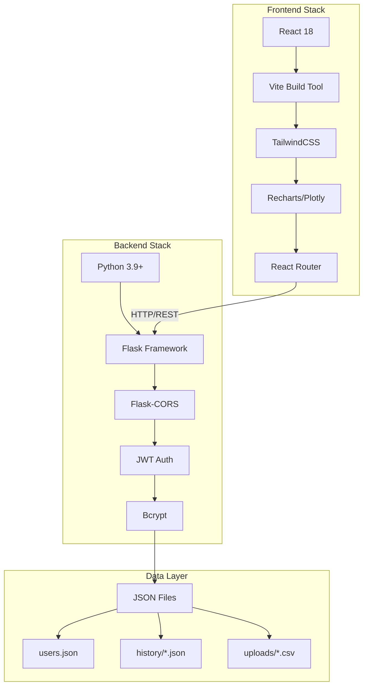

---

## High-Level Architecture

### System Architecture Overview

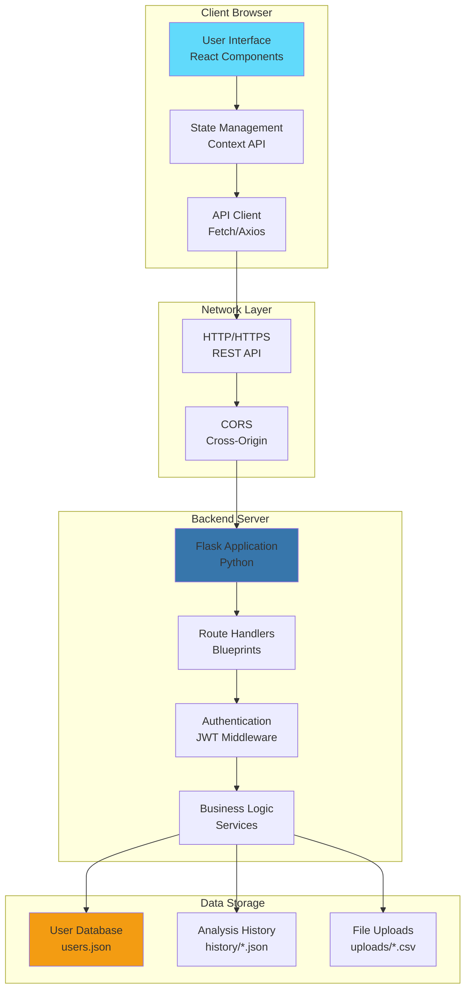

### Three-Tier Architecture

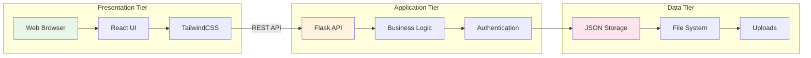

---

## Frontend Architecture

### React Application Structure

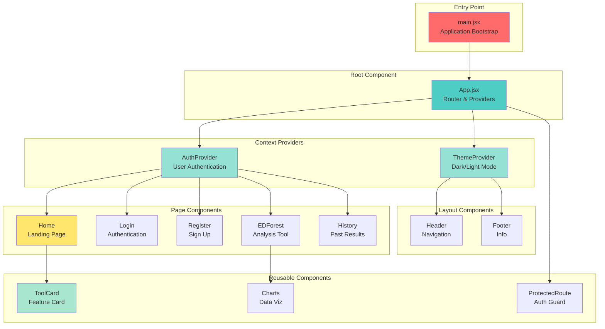

### Component Hierarchy (Detailed)

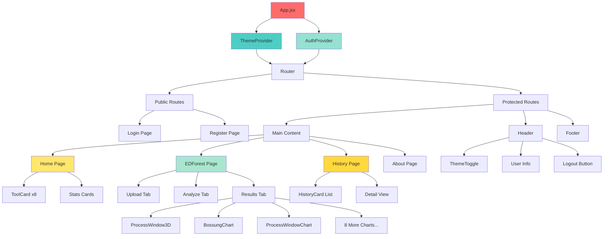

### Vite Build Process

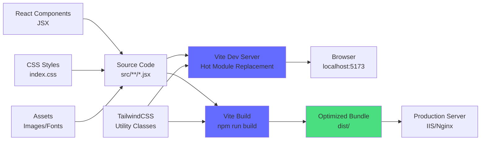

---

## Backend Architecture

### Flask Application Structure

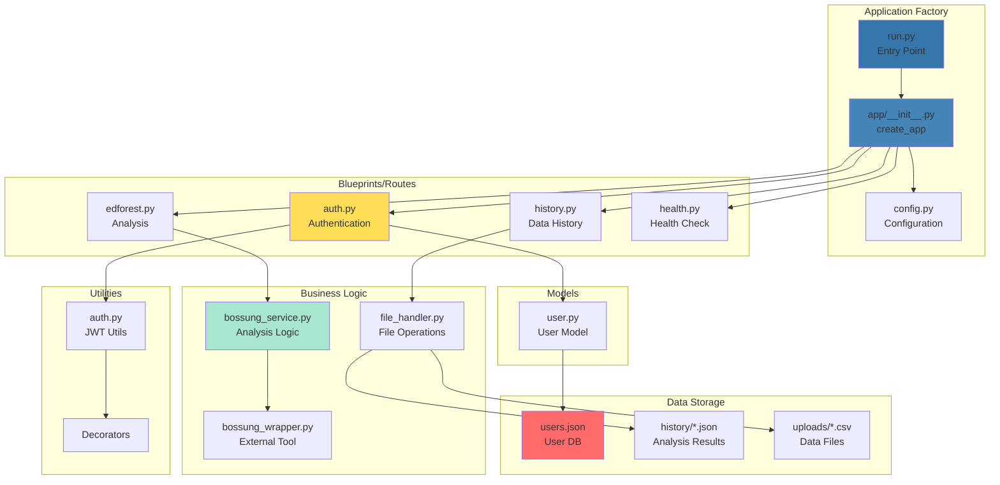

### API Route Structure

```mermaid
graph TB
    A[Flask App<br/>localhost:5000] --> B[/api/v1]
    
    B --> C[/auth]
    B --> D[/edforest]
    B --> E[/history]
    B --> F[/health]
    
    C --> G[POST /register<br/>Create User]
    C --> H[POST /login<br/>Get Token]
    C --> I[GET /me<br/>Current User]
    C --> J[GET /users<br/>List All]
    
    D --> K[POST /upload<br/>Upload CSV]
    D --> L[POST /analyze<br/>Run Analysis]
    D --> M[POST /generate-mock<br/>Test Data]
    D --> N[GET /download/:file<br/>Get Result]
    
    E --> O[POST /save<br/>Save Analysis]
    E --> P[GET /list<br/>Get All]
    E --> Q[GET /:id<br/>Get One]
    E --> R[DELETE /:id<br/>Delete]
    E --> S[GET /stats<br/>Statistics]
    
    F --> T[GET /<br/>Health Status]
    
    style A fill:#3776ab
    style C fill:#ff6b6b
    style D fill:#4ecdc4
    style E fill:#95e1d3
    style F fill:#ffe66d
```

---

## Data Flow Diagrams

### User Login Flow (Sequence Diagram)

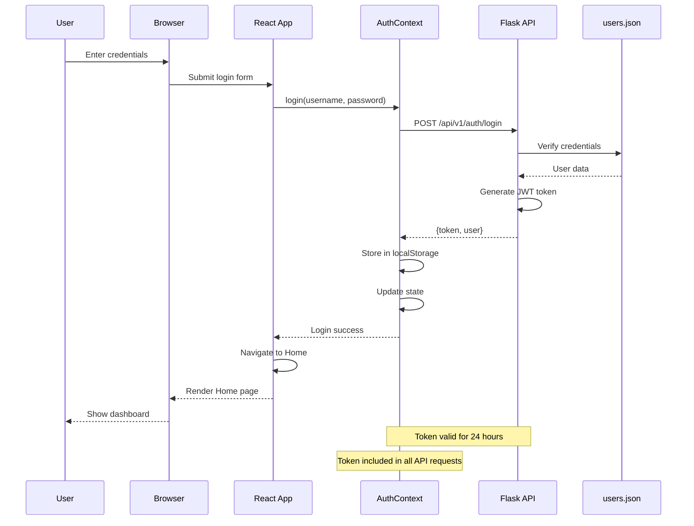

### Data Analysis Flow (EDForest)

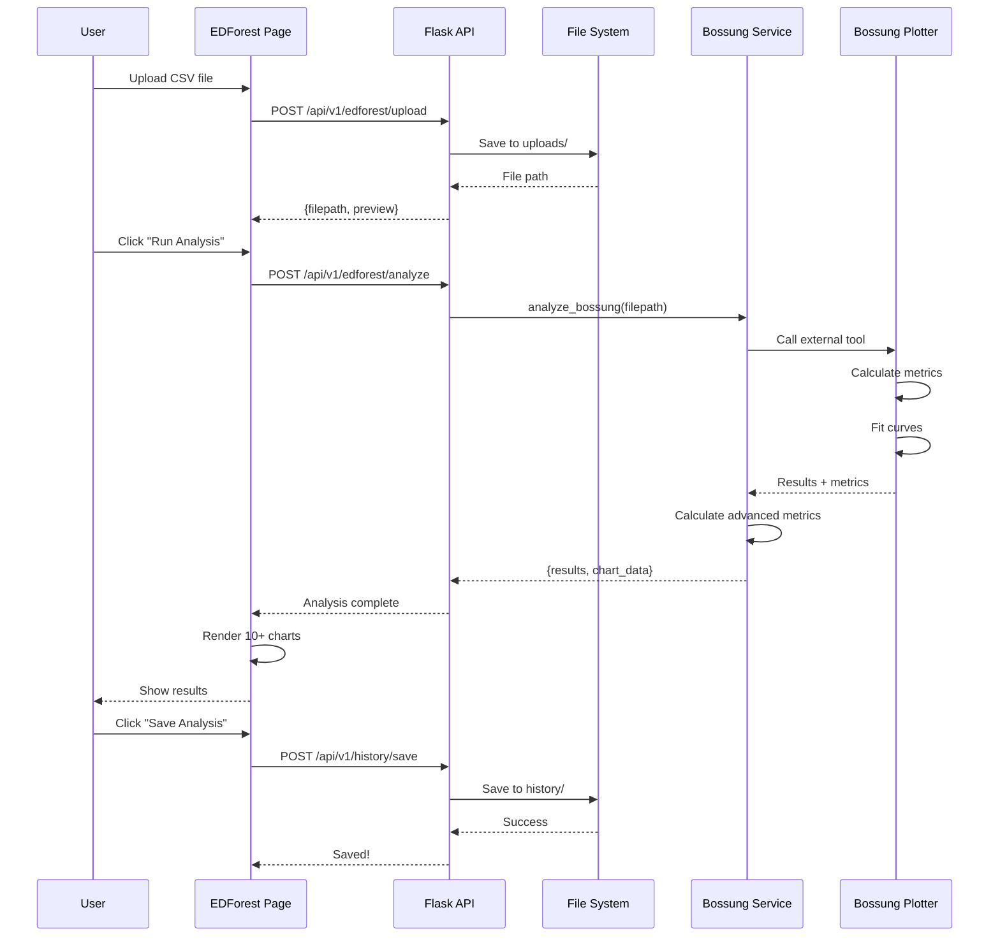

### Component Data Flow

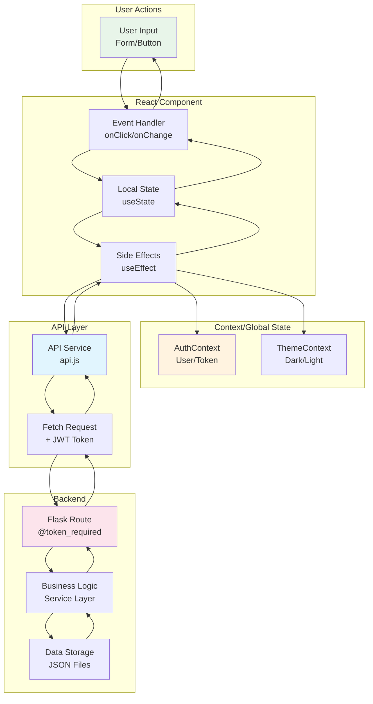

---

## Authentication Flow

### Complete Authentication Cycle

```mermaid
graph TB
    subgraph "Registration Flow"
        A[User fills form] --> B[POST /auth/register]
        B --> C[Validate input]
        C --> D[Hash password<br/>bcrypt]
        D --> E[Save to users.json]
        E --> F[Generate JWT token]
        F --> G[Return token + user]
    end
    
    subgraph "Login Flow"
        H[User enters credentials] --> I[POST /auth/login]
        I --> J[Find user]
        J --> K[Verify password<br/>bcrypt.checkpw]
        K --> L[Generate JWT token]
        L --> M[Update last_login]
        M --> N[Return token + user]
    end
    
    subgraph "Protected Request Flow"
        O[User makes request] --> P[Include token<br/>Authorization: Bearer]
        P --> Q[@token_required<br/>decorator]
        Q --> R[Decode JWT]
        R --> S[Verify signature]
        S --> T[Check expiration]
        T --> U[Add user to request]
        U --> V[Execute route]
    end
    
    subgraph "Logout Flow"
        W[User clicks logout] --> X[Clear localStorage]
        X --> Y[Clear state]
        Y --> Z[Redirect to login]
    end
    
    style A fill:#e8f5e9
    style H fill:#fff3e0
    style O fill:#e1f5fe
    style W fill:#fce4ec
```

### JWT Token Structure

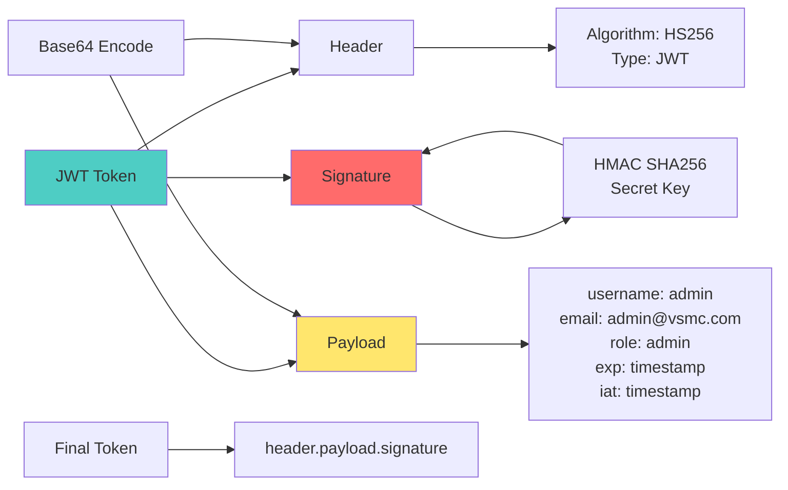

### Protected Route Flow

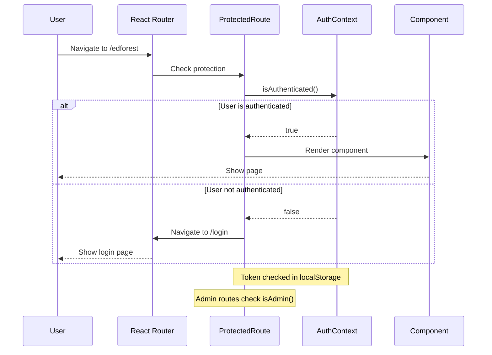

---

## Component Hierarchy

### Page Component Structure

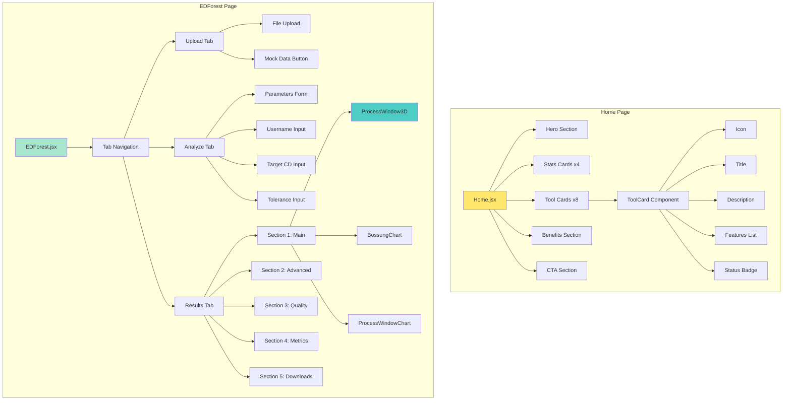

### Chart Component Pattern

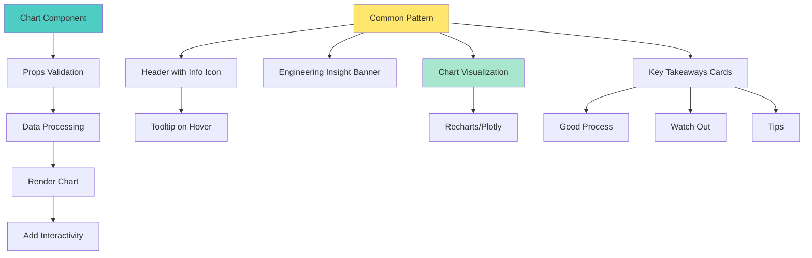

---

## API Integration

### API Service Layer

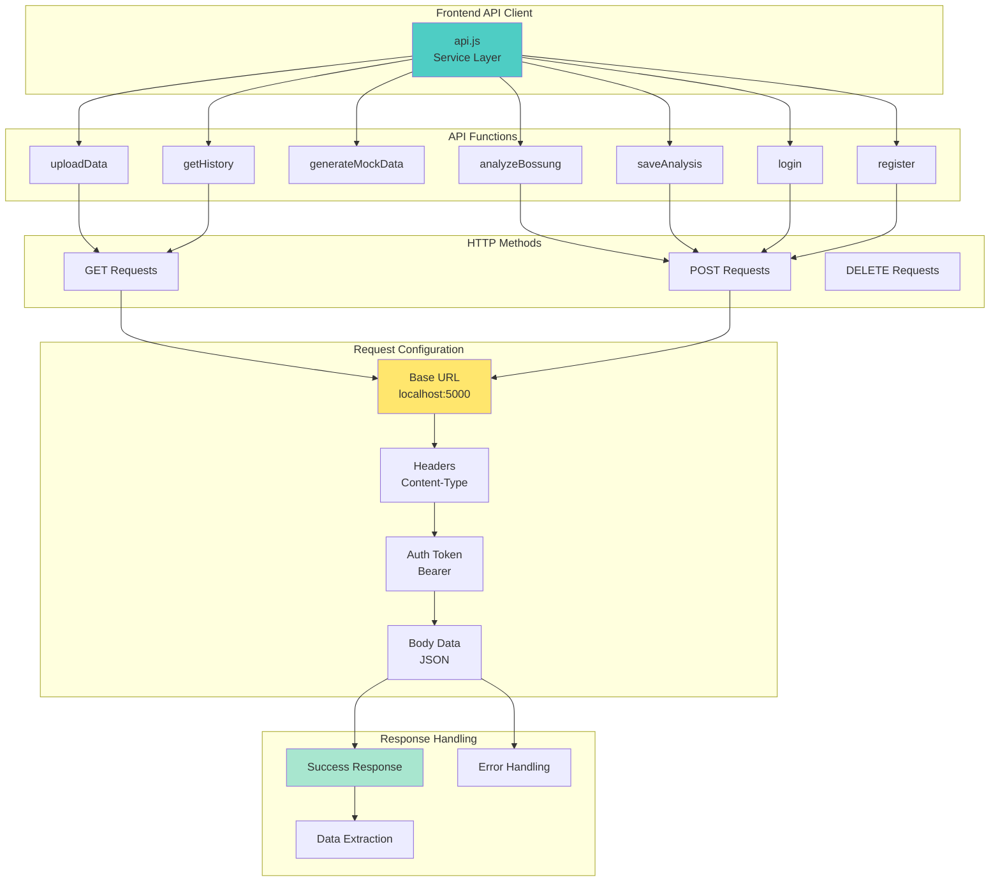

### API Request Flow

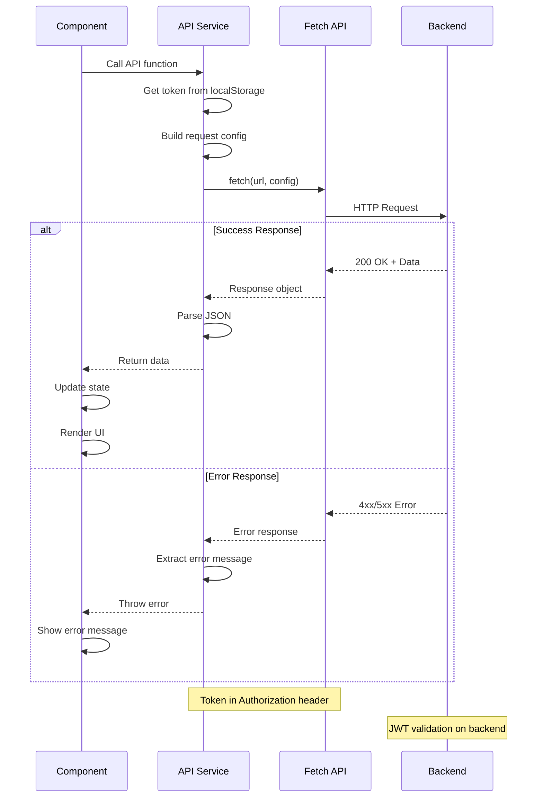

---

## State Management

### Context API Pattern

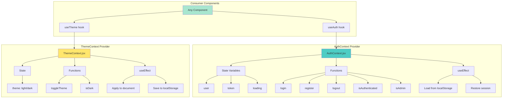

### Component State Flow

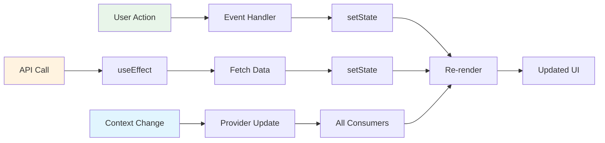

---

## Deployment Architecture

### Development Environment

```mermaid
graph TB
    subgraph "Developer Machine"
        A[VS Code<br/>IDE]
        B[Git<br/>Version Control]
    end
    
    subgraph "Frontend Dev"
        C[Vite Dev Server<br/>localhost:5173]
        D[Hot Module Replacement]
        E[React DevTools]
    end
    
    subgraph "Backend Dev"
        F[Flask Dev Server<br/>localhost:5000]
        G[Debug Mode]
        H[Auto Reload]
    end
    
    subgraph "Browser"
        I[Chrome/Edge<br/>DevTools]
    end
    
    A --> B
    A --> C
    A --> F
    C --> D
    C --> E
    F --> G
    F --> H
    C --> I
    F --> I
    
    style C fill:#646cff
    style F fill:#3776ab
    style I fill:#4ecdc4
```

### Production Environment

```mermaid
graph TB
    subgraph "Windows Server"
        A[IIS Web Server<br/>Port 80/443]
        B[Static Files<br/>frontend/dist]
        C[URL Rewrite<br/>web.config]
    end
    
    subgraph "Backend Service"
        D[Windows Service<br/>NSSM]
        E[Flask App<br/>Port 5000]
        F[Python Process]
    end
    
    subgraph "Data Storage"
        G[users.json]
        H[history/*.json]
        I[uploads/*.csv]
    end
    
    subgraph "Network"
        J[Firewall Rules]
        K[CORS Config]
        L[SSL Certificate]
    end
    
    subgraph "Monitoring"
        M[Windows Event Log]
        N[Application Logs]
        O[Health Checks]
    end
    
    A --> B
    A --> C
    A --> L
    D --> E
    E --> F
    F --> G
    F --> H
    F --> I
    J --> A
    J --> E
    K --> E
    M --> N
    N --> O
    
    style A fill:#0078d4
    style E fill:#3776ab
    style G fill:#ff6b6b
```

### Build and Deploy Process

```mermaid
graph LR
    A[Source Code<br/>Git Repo] --> B[Pull Latest]
    B --> C[Install Dependencies]
    
    C --> D[Backend Setup]
    D --> E[pip install]
    E --> F[Configure config.py]
    
    C --> G[Frontend Setup]
    G --> H[npm install]
    H --> I[npm run build]
    I --> J[dist/ folder]
    
    F --> K[Start Backend Service]
    J --> L[Deploy to IIS]
    
    K --> M[Test API]
    L --> N[Test Frontend]
    
    M --> O[Production Ready]
    N --> O
    
    style A fill:#e8f5e9
    style I fill:#646cff
    style O fill:#4ade80
```

---

## Learning Path for Junior Engineers

### Week 1: Frontend Basics

```mermaid
graph TB
    A[Day 1-2<br/>React Fundamentals] --> B[Components<br/>Props & State]
    B --> C[JSX Syntax<br/>Event Handling]
    
    D[Day 3-4<br/>React Hooks] --> E[useState<br/>useEffect]
    E --> F[useContext<br/>Custom Hooks]
    
    G[Day 5<br/>Vite & Build] --> H[Dev Server<br/>HMR]
    H --> I[Build Process<br/>Optimization]
    
    style A fill:#61dafb
    style D fill:#61dafb
    style G fill:#646cff
```

### Week 2: Advanced Concepts

```mermaid
graph TB
    A[Day 1-2<br/>Routing] --> B[React Router<br/>Navigation]
    B --> C[Protected Routes<br/>Auth Guards]
    
    D[Day 3-4<br/>State Management] --> E[Context API<br/>Global State]
    E --> F[API Integration<br/>Fetch/Axios]
    
    G[Day 5<br/>Styling] --> H[TailwindCSS<br/>Utility Classes]
    H --> I[Dark Mode<br/>Theming]
    
    style A fill:#ca4245
    style D fill:#4ecdc4
    style G fill:#06b6d4
```

### Week 3-4: Full Stack Integration

```mermaid
graph TB
    A[Week 3<br/>Backend Basics] --> B[Flask Routes<br/>REST API]
    B --> C[Authentication<br/>JWT]
    
    D[Week 4<br/>Integration] --> E[Connect Frontend<br/>to Backend]
    E --> F[Deploy Application<br/>Production]
    
    style A fill:#3776ab
    style D fill:#4ade80
```

---

## Key Takeaways

### For Junior Engineers

1. **Component-Based Architecture**
   - Break UI into reusable components
   - Props flow down, events flow up
   - Keep components focused and simple

2. **State Management**
   - Use local state for component-specific data
   - Use Context for global state (auth, theme)
   - Lift state up when needed

3. **API Integration**
   - Centralize API calls in service layer
   - Handle loading and error states
   - Use async/await for cleaner code

4. **Authentication**
   - Store JWT tokens securely
   - Include tokens in API requests
   - Protect routes that need authentication

5. **Modern Tooling**
   - Vite for fast development
   - TailwindCSS for rapid styling
   - React DevTools for debugging

---

## Next Steps

1. **Study the Code**
   - Read through each component
   - Understand the data flow
   - Trace API calls from UI to backend

2. **Make Small Changes**
   - Add a new button
   - Create a simple component
   - Modify existing styles

3. **Build Features**
   - Add a new page
   - Create a new API endpoint
   - Implement a new chart

4. **Deploy**
   - Follow deployment SOP
   - Test in production
   - Monitor and debug

---

**Happy Learning! 🚀**

For questions or support, contact the development team.


