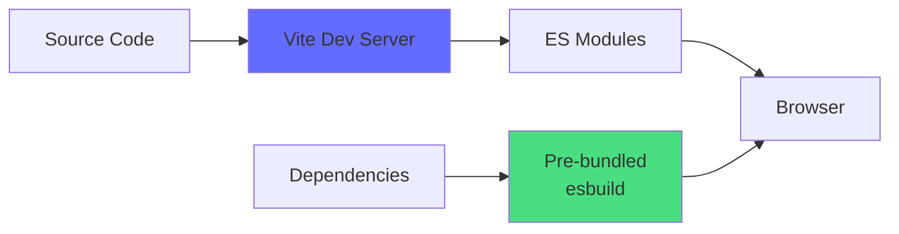
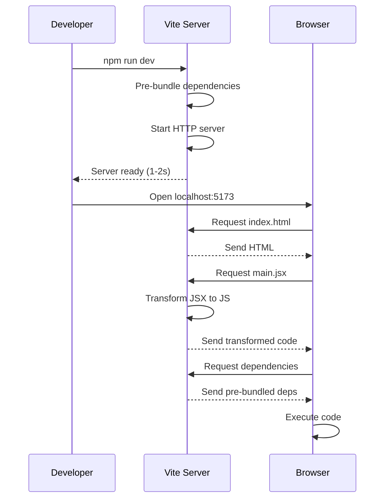
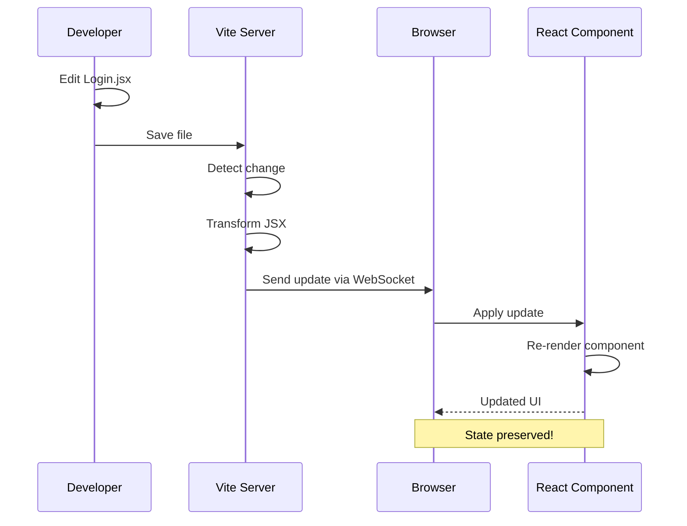
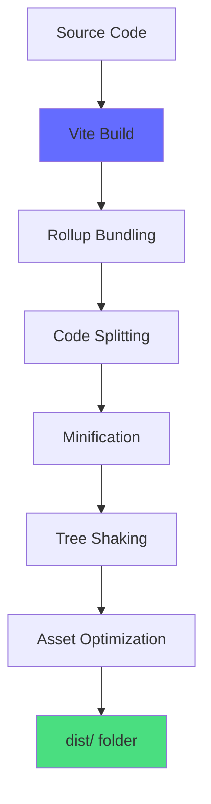

# 📚 Vite Build Tool Training Guide

## Modern Frontend Development with Vite

**Target Audience:** Frontend Developers, Build Tool Beginners  
**Prerequisites:** Basic JavaScript, Node.js installed  
**Learning Time:** 1-2 days  
**Difficulty:** Beginner to Intermediate

---

## Table of Contents
1. [What is Vite?](#what-is-vite)
2. [Why Vite vs Other Build Tools](#why-vite-vs-other-build-tools)
3. [Project Setup](#project-setup)
4. [Configuration Files](#configuration-files)
5. [Development Server](#development-server)
6. [Hot Module Replacement (HMR)](#hot-module-replacement-hmr)
7. [Building for Production](#building-for-production)
8. [Environment Variables](#environment-variables)
9. [Asset Handling](#asset-handling)
10. [Plugins and Extensions](#plugins-and-extensions)
11. [Optimization Techniques](#optimization-techniques)
12. [Troubleshooting](#troubleshooting)

---

## What is Vite?

### Definition

**Vite** (French word for "fast", pronounced /vit/) is a modern build tool that provides:
- ⚡ **Lightning-fast** development server
- 🔥 **Instant** Hot Module Replacement (HMR)
- 📦 **Optimized** production builds
- 🎯 **Zero-config** for most projects

### The Problem Vite Solves

**Traditional Build Tools (Webpack, Parcel):**
```
Start Dev Server → Bundle ALL files → Wait 30-60 seconds → Start coding
Make a change → Rebuild bundle → Wait 5-10 seconds → See changes
```

**Vite's Approach:**
```
Start Dev Server → Serve files on-demand → Ready in 1-2 seconds → Start coding
Make a change → Update only that file → See changes instantly (< 100ms)
```

### How Vite Works



**Key Concepts:**

1. **Native ES Modules:**
   - Modern browsers support `import/export`
   - No bundling needed in development
   - Each file served separately

2. **Pre-bundling Dependencies:**
   - npm packages bundled once with esbuild
   - Cached for speed
   - Only re-bundle when dependencies change

3. **On-Demand Compilation:**
   - Only compile files when requested
   - Faster startup time
   - Scales with project size

---

## Why Vite vs Other Build Tools

### Comparison Table

| Feature | Vite | Webpack | Create React App |
|---------|------|---------|------------------|
| Dev Server Start | 1-2s | 30-60s | 20-40s |
| HMR Speed | < 100ms | 1-5s | 2-10s |
| Build Speed | Fast | Slow | Slow |
| Configuration | Minimal | Complex | Hidden |
| Bundle Size | Optimized | Good | Good |
| Learning Curve | Easy | Hard | Easy |

### When to Use Vite

✅ **Perfect For:**
- New React/Vue/Svelte projects
- Projects needing fast development
- Modern browser targets
- Teams wanting simple config

⚠️ **Consider Alternatives:**
- Legacy browser support (IE11)
- Existing Webpack projects (migration effort)
- Complex custom build requirements

---

## Project Setup

### Our Project Structure

Let's examine our VSMC Litho Platform frontend:

```
frontend/
├── node_modules/          # Dependencies
├── public/                # Static assets (served as-is)
├── src/                   # Source code
│   ├── assets/           # Images, fonts, etc.
│   ├── components/       # React components
│   ├── context/          # Context providers
│   ├── pages/            # Page components
│   ├── services/         # API services
│   ├── App.jsx           # Root component
│   ├── main.jsx          # Entry point
│   └── index.css         # Global styles
├── index.html            # HTML template
├── package.json          # Dependencies & scripts
├── vite.config.js        # Vite configuration
├── tailwind.config.js    # TailwindCSS config
└── postcss.config.js     # PostCSS config
```

### package.json Analysis

```json
{
  "name": "vsmc-litho-platform",
  "private": true,
  "version": "1.0.0",
  "type": "module",
  "scripts": {
    "dev": "vite",
    "build": "vite build",
    "preview": "vite preview"
  },
  "dependencies": {
    "react": "^18.3.1",
    "react-dom": "^18.3.1",
    "react-router-dom": "^6.28.0",
    "recharts": "^2.15.0",
    "react-plotly.js": "^2.6.0",
    "plotly.js-dist-min": "^2.36.0",
    "lucide-react": "^0.468.0"
  },
  "devDependencies": {
    "@vitejs/plugin-react": "^4.3.4",
    "vite": "^5.4.21",
    "tailwindcss": "^3.4.17",
    "postcss": "^8.4.49",
    "autoprefixer": "^10.4.20"
  }
}
```

**Understanding Each Part:**

### 1. Scripts Section

```json
"scripts": {
  "dev": "vite",
  "build": "vite build",
  "preview": "vite preview"
}
```

**What Each Script Does:**

**`npm run dev`** - Development Server
```bash
# Starts Vite dev server
# Default port: 5173
# Hot Module Replacement enabled
# Source maps enabled
```

**`npm run build`** - Production Build
```bash
# Creates optimized production bundle
# Output: dist/ folder
# Minified and tree-shaken
# Ready for deployment
```

**`npm run preview`** - Preview Production Build
```bash
# Serves the production build locally
# Test before deploying
# Same as production environment
```

### 2. Dependencies

**Production Dependencies:**
- Used in the final application
- Included in production bundle
- Examples: react, react-dom, recharts

**Dev Dependencies:**
- Only used during development
- Not included in production bundle
- Examples: vite, @vitejs/plugin-react, tailwindcss

### 3. Type: "module"

```json
"type": "module"
```

- Enables ES Modules in Node.js
- Allows `import/export` syntax
- Required for Vite

---

## Configuration Files

### vite.config.js - Main Configuration

```javascript
// frontend/vite.config.js
import { defineConfig } from 'vite'
import react from '@vitejs/plugin-react'

// https://vitejs.dev/config/
export default defineConfig({
  plugins: [react()],
  server: {
    port: 5173,
    open: false,
    cors: true
  },
  build: {
    outDir: 'dist',
    sourcemap: false,
    minify: 'esbuild',
    target: 'es2015'
  }
})
```

**Line-by-Line Explanation:**

### 1. Import Configuration Helper

```javascript
import { defineConfig } from 'vite'
```

- `defineConfig` provides TypeScript intellisense
- Not required but highly recommended
- Helps catch configuration errors

### 2. Import React Plugin

```javascript
import react from '@vitejs/plugin-react'
```

- Official Vite plugin for React
- Enables Fast Refresh (HMR for React)
- Handles JSX transformation
- Includes React DevTools integration

### 3. Export Configuration

```javascript
export default defineConfig({
  // Configuration options
})
```

- Must export default configuration object
- Can be a function for dynamic config
- Can be async for complex setups

### 4. Plugins Array

```javascript
plugins: [react()]
```

**What This Does:**
- Registers React plugin
- Enables JSX/TSX support
- Configures Fast Refresh
- Optimizes React imports

**Other Common Plugins:**
```javascript
plugins: [
  react(),
  // Add more plugins here
]
```

### 5. Server Configuration

```javascript
server: {
  port: 5173,        // Dev server port
  open: false,       // Don't auto-open browser
  cors: true         // Enable CORS
}
```

**Available Options:**

```javascript
server: {
  port: 5173,              // Port number
  strictPort: false,       // Exit if port is busy
  host: 'localhost',       // Host address
  open: false,             // Auto-open browser
  cors: true,              // Enable CORS
  proxy: {                 // API proxy
    '/api': {
      target: 'http://localhost:5000',
      changeOrigin: true
    }
  },
  hmr: {                   // HMR configuration
    overlay: true          // Show errors as overlay
  }
}
```

**Real-World Example - API Proxy:**

```javascript
// If your backend is on different port
server: {
  proxy: {
    '/api': {
      target: 'http://localhost:5000',
      changeOrigin: true,
      rewrite: (path) => path.replace(/^\/api/, '')
    }
  }
}

// Now you can call:
fetch('/api/users')  // Proxied to http://localhost:5000/users
```

### 6. Build Configuration

```javascript
build: {
  outDir: 'dist',          // Output directory
  sourcemap: false,        // Generate source maps
  minify: 'esbuild',       // Minification tool
  target: 'es2015'         // Browser target
}
```

**Available Options:**

```javascript
build: {
  outDir: 'dist',                    // Output folder
  assetsDir: 'assets',               // Assets subfolder
  sourcemap: false,                  // Source maps (true/false/'inline')
  minify: 'esbuild',                 // 'esbuild' | 'terser' | false
  target: 'es2015',                  // Browser compatibility
  cssCodeSplit: true,                // Split CSS per component
  rollupOptions: {                   // Advanced Rollup config
    output: {
      manualChunks: {
        'react-vendor': ['react', 'react-dom'],
        'charts': ['recharts', 'plotly.js']
      }
    }
  },
  chunkSizeWarningLimit: 500,        // Chunk size warning (KB)
  reportCompressedSize: false        // Report gzip size
}
```

### Advanced Configuration Example

```javascript
// vite.config.js - Production-ready
import { defineConfig } from 'vite'
import react from '@vitejs/plugin-react'
import path from 'path'

export default defineConfig(({ command, mode }) => {
  const isProduction = mode === 'production'
  
  return {
    plugins: [react()],
    
    // Path aliases
    resolve: {
      alias: {
        '@': path.resolve(__dirname, './src'),
        '@components': path.resolve(__dirname, './src/components'),
        '@pages': path.resolve(__dirname, './src/pages'),
        '@services': path.resolve(__dirname, './src/services')
      }
    },
    
    // Development server
    server: {
      port: 5173,
      host: true,  // Listen on all addresses
      proxy: {
        '/api': {
          target: 'http://localhost:5000',
          changeOrigin: true
        }
      }
    },
    
    // Production build
    build: {
      outDir: 'dist',
      sourcemap: !isProduction,
      minify: isProduction ? 'esbuild' : false,
      target: 'es2015',
      rollupOptions: {
        output: {
          manualChunks: {
            'react-vendor': ['react', 'react-dom', 'react-router-dom'],
            'chart-vendor': ['recharts', 'plotly.js-dist-min'],
            'ui-vendor': ['lucide-react']
          }
        }
      }
    },
    
    // CSS configuration
    css: {
      devSourcemap: true,
      postcss: './postcss.config.js'
    },
    
    // Define global constants
    define: {
      __APP_VERSION__: JSON.stringify('1.0.0'),
      __API_URL__: JSON.stringify(process.env.VITE_API_URL || 'http://localhost:5000')
    }
  }
})
```

**Using Path Aliases:**

```javascript
// Before
import Button from '../../../components/Button'
import { api } from '../../../services/api'

// After (with aliases)
import Button from '@components/Button'
import { api } from '@services/api'
```

---

## Development Server

### Starting the Dev Server

```bash
# Navigate to frontend folder
cd frontend

# Start development server
npm run dev
```

**Output:**
```
  VITE v5.4.21  ready in 221 ms

  ➜  Local:   http://localhost:5173/
  ➜  Network: use --host to expose
  ➜  press h + enter to show help
```

### What Happens When You Start Vite?



### Dev Server Features

**1. Instant Server Start**
```bash
# Traditional bundler
$ webpack-dev-server
Compiling... (30 seconds)
Ready!

# Vite
$ vite
Ready in 221 ms  ⚡
```

**2. On-Demand Compilation**
```javascript
// Only compiles files when browser requests them
// Not all files upfront
```

**3. Native ES Modules**
```html
<!-- Browser loads modules directly -->
<script type="module" src="/src/main.jsx"></script>
```

**4. Dependency Pre-Bundling**
```javascript
// node_modules are pre-bundled with esbuild
// Cached until package.json changes
// 10-100x faster than Webpack
```

### Dev Server Commands

While server is running, press:

- **`h`** - Show help
- **`r`** - Restart server
- **`u`** - Show server URL
- **`o`** - Open in browser
- **`c`** - Clear console
- **`q`** - Quit server

---


## Hot Module Replacement (HMR)

### What is HMR?

**Hot Module Replacement** updates your code in the browser WITHOUT full page reload.

### Traditional Reload vs HMR

**Without HMR:**
```
Edit code → Save → Browser reloads → Lose state → Navigate back → Test again
```

**With HMR:**
```
Edit code → Save → Component updates → State preserved → Instant feedback
```

### How HMR Works in Our Project



### Real Example: Editing a Component

**Before Edit:**
```jsx
// src/pages/Login.jsx
function Login() {
  const [username, setUsername] = useState('')
  const [password, setPassword] = useState('')
  
  return (
    <form>
      <h1>Login</h1>
      <input value={username} onChange={e => setUsername(e.target.value)} />
      <input value={password} onChange={e => setPassword(e.target.value)} />
      <button>Submit</button>
    </form>
  )
}
```

**You type "admin" in username field**

**Edit the code:**
```jsx
function Login() {
  const [username, setUsername] = useState('')
  const [password, setPassword] = useState('')
  
  return (
    <form>
      <h1>Welcome! Please Login</h1>  {/* Changed this */}
      <input value={username} onChange={e => setUsername(e.target.value)} />
      <input value={password} onChange={e => setPassword(e.target.value)} />
      <button>Submit</button>
    </form>
  )
}
```

**Result:**
- Title changes to "Welcome! Please Login"
- Username field still shows "admin"
- No page reload!
- State preserved!

### HMR Configuration

Vite's React plugin handles HMR automatically:

```javascript
// vite.config.js
import react from '@vitejs/plugin-react'

export default defineConfig({
  plugins: [
    react({
      // Fast Refresh options
      fastRefresh: true,
      
      // Babel options (if needed)
      babel: {
        plugins: []
      }
    })
  ]
})
```

### When HMR Fails

Sometimes HMR can't update and forces a full reload:

**Scenarios:**
1. Syntax errors
2. Module-level side effects
3. Exporting non-component values
4. Circular dependencies

**Example - Forces Full Reload:**
```javascript
// ❌ Module-level side effect
console.log('This runs on import!')

export function MyComponent() {
  return <div>Hello</div>
}
```

**Fix:**
```javascript
// ✅ Side effect inside component
export function MyComponent() {
  useEffect(() => {
    console.log('Component mounted!')
  }, [])
  
  return <div>Hello</div>
}
```

### HMR API (Advanced)

For custom HMR handling:

```javascript
// Accept HMR updates
if (import.meta.hot) {
  import.meta.hot.accept((newModule) => {
    // Handle update
    console.log('Module updated:', newModule)
  })
  
  // Dispose callback
  import.meta.hot.dispose((data) => {
    // Cleanup before update
    console.log('Cleaning up...')
  })
}
```

---

## Building for Production

### Build Process

```bash
# Create production build
npm run build
```

**What Happens:**



### Build Output

```bash
npm run build
```

**Console Output:**
```
vite v5.4.21 building for production...
✓ 1234 modules transformed.
dist/index.html                   0.45 kB │ gzip:  0.30 kB
dist/assets/index-a1b2c3d4.css   45.67 kB │ gzip: 12.34 kB
dist/assets/index-e5f6g7h8.js   234.56 kB │ gzip: 78.90 kB
✓ built in 3.45s
```

### Understanding the Output

**dist/ folder structure:**
```
dist/
├── index.html                    # Entry HTML
├── assets/
│   ├── index-[hash].css         # Bundled CSS
│   ├── index-[hash].js          # Main bundle
│   ├── vendor-[hash].js         # Dependencies
│   ├── Login-[hash].js          # Code-split chunk
│   ├── EDForest-[hash].js       # Code-split chunk
│   └── logo-[hash].png          # Optimized images
└── favicon.ico                   # Static assets
```

**Why Hashes in Filenames?**

```javascript
// Without hash
index.js  // Browser caches this

// You update code
index.js  // Browser uses old cached version! 😱

// With hash
index-a1b2c3d4.js  // Browser caches this
index-e5f6g7h8.js  // New hash = new file = no cache issue! ✅
```

### Build Optimizations

**1. Code Splitting**

Vite automatically splits code by routes:

```javascript
// Lazy loading routes
const Home = lazy(() => import('./pages/Home'))
const EDForest = lazy(() => import('./pages/EDForest'))
const History = lazy(() => import('./pages/History'))

// Results in separate chunks:
// Home-[hash].js
// EDForest-[hash].js
// History-[hash].js
```

**Benefits:**
- Smaller initial bundle
- Faster page load
- Load pages on-demand

**2. Tree Shaking**

Removes unused code:

```javascript
// You import
import { Button, Card, Modal } from 'ui-library'

// You only use
<Button>Click</Button>

// Vite only includes Button in bundle
// Card and Modal are removed (tree-shaken)
```

**3. Minification**

```javascript
// Before minification (readable)
function calculateTotal(items) {
  let total = 0
  for (let i = 0; i < items.length; i++) {
    total += items[i].price
  }
  return total
}

// After minification (smaller)
function c(i){let t=0;for(let e=0;e<i.length;e++)t+=i[e].price;return t}
```

**4. Asset Optimization**

```javascript
// Images
import logo from './logo.png'  // Optimized and hashed

// CSS
import './styles.css'  // Minified and extracted

// Fonts
@font-face {
  src: url('./font.woff2')  // Optimized and hashed
}
```

### Build Configuration

```javascript
// vite.config.js
export default defineConfig({
  build: {
    // Output directory
    outDir: 'dist',
    
    // Generate source maps (for debugging)
    sourcemap: false,  // true in development
    
    // Minification
    minify: 'esbuild',  // 'esbuild' | 'terser' | false
    
    // Browser target
    target: 'es2015',  // or 'esnext', 'es2020', etc.
    
    // Chunk size warning
    chunkSizeWarningLimit: 500,  // KB
    
    // CSS code splitting
    cssCodeSplit: true,
    
    // Advanced: Manual chunks
    rollupOptions: {
      output: {
        manualChunks: {
          // Group React libraries
          'react-vendor': [
            'react',
            'react-dom',
            'react-router-dom'
          ],
          // Group chart libraries
          'chart-vendor': [
            'recharts',
            'plotly.js-dist-min',
            'react-plotly.js'
          ],
          // Group UI libraries
          'ui-vendor': [
            'lucide-react'
          ]
        }
      }
    }
  }
})
```

### Analyzing Bundle Size

```bash
# Install analyzer
npm install --save-dev rollup-plugin-visualizer

# Add to vite.config.js
import { visualizer } from 'rollup-plugin-visualizer'

export default defineConfig({
  plugins: [
    react(),
    visualizer({
      open: true,
      gzipSize: true,
      brotliSize: true
    })
  ]
})

# Build and analyze
npm run build
# Opens stats.html in browser
```

### Preview Production Build

```bash
# Build first
npm run build

# Preview the build
npm run preview
```

**Output:**
```
  ➜  Local:   http://localhost:4173/
  ➜  Network: use --host to expose
```

**Why Preview?**
- Test production build locally
- Verify optimizations work
- Check for build-specific issues
- Same as deployed version

---

## Environment Variables

### What are Environment Variables?

Variables that change based on environment (development, production, staging).

### Vite Environment Variables

**Rules:**
1. Must start with `VITE_`
2. Defined in `.env` files
3. Accessible via `import.meta.env`

### Creating .env Files

```bash
# frontend/.env.development
VITE_API_URL=http://localhost:5000
VITE_APP_TITLE=VSMC Litho Platform (Dev)
VITE_ENABLE_DEBUG=true

# frontend/.env.production
VITE_API_URL=https://api.production.com
VITE_APP_TITLE=VSMC Litho Platform
VITE_ENABLE_DEBUG=false
```

### Using Environment Variables

```javascript
// src/services/api.js
const API_BASE_URL = import.meta.env.VITE_API_URL || 'http://localhost:5000'

export const fetchData = async () => {
  const response = await fetch(`${API_BASE_URL}/api/data`)
  return response.json()
}

// src/App.jsx
function App() {
  useEffect(() => {
    document.title = import.meta.env.VITE_APP_TITLE
  }, [])
  
  if (import.meta.env.VITE_ENABLE_DEBUG) {
    console.log('Debug mode enabled')
  }
  
  return <div>...</div>
}
```

### Built-in Environment Variables

```javascript
// Mode: 'development' or 'production'
console.log(import.meta.env.MODE)

// Is development?
console.log(import.meta.env.DEV)  // true in dev

// Is production?
console.log(import.meta.env.PROD)  // true in production

// Base URL
console.log(import.meta.env.BASE_URL)  // '/' by default
```

### TypeScript Support

```typescript
// src/vite-env.d.ts
/// <reference types="vite/client" />

interface ImportMetaEnv {
  readonly VITE_API_URL: string
  readonly VITE_APP_TITLE: string
  readonly VITE_ENABLE_DEBUG: string
}

interface ImportMeta {
  readonly env: ImportMetaEnv
}
```

### Security Note

⚠️ **Never put secrets in VITE_ variables!**

```javascript
// ❌ WRONG - Exposed in client bundle
VITE_API_SECRET_KEY=abc123

// ✅ CORRECT - Keep secrets on backend
// Use VITE_ only for public config
VITE_API_URL=https://api.example.com
```

---

## Asset Handling

### Importing Assets

Vite handles various asset types automatically.

### Images

```javascript
// Import as URL
import logo from './assets/logo.png'

function Header() {
  return 
}

// Rendered as:
// 
```

**What Vite Does:**
1. Copies image to dist/assets/
2. Adds hash to filename
3. Returns the URL
4. Optimizes image size

### CSS

```javascript
// Import CSS
import './styles.css'

// CSS Modules
import styles from './Button.module.css'

function Button() {
  return <button className={styles.primary}>Click</button>
}
```

**CSS Modules:**
```css
/* Button.module.css */
.primary {
  background: blue;
  color: white;
}

/* Becomes: */
.Button_primary_a1b2c3 {
  background: blue;
  color: white;
}
```

### JSON

```javascript
// Import JSON
import data from './data.json'

console.log(data.users)

// Named imports
import { users } from './data.json'
```

### SVG

```javascript
// As URL
import icon from './icon.svg'


// As React component (with plugin)
import { ReactComponent as Icon } from './icon.svg'
<Icon />
```

### Fonts

```css
/* In CSS */
@font-face {
  font-family: 'CustomFont';
  src: url('./fonts/custom.woff2') format('woff2');
}

/* Vite automatically:
   1. Copies font to dist/assets/
   2. Updates URL with hash
   3. Optimizes font file
*/
```

### Public Directory

Files in `public/` are served as-is:

```
public/
├── favicon.ico
├── robots.txt
└── manifest.json
```

**Access in code:**
```html
<!-- Always use absolute path -->
<link rel="icon" href="/favicon.ico" />
<link rel="manifest" href="/manifest.json" />
```

**When to use public/:**
- Files that must keep exact name
- Files referenced in index.html
- Files that shouldn't be processed

**When to use src/assets/:**
- Images used in components
- Fonts imported in CSS
- Files that benefit from optimization

### Asset URL Handling

```javascript
// Small files (< 4KB) - Inlined as base64
import smallIcon from './small-icon.png'
// Result: "data:image/png;base64,iVBORw0KG..."

// Large files - Separate file with hash
import largeImage from './large-image.png'
// Result: "/assets/large-image-a1b2c3d4.png"
```

**Configure threshold:**
```javascript
// vite.config.js
export default defineConfig({
  build: {
    assetsInlineLimit: 4096  // 4KB (default)
  }
})
```

---

## Plugins and Extensions

### Official Plugins

**1. @vitejs/plugin-react**

```javascript
import react from '@vitejs/plugin-react'

export default defineConfig({
  plugins: [
    react({
      // Enable Fast Refresh
      fastRefresh: true,
      
      // Babel configuration
      babel: {
        plugins: [
          // Add Babel plugins here
        ]
      },
      
      // JSX runtime
      jsxRuntime: 'automatic'  // or 'classic'
    })
  ]
})
```

**2. @vitejs/plugin-legacy**

For older browser support:

```javascript
import legacy from '@vitejs/plugin-legacy'

export default defineConfig({
  plugins: [
    react(),
    legacy({
      targets: ['defaults', 'not IE 11']
    })
  ]
})
```

### Popular Community Plugins

**1. vite-plugin-pwa**

Progressive Web App support:

```javascript
import { VitePWA } from 'vite-plugin-pwa'

export default defineConfig({
  plugins: [
    react(),
    VitePWA({
      registerType: 'autoUpdate',
      manifest: {
        name: 'VSMC Litho Platform',
        short_name: 'VSMC',
        theme_color: '#646cff'
      }
    })
  ]
})
```

**2. vite-plugin-compression**

Gzip/Brotli compression:

```javascript
import compression from 'vite-plugin-compression'

export default defineConfig({
  plugins: [
    react(),
    compression({
      algorithm: 'gzip',
      ext: '.gz'
    })
  ]
})
```

**3. vite-plugin-imagemin**

Image optimization:

```javascript
import imagemin from 'vite-plugin-imagemin'

export default defineConfig({
  plugins: [
    react(),
    imagemin({
      gifsicle: { optimizationLevel: 7 },
      optipng: { optimizationLevel: 7 },
      mozjpeg: { quality: 80 },
      pngquant: { quality: [0.8, 0.9] },
      svgo: { plugins: [{ removeViewBox: false }] }
    })
  ]
})
```

### Creating Custom Plugin

```javascript
// plugins/my-plugin.js
export default function myPlugin() {
  return {
    name: 'my-plugin',
    
    // Transform code
    transform(code, id) {
      if (id.endsWith('.custom')) {
        return {
          code: transformCode(code),
          map: null
        }
      }
    },
    
    // Handle HMR
    handleHotUpdate({ file, server }) {
      if (file.endsWith('.custom')) {
        server.ws.send({
          type: 'custom',
          event: 'file-updated'
        })
      }
    }
  }
}

// Use in vite.config.js
import myPlugin from './plugins/my-plugin'

export default defineConfig({
  plugins: [react(), myPlugin()]
})
```

---

## Optimization Techniques

### 1. Code Splitting

**Automatic Route-Based Splitting:**

```javascript
import { lazy, Suspense } from 'react'

// Lazy load pages
const Home = lazy(() => import('./pages/Home'))
const EDForest = lazy(() => import('./pages/EDForest'))
const History = lazy(() => import('./pages/History'))

function App() {
  return (
    <Suspense fallback={<Loading />}>
      <Routes>
        <Route path="/" element={<Home />} />
        <Route path="/edforest" element={<EDForest />} />
        <Route path="/history" element={<History />} />
      </Routes>
    </Suspense>
  )
}
```

**Manual Chunk Splitting:**

```javascript
// vite.config.js
export default defineConfig({
  build: {
    rollupOptions: {
      output: {
        manualChunks(id) {
          // Vendor chunks
          if (id.includes('node_modules')) {
            if (id.includes('react')) {
              return 'react-vendor'
            }
            if (id.includes('recharts') || id.includes('plotly')) {
              return 'chart-vendor'
            }
            return 'vendor'
          }
          
          // Feature chunks
          if (id.includes('/pages/')) {
            return 'pages'
          }
          if (id.includes('/components/')) {
            return 'components'
          }
        }
      }
    }
  }
})
```

### 2. Dependency Pre-Bundling

```javascript
// vite.config.js
export default defineConfig({
  optimizeDeps: {
    // Include dependencies
    include: [
      'react',
      'react-dom',
      'react-router-dom'
    ],
    
    // Exclude from pre-bundling
    exclude: [
      'some-esm-package'
    ],
    
    // Force re-optimization
    force: false
  }
})
```

### 3. Build Performance

```javascript
export default defineConfig({
  build: {
    // Faster minification
    minify: 'esbuild',  // vs 'terser'
    
    // Disable source maps in production
    sourcemap: false,
    
    // Disable compressed size reporting
    reportCompressedSize: false,
    
    // Increase chunk size limit
    chunkSizeWarningLimit: 1000
  }
})
```

### 4. CSS Optimization

```javascript
export default defineConfig({
  css: {
    // PostCSS configuration
    postcss: {
      plugins: [
        // Autoprefixer
        require('autoprefixer'),
        // PurgeCSS (remove unused CSS)
        require('@fullhuman/postcss-purgecss')({
          content: ['./src/**/*.{js,jsx,ts,tsx}']
        })
      ]
    },
    
    // CSS modules configuration
    modules: {
      localsConvention: 'camelCase',
      generateScopedName: '[name]__[local]___[hash:base64:5]'
    }
  }
})
```

### 5. Asset Optimization

```javascript
export default defineConfig({
  build: {
    // Inline small assets
    assetsInlineLimit: 4096,  // 4KB
    
    // Asset file names
    assetsDir: 'assets',
    
    // Rollup options
    rollupOptions: {
      output: {
        // Custom file names
        assetFileNames: 'assets/[name]-[hash][extname]',
        chunkFileNames: 'js/[name]-[hash].js',
        entryFileNames: 'js/[name]-[hash].js'
      }
    }
  }
})
```

### 6. Preload Directives

```javascript
// Preload critical resources
export default defineConfig({
  build: {
    rollupOptions: {
      output: {
        // Generate preload directives
        manualChunks: {
          'critical': ['react', 'react-dom']
        }
      }
    }
  }
})
```

**In index.html:**
```html
<head>
  <!-- Preload critical chunks -->
  <link rel="modulepreload" href="/assets/critical-[hash].js">
</head>
```

### 7. Performance Monitoring

```javascript
// src/main.jsx
import { StrictMode } from 'react'
import { createRoot } from 'react-dom/client'
import App from './App'

// Measure performance
if (import.meta.env.PROD) {
  // Web Vitals
  import('web-vitals').then(({ getCLS, getFID, getFCP, getLCP, getTTFB }) => {
    getCLS(console.log)
    getFID(console.log)
    getFCP(console.log)
    getLCP(console.log)
    getTTFB(console.log)
  })
}

createRoot(document.getElementById('root')).render(
  <StrictMode>
    <App />
  </StrictMode>
)
```

### 8. Bundle Analysis

```bash
# Install bundle analyzer
npm install --save-dev rollup-plugin-visualizer

# Add to vite.config.js
import { visualizer } from 'rollup-plugin-visualizer'

export default defineConfig({
  plugins: [
    react(),
    visualizer({
      filename: './dist/stats.html',
      open: true,
      gzipSize: true,
      brotliSize: true
    })
  ]
})

# Build and analyze
npm run build
# Opens stats.html showing bundle composition
```

**What to Look For:**
- Large dependencies (consider alternatives)
- Duplicate code (fix imports)
- Unused code (remove or lazy load)
- Unoptimized assets (compress images)

---

## Troubleshooting

### Common Issues and Solutions

### 1. Port Already in Use

**Error:**
```
Error: Port 5173 is already in use
```

**Solution:**
```javascript
// vite.config.js - Use different port
export default defineConfig({
  server: {
    port: 5174  // or any available port
  }
})

// Or use strictPort: false to auto-find available port
export default defineConfig({
  server: {
    port: 5173,
    strictPort: false  // Auto-increment if busy
  }
})
```

**Windows Command to Kill Process:**
```cmd
# Find process using port 5173
netstat -ano | findstr :5173

# Kill process (replace PID with actual process ID)
taskkill /PID <PID> /F
```

### 2. Module Not Found

**Error:**
```
Failed to resolve import "./components/Button" from "src/App.jsx"
```

**Common Causes:**
1. Wrong file path
2. Missing file extension
3. Case sensitivity

**Solutions:**
```javascript
// ❌ Wrong
import Button from './components/button'  // Wrong case

// ✅ Correct
import Button from './components/Button'  // Match exact filename

// ❌ Wrong path
import Button from '../Button'  // File not there

// ✅ Correct path
import Button from './components/Button.jsx'
```

**Use Path Aliases:**
```javascript
// vite.config.js
import path from 'path'

export default defineConfig({
  resolve: {
    alias: {
      '@': path.resolve(__dirname, './src'),
      '@components': path.resolve(__dirname, './src/components')
    }
  }
})

// Now you can use:
import Button from '@components/Button'
```

### 3. Dependency Pre-Bundling Issues

**Error:**
```
Dependency pre-bundling failed
```

**Solution:**
```bash
# Clear Vite cache
rm -rf node_modules/.vite

# Windows
rmdir /s /q node_modules\.vite

# Restart dev server
npm run dev
```

**Force Re-optimization:**
```javascript
// vite.config.js
export default defineConfig({
  optimizeDeps: {
    force: true  // Force re-bundle dependencies
  }
})
```

### 4. HMR Not Working

**Symptoms:**
- Changes require full page reload
- Updates not appearing

**Solutions:**

**Check WebSocket Connection:**
```javascript
// Browser console
// Should see: [vite] connected.
```

**Fix Firewall/Proxy Issues:**
```javascript
// vite.config.js
export default defineConfig({
  server: {
    hmr: {
      protocol: 'ws',
      host: 'localhost',
      port: 5173
    }
  }
})
```

**Check File Watchers (Windows):**
```javascript
// vite.config.js
export default defineConfig({
  server: {
    watch: {
      usePolling: true  // Use polling instead of native watchers
    }
  }
})
```

### 5. Build Fails but Dev Works

**Common Causes:**
1. Environment variables not set
2. Import errors (dynamic imports)
3. Missing dependencies

**Debug Build:**
```bash
# Build with detailed output
npm run build -- --debug

# Check for warnings
npm run build 2>&1 | findstr "warning"
```

**Check Dynamic Imports:**
```javascript
// ❌ Wrong - Variable paths don't work
const component = './components/' + name
import(component)

// ✅ Correct - Use static paths
import(`./components/${name}.jsx`)
```

### 6. CSS Not Loading

**Issue:** Styles not applied in production

**Solutions:**

**Check Import Order:**
```javascript
// main.jsx
import './index.css'  // Import CSS first
import App from './App'
```

**Check CSS Modules:**
```javascript
// ❌ Wrong
import './Button.module.css'

// ✅ Correct
import styles from './Button.module.css'
<button className={styles.primary}>Click</button>
```

**Check PostCSS Config:**
```javascript
// postcss.config.js
export default {
  plugins: {
    tailwindcss: {},
    autoprefixer: {}
  }
}
```

### 7. Large Bundle Size

**Diagnosis:**
```bash
# Analyze bundle
npm install --save-dev rollup-plugin-visualizer
npm run build
# Check dist/stats.html
```

**Solutions:**

**1. Lazy Load Routes:**
```javascript
const EDForest = lazy(() => import('./pages/EDForest'))
```

**2. Remove Unused Dependencies:**
```bash
# Check unused dependencies
npm install -g depcheck
depcheck
```

**3. Use Lighter Alternatives:**
```javascript
// ❌ Heavy (500KB)
import moment from 'moment'

// ✅ Light (2KB)
import { format } from 'date-fns'
```

**4. Tree-Shake Properly:**
```javascript
// ❌ Imports everything
import _ from 'lodash'

// ✅ Import only what you need
import debounce from 'lodash/debounce'
```

### 8. CORS Errors

**Error:**
```
Access to fetch at 'http://localhost:5000/api/data' from origin 
'http://localhost:5173' has been blocked by CORS policy
```

**Solution:**
```javascript
// vite.config.js - Add proxy
export default defineConfig({
  server: {
    proxy: {
      '/api': {
        target: 'http://localhost:5000',
        changeOrigin: true,
        secure: false
      }
    }
  }
})

// Now use relative URLs
fetch('/api/data')  // Proxied to http://localhost:5000/api/data
```

### 9. Memory Issues

**Error:**
```
JavaScript heap out of memory
```

**Solution:**
```bash
# Increase Node.js memory limit
# Windows
set NODE_OPTIONS=--max-old-space-size=4096
npm run build

# Or in package.json
{
  "scripts": {
    "build": "node --max-old-space-size=4096 ./node_modules/vite/bin/vite.js build"
  }
}
```

### 10. Slow Build Times

**Optimizations:**

```javascript
// vite.config.js
export default defineConfig({
  build: {
    // Use esbuild (faster than terser)
    minify: 'esbuild',
    
    // Disable source maps
    sourcemap: false,
    
    // Disable size reporting
    reportCompressedSize: false,
    
    // Increase chunk size limit
    chunkSizeWarningLimit: 1000
  }
})
```

**Clear Cache:**
```bash
# Clear all caches
rm -rf node_modules/.vite
rm -rf dist
npm run build
```

---

## Best Practices

### 1. Project Structure

```
frontend/
├── public/              # Static assets (served as-is)
│   ├── favicon.ico
│   └── robots.txt
├── src/
│   ├── assets/         # Images, fonts (processed by Vite)
│   ├── components/     # Reusable components
│   ├── pages/          # Page components
│   ├── context/        # React Context
│   ├── services/       # API services
│   ├── utils/          # Utility functions
│   ├── hooks/          # Custom hooks
│   ├── App.jsx         # Root component
│   ├── main.jsx        # Entry point
│   └── index.css       # Global styles
├── .env.development    # Dev environment variables
├── .env.production     # Prod environment variables
├── vite.config.js      # Vite configuration
└── package.json        # Dependencies
```

### 2. Import Best Practices

```javascript
// ✅ Use absolute imports with aliases
import Button from '@components/Button'
import { api } from '@services/api'

// ✅ Group imports logically
// 1. External dependencies
import React, { useState, useEffect } from 'react'
import { useNavigate } from 'react-router-dom'

// 2. Internal components
import Header from '@components/Header'
import Footer from '@components/Footer'

// 3. Utilities and services
import { api } from '@services/api'
import { formatDate } from '@utils/date'

// 4. Styles
import styles from './App.module.css'

// ✅ Use named exports for utilities
export const formatDate = (date) => { }
export const parseData = (data) => { }

// ✅ Use default export for components
export default function Button() { }
```

### 3. Environment Variables

```javascript
// ✅ Always prefix with VITE_
VITE_API_URL=http://localhost:5000
VITE_APP_TITLE=My App

// ✅ Provide defaults
const API_URL = import.meta.env.VITE_API_URL || 'http://localhost:5000'

// ✅ Use different .env files
// .env.development
// .env.production
// .env.staging

// ❌ Never expose secrets
// VITE_SECRET_KEY=abc123  // DON'T DO THIS!
```

### 4. Code Splitting

```javascript
// ✅ Lazy load routes
const Home = lazy(() => import('./pages/Home'))
const About = lazy(() => import('./pages/About'))

// ✅ Lazy load heavy components
const Chart = lazy(() => import('./components/Chart'))

// ✅ Use Suspense
<Suspense fallback={<Loading />}>
  <Chart data={data} />
</Suspense>

// ✅ Preload on hover
<Link 
  to="/about"
  onMouseEnter={() => import('./pages/About')}
>
  About
</Link>
```

### 5. Asset Optimization

```javascript
// ✅ Import images
import logo from './assets/logo.png'


// ✅ Use WebP format
import logoWebP from './assets/logo.webp'
<picture>
  <source srcSet={logoWebP} type="image/webp" />
  
</picture>

// ✅ Lazy load images


// ✅ Use public/ for static assets
<link rel="icon" href="/favicon.ico" />
```

### 6. Performance Optimization

```javascript
// ✅ Memoize expensive computations
const expensiveValue = useMemo(() => {
  return computeExpensiveValue(data)
}, [data])

// ✅ Memoize callbacks
const handleClick = useCallback(() => {
  doSomething(id)
}, [id])

// ✅ Virtualize long lists
import { FixedSizeList } from 'react-window'

// ✅ Debounce user input
import { debounce } from 'lodash'
const debouncedSearch = debounce(search, 300)
```

### 7. Development Workflow

```bash
# 1. Start dev server
npm run dev

# 2. Make changes (HMR updates automatically)

# 3. Test in browser

# 4. Build for production
npm run build

# 5. Preview production build
npm run preview

# 6. Deploy dist/ folder
```

### 8. Configuration Tips

```javascript
// vite.config.js - Production-ready config
import { defineConfig } from 'vite'
import react from '@vitejs/plugin-react'
import path from 'path'

export default defineConfig(({ mode }) => {
  const isDev = mode === 'development'
  
  return {
    plugins: [react()],
    
    // Path aliases
    resolve: {
      alias: {
        '@': path.resolve(__dirname, './src'),
        '@components': path.resolve(__dirname, './src/components'),
        '@pages': path.resolve(__dirname, './src/pages'),
        '@services': path.resolve(__dirname, './src/services'),
        '@utils': path.resolve(__dirname, './src/utils')
      }
    },
    
    // Dev server
    server: {
      port: 5173,
      host: true,
      open: false,
      proxy: {
        '/api': {
          target: 'http://localhost:5000',
          changeOrigin: true
        }
      }
    },
    
    // Production build
    build: {
      outDir: 'dist',
      sourcemap: isDev,
      minify: 'esbuild',
      target: 'es2015',
      rollupOptions: {
        output: {
          manualChunks: {
            'react-vendor': ['react', 'react-dom', 'react-router-dom'],
            'chart-vendor': ['recharts', 'plotly.js-dist-min'],
            'ui-vendor': ['lucide-react']
          }
        }
      }
    },
    
    // Dependency optimization
    optimizeDeps: {
      include: ['react', 'react-dom', 'react-router-dom']
    }
  }
})
```

---

## Comparison with Other Build Tools

### Vite vs Webpack

| Aspect | Vite | Webpack |
|--------|------|---------|
| **Dev Server Start** | 1-2 seconds | 30-60 seconds |
| **HMR Speed** | < 100ms | 1-5 seconds |
| **Configuration** | Simple, minimal | Complex, verbose |
| **Learning Curve** | Easy | Steep |
| **Build Speed** | Fast (Rollup + esbuild) | Slower |
| **Browser Support** | Modern (ES2015+) | All (including IE11) |
| **Ecosystem** | Growing | Mature |
| **Use Case** | New projects | Legacy projects |

**When to Use Webpack:**
- Need IE11 support
- Existing Webpack project
- Complex custom loaders
- Specific Webpack plugins required

**When to Use Vite:**
- New projects
- Modern browsers only
- Fast development experience
- Simple configuration

### Vite vs Create React App (CRA)

| Aspect | Vite | Create React App |
|--------|------|------------------|
| **Dev Server** | 1-2s | 20-40s |
| **HMR** | Instant | 2-10s |
| **Configuration** | Flexible | Hidden (eject required) |
| **Build Tool** | Rollup + esbuild | Webpack |
| **Bundle Size** | Smaller | Larger |
| **Customization** | Easy | Difficult |
| **Maintenance** | Active | Slowing down |

**Migration from CRA to Vite:**

```bash
# 1. Install Vite
npm install --save-dev vite @vitejs/plugin-react

# 2. Create vite.config.js
# (See configuration section)

# 3. Move index.html to root
# Update script tag: <script type="module" src="/src/main.jsx"></script>

# 4. Rename .js to .jsx (if using JSX)

# 5. Update package.json scripts
{
  "scripts": {
    "dev": "vite",
    "build": "vite build",
    "preview": "vite preview"
  }
}

# 6. Update environment variables
# REACT_APP_* → VITE_*
# process.env.REACT_APP_API_URL → import.meta.env.VITE_API_URL

# 7. Remove CRA dependencies
npm uninstall react-scripts

# 8. Test
npm run dev
```

### Vite vs Parcel

| Aspect | Vite | Parcel |
|--------|------|--------|
| **Configuration** | Minimal | Zero |
| **Speed** | Very Fast | Fast |
| **Plugins** | Rich ecosystem | Limited |
| **React Support** | Excellent | Good |
| **Production Build** | Optimized | Good |
| **Debugging** | Excellent | Good |

**When to Use Parcel:**
- Absolute zero config needed
- Simple projects
- Quick prototypes

**When to Use Vite:**
- Need plugins
- Better performance
- More control
- Production apps

---

## Real-World Examples from Our Project

### Example 1: Development Workflow

```bash
# Start backend (Terminal 1)
cd backend
python run.py

# Start frontend (Terminal 2)
cd frontend
npm run dev

# Browser opens at http://localhost:5173
# Backend API at http://localhost:5000
# Vite proxies /api requests to backend
```

### Example 2: API Integration

```javascript
// src/services/api.js
const API_BASE = import.meta.env.VITE_API_URL || '/api/v1'

export const uploadFile = async (file) => {
  const formData = new FormData()
  formData.append('file', file)
  
  // Vite proxies /api to http://localhost:5000
  const response = await fetch(`${API_BASE}/edforest/upload`, {
    method: 'POST',
    body: formData
  })
  
  return response.json()
}
```

### Example 3: Component with Assets

```javascript
// src/components/Header.jsx
import { useState } from 'react'
import logo from '@/assets/logo.png'  // Vite processes this
import styles from './Header.module.css'  // CSS Modules

export default function Header() {
  const [theme, setTheme] = useState('light')
  
  return (
    <header className={styles.header}>
      
      <h1>{import.meta.env.VITE_APP_TITLE}</h1>
      <button onClick={() => setTheme(theme === 'light' ? 'dark' : 'light')}>
        Toggle Theme
      </button>
    </header>
  )
}
```

### Example 4: Lazy Loading Routes

```javascript
// src/App.jsx
import { lazy, Suspense } from 'react'
import { BrowserRouter, Routes, Route } from 'react-router-dom'

// Lazy load pages
const Home = lazy(() => import('./pages/Home'))
const EDForest = lazy(() => import('./pages/EDForest'))
const History = lazy(() => import('./pages/History'))
const Login = lazy(() => import('./pages/Login'))

function App() {
  return (
    <BrowserRouter>
      <Suspense fallback={<div>Loading...</div>}>
        <Routes>
          <Route path="/" element={<Home />} />
          <Route path="/edforest" element={<EDForest />} />
          <Route path="/history" element={<History />} />
          <Route path="/login" element={<Login />} />
        </Routes>
      </Suspense>
    </BrowserRouter>
  )
}

export default App
```

### Example 5: Production Build

```bash
# Build for production
cd frontend
npm run build

# Output:
# dist/
# ├── index.html
# ├── assets/
# │   ├── index-a1b2c3d4.css      (45 KB)
# │   ├── index-e5f6g7h8.js       (234 KB)
# │   ├── react-vendor-i9j0k1l2.js (142 KB)
# │   ├── chart-vendor-m3n4o5p6.js (89 KB)
# │   └── logo-q7r8s9t0.png       (12 KB)

# Deploy dist/ folder to web server
```

---

## Practice Exercises

### Exercise 1: Setup New Vite Project

**Task:** Create a new Vite + React project from scratch

```bash
# 1. Create project
npm create vite@latest my-app -- --template react

# 2. Install dependencies
cd my-app
npm install

# 3. Start dev server
npm run dev

# 4. Make a change and see HMR in action

# 5. Build for production
npm run build

# 6. Preview production build
npm run preview
```

### Exercise 2: Configure Path Aliases

**Task:** Add path aliases to avoid relative imports

```javascript
// vite.config.js
import { defineConfig } from 'vite'
import react from '@vitejs/plugin-react'
import path from 'path'

export default defineConfig({
  plugins: [react()],
  resolve: {
    alias: {
      '@': path.resolve(__dirname, './src'),
      '@components': path.resolve(__dirname, './src/components')
    }
  }
})

// Test by importing:
import Button from '@components/Button'
```

### Exercise 3: Add Environment Variables

**Task:** Create environment-specific configurations

```bash
# 1. Create .env.development
VITE_API_URL=http://localhost:5000
VITE_APP_NAME=My App (Dev)

# 2. Create .env.production
VITE_API_URL=https://api.production.com
VITE_APP_NAME=My App

# 3. Use in code
const apiUrl = import.meta.env.VITE_API_URL
console.log(import.meta.env.VITE_APP_NAME)
```

### Exercise 4: Optimize Bundle Size

**Task:** Analyze and reduce bundle size

```bash
# 1. Install analyzer
npm install --save-dev rollup-plugin-visualizer

# 2. Add to vite.config.js
import { visualizer } from 'rollup-plugin-visualizer'

export default defineConfig({
  plugins: [
    react(),
    visualizer({ open: true })
  ]
})

# 3. Build and analyze
npm run build

# 4. Identify large dependencies
# 5. Lazy load or find alternatives
```

### Exercise 5: Add API Proxy

**Task:** Configure proxy to avoid CORS issues

```javascript
// vite.config.js
export default defineConfig({
  server: {
    proxy: {
      '/api': {
        target: 'http://localhost:5000',
        changeOrigin: true,
        rewrite: (path) => path.replace(/^\/api/, '')
      }
    }
  }
})

// Test by calling:
fetch('/api/users')  // Proxied to http://localhost:5000/users
```

---

## Summary

### Key Takeaways

1. **Vite is Fast**
   - 1-2 second dev server start
   - Instant HMR (< 100ms)
   - Optimized production builds

2. **Simple Configuration**
   - Minimal vite.config.js
   - Sensible defaults
   - Easy to customize

3. **Modern Approach**
   - Native ES Modules
   - Pre-bundled dependencies
   - On-demand compilation

4. **Great Developer Experience**
   - Fast feedback loop
   - Clear error messages
   - Excellent documentation

5. **Production Ready**
   - Optimized builds
   - Code splitting
   - Tree shaking
   - Asset optimization

### Next Steps

1. **Practice:** Build a small project with Vite
2. **Explore:** Try different plugins
3. **Optimize:** Analyze and improve bundle size
4. **Deploy:** Deploy to production
5. **Learn More:** Read official Vite documentation

### Resources

- **Official Docs:** https://vitejs.dev
- **GitHub:** https://github.com/vitejs/vite
- **Discord:** https://chat.vitejs.dev
- **Awesome Vite:** https://github.com/vitejs/awesome-vite

---

## Conclusion

Vite represents the future of frontend build tools. Its speed, simplicity, and modern approach make it the ideal choice for new React projects. By leveraging native ES Modules and smart pre-bundling, Vite provides an unmatched development experience while still producing optimized production builds.

The VSMC Litho Platform successfully uses Vite to deliver:
- Lightning-fast development with instant HMR
- Optimized production builds with code splitting
- Simple configuration with powerful customization
- Excellent developer experience

Whether you're starting a new project or considering migration, Vite is worth serious consideration. Its growing ecosystem, active development, and strong community support make it a solid foundation for modern web applications.

**Happy coding with Vite! ⚡**

---

*Training Material Version: 1.0*  
*Last Updated: January 2026*  
*For: VSMC Litho Platform Engineering Team*

