# Week 1: Semiconductor Domain Knowledge

## Welcome to FAB IT Training

Welcome to the first week of your journey to becoming an effective IT professional in the semiconductor manufacturing industry. This week is foundational—you'll build the domain knowledge necessary to communicate effectively with FAB stakeholders and understand the operational context in which you'll be designing IT solutions.

### Why Domain Knowledge Matters

As IT engineers supporting FAB operations, you're not just building software—you're enabling critical manufacturing processes that produce the chips powering everything from smartphones to supercomputers. To design effective IT solutions, you must understand:

- **The Language**: FAB professionals speak in terms of processes, recipes, lots, and yields. You need to speak their language.
- **The Context**: Manufacturing decisions are driven by yield, throughput, and quality. Your IT solutions must support these priorities.
- **The Constraints**: FABs operate 24/7 with zero tolerance for unplanned downtime. Your systems must be reliable and resilient.
- **The Complexity**: A single wafer goes through hundreds of process steps across dozens of equipment. Your solutions must handle this complexity.

By the end of this week, you'll be able to walk into a FAB, understand what's happening, and have meaningful conversations with Process Engineers, Equipment Engineers, and Operators.

---

## Learning Objectives

By the end of Week 1, you will be able to:

1. **Explain** the complete semiconductor wafer manufacturing flow from raw silicon to finished wafer
2. **Identify** and describe the purpose of key FAB processes (Lithography, Etch, Deposition, CMP, Diffusion)
3. **Understand** equipment types, automation systems, and communication protocols (SECS/GEM)
4. **Communicate** effectively with FAB stakeholders using proper terminology
5. **Analyze** a complete lot processing flow and identify data collection points
6. **Recognize** the IT systems that support FAB operations (MES, EAP, SPC, FDC)

---

## Week 1 Structure

| Day | Topic | Duration |
|-----|-------|----------|
| **Day 1** | Semiconductor Manufacturing Fundamentals | 3 hours |
| **Day 2** | Key FAB Processes (Lithography, Etch, Deposition) | 3 hours |
| **Day 3** | Key FAB Processes (CMP, Diffusion, Wet) & Equipment | 3 hours |
| **Day 4** | FAB Automation & Stakeholders | 3 hours |
| **Day 5** | Case Study & Deliverable Workshop | 4 hours |

---

## 1. Semiconductor Manufacturing Fundamentals

### 1.1 What is a Semiconductor?

A semiconductor is a material whose electrical conductivity falls between that of a conductor (like copper) and an insulator (like glass). Silicon is the most common semiconductor material used in chip manufacturing.

**Key Properties:**
- Conductivity can be controlled by adding impurities (doping)
- Forms the basis of transistors, diodes, and integrated circuits
- Enables the digital electronics that power modern technology

### 1.2 From Sand to Silicon Wafer

The journey begins with sand (silicon dioxide), which is refined into pure silicon:

1. **Purification**: Sand is heated with carbon to produce metallurgical-grade silicon (98% pure)
2. **Czochralski Process**: Silicon is melted and a seed crystal is dipped and slowly pulled, forming a cylindrical ingot (99.9999999% pure - "nine nines")
3. **Slicing**: The ingot is sliced into thin wafers (typically 300mm diameter, 0.775mm thick)
4. **Polishing**: Wafers are polished to achieve mirror-smooth surfaces

### 1.3 The Wafer Fabrication Process

Wafer fabrication (FAB) is where the magic happens—transforming blank silicon wafers into integrated circuits with billions of transistors.

**Complete Wafer Manufacturing Flow:**

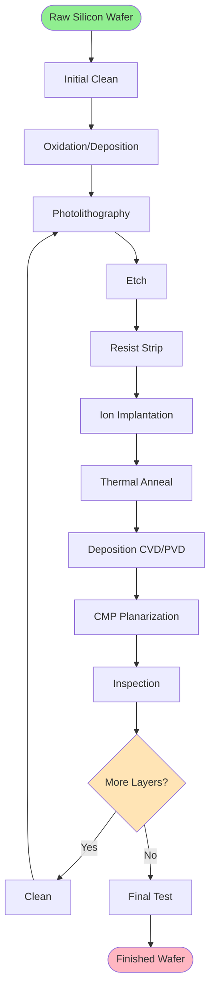

**Key Concepts:**

- **Process Flow**: The sequence of manufacturing steps a wafer undergoes (typically 300-1000 steps)
- **Layer Building**: Modern chips have 10-15 metal layers and 50+ total layers
- **Iteration**: The pattern of lithography → etch → deposition → CMP repeats for each layer

### 1.4 Clean Room Environment

FABs operate in ultra-clean environments to prevent contamination:

**Clean Room Classifications:**

| Class | Particles/m³ (≥0.5μm) | Typical Use |
|-------|----------------------|-------------|
| ISO 1 | 10 | Critical lithography areas |
| ISO 3 | 1,000 | Advanced process tools |
| ISO 5 | 100,000 | Standard FAB areas |
| ISO 7 | 1,000,000 | Support areas |

**Contamination Control:**
- HEPA/ULPA filtration systems
- Positive air pressure
- Cleanroom garments (bunny suits)
- Strict material handling protocols
- Continuous monitoring

**Why It Matters for IT:**
- Equipment must operate in controlled environments
- Maintenance windows are limited and expensive
- System reliability is critical—no "just reboot it"
- Data collection must not interfere with production

### 1.5 Lots, Wafers, and Material Flow

**Lot**: A group of wafers (typically 25 wafers) processed together as a batch
- Identified by unique Lot ID (e.g., LOT-20250110-001)
- All wafers in a lot follow the same process flow
- Lot tracking is critical for quality and yield management

**Wafer**: Individual silicon disc within a lot
- Identified by Lot ID + Slot Number (e.g., LOT-20250110-001.05)
- Each wafer may have hundreds of die (individual chips)
- Wafer-level tracking enables detailed analysis

**Material Flow Through FAB:**

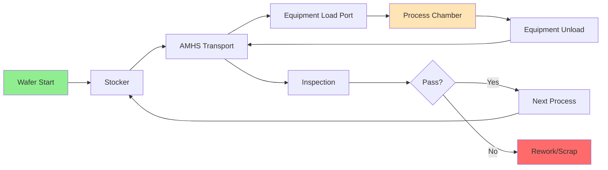

### 1.6 Process Recipes

A **recipe** is a set of parameters that define how equipment processes wafers:

**Recipe Components:**
- Process parameters (temperature, pressure, gas flows, time)
- Equipment settings and configurations
- Quality control checkpoints
- Expected results and tolerances

**Example Recipe Parameters (Simplified):**
```
Recipe: LITHO_CRITICAL_LAYER_5
- Resist Type: EUV-001
- Spin Speed: 3000 RPM
- Bake Temperature: 130°C
- Bake Time: 90 seconds
- Exposure Dose: 45 mJ/cm²
- Focus Offset: +0.05 μm
- Development Time: 60 seconds
```

**Why Recipes Matter for IT:**
- Recipe management systems store and version control recipes
- Recipe execution must be tracked for traceability
- Recipe deviations can impact yield
- Your IT systems will manage recipe distribution and execution

### 1.7 Yield and Quality Metrics

**Yield**: The percentage of good die produced from wafers

**Yield Calculation:**
```
Yield = (Good Die / Total Die) × 100%
```

**Key Metrics:**

| Metric | Description | Typical Target |
|--------|-------------|----------------|
| **Wafer Yield** | % of wafers passing all tests | > 95% |
| **Die Yield** | % of functional die per wafer | 70-90% (varies by technology) |
| **First Pass Yield** | % passing without rework | > 98% |
| **Cycle Time** | Time from start to finish | 6-12 weeks |
| **WIP** | Work in Progress (lots in FAB) | Minimize while maintaining throughput |

**Quality Control:**
- In-line inspection after critical steps
- Metrology measurements (dimensions, thickness, overlay)
- Electrical testing
- Statistical Process Control (SPC) monitoring

**IT's Role in Yield:**
- Collect and analyze process data
- Detect anomalies early (FDC systems)
- Enable root cause analysis
- Track equipment performance (OEE)

---


## 2. Key FAB Processes - Part 1

### 2.1 Photolithography

Photolithography is the process of transferring circuit patterns onto the wafer—think of it as "printing" the circuit design.

**Process Steps:**

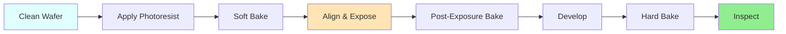

**Detailed Process:**

1. **Photoresist Application**
   - Liquid photosensitive polymer spun onto wafer
   - Spin coating creates uniform thin film (50-200nm)
   - Resist type: positive (exposed areas dissolve) or negative (exposed areas remain)

2. **Soft Bake**
   - Remove solvents from resist
   - Typical: 90-130°C for 60-90 seconds
   - Improves adhesion and stability

3. **Alignment & Exposure**
   - Align wafer to mask/reticle (pattern template)
   - Expose resist to UV or EUV light
   - Light passes through mask, creating pattern in resist
   - Alignment accuracy: < 2nm for advanced nodes

4. **Post-Exposure Bake (PEB)**
   - Catalyze chemical reactions in resist
   - Critical for pattern fidelity

5. **Development**
   - Chemical developer removes soluble resist
   - Reveals pattern in resist layer
   - Pattern now ready for etch or implant

6. **Inspection**
   - Verify pattern quality, dimensions, overlay
   - Critical Dimension (CD) measurement
   - Overlay measurement (alignment to previous layers)

**Lithography Equipment Types:**

| Type | Wavelength | Resolution | Use Case |
|------|-----------|------------|----------|
| **i-line** | 365nm | > 350nm | Mature nodes, non-critical layers |
| **DUV (Deep UV)** | 248nm, 193nm | 45-250nm | Mainstream production |
| **Immersion** | 193nm (in water) | 32-65nm | Advanced nodes |
| **EUV** | 13.5nm | < 10nm | Leading edge (7nm, 5nm, 3nm) |

**IT Implications:**
- Lithography tools are the most expensive in the FAB ($100M+ for EUV)
- Require extensive data: mask data, alignment data, metrology feedback
- Real-time process control for overlay and focus
- Massive data generation (terabytes per day)

### 2.2 Etch

Etch removes material from the wafer surface, transferring the photoresist pattern into underlying layers.

**Etch Types:**

**Dry Etch (Plasma Etch):**
- Uses reactive gases in plasma state
- Anisotropic (vertical) etching
- High selectivity and precision
- Most common in modern FABs

**Wet Etch:**
- Uses liquid chemicals
- Isotropic (all directions) etching
- Lower cost, higher throughput
- Used for non-critical layers

**Dry Etch Process Flow:**

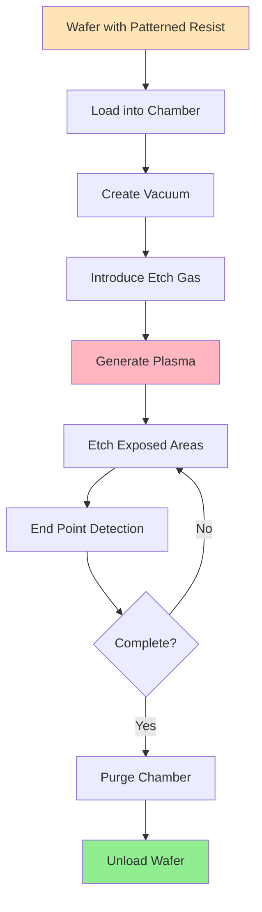

**Key Etch Parameters:**

| Parameter | Purpose | Typical Range |
|-----------|---------|---------------|
| **Gas Flow** | Control etch chemistry | 10-500 sccm |
| **Pressure** | Control plasma density | 1-100 mTorr |
| **RF Power** | Control etch rate | 100-3000 W |
| **Temperature** | Control selectivity | 20-80°C |
| **Time** | Control etch depth | 30-300 seconds |

**Etch Chemistry Examples:**

- **Silicon Etch**: SF₆, CF₄, Cl₂
- **Oxide Etch**: CF₄, CHF₃, C₄F₈
- **Metal Etch**: Cl₂, BCl₃, HBr
- **Nitride Etch**: CF₄, CHF₃, O₂

**End Point Detection (EPD):**
- Optical emission spectroscopy monitors plasma
- Detects when etch reaches target layer
- Prevents over-etching
- Critical for process control

**IT Implications:**
- Real-time monitoring of etch parameters
- End point detection data collection
- Chamber matching (ensuring consistent results across tools)
- Predictive maintenance based on chamber condition

### 2.3 Deposition Processes

Deposition adds thin films of material onto the wafer surface.

**Major Deposition Types:**

#### Chemical Vapor Deposition (CVD)

Chemical reactions deposit material from gas phase onto wafer surface.

**CVD Process:**


**CVD Variants:**

| Type | Temperature | Pressure | Application |
|------|-------------|----------|-------------|
| **LPCVD** | 400-900°C | 0.1-1 Torr | Poly-silicon, nitride |
| **PECVD** | 200-400°C | 0.5-5 Torr | Oxide, nitride (low temp) |
| **HDPCVD** | 300-500°C | 1-10 mTorr | Gap fill, planarization |
| **ALD** | 100-400°C | 1-10 Torr | Ultra-thin, conformal films |

**Common CVD Films:**
- Silicon dioxide (SiO₂) - insulator
- Silicon nitride (Si₃N₄) - barrier, etch stop
- Polysilicon - gates, interconnects
- Tungsten (W) - contacts, vias

#### Physical Vapor Deposition (PVD)

Physical process transfers material from target to wafer.

**PVD Process (Sputtering):**

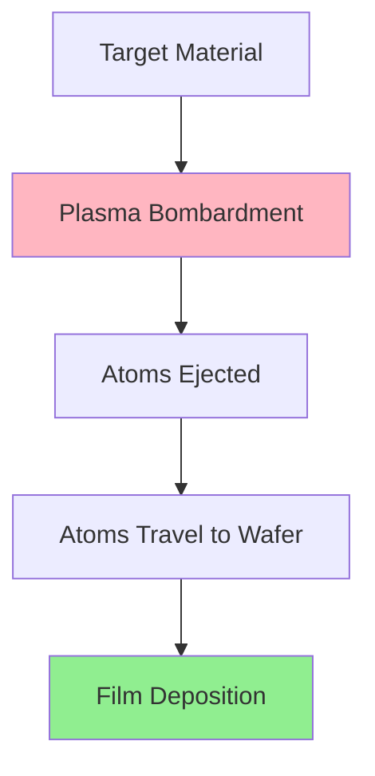

**Common PVD Films:**
- Aluminum (Al) - interconnects
- Copper (Cu) - advanced interconnects
- Titanium (Ti) - barrier layers
- Tantalum (Ta) - barrier layers
- Tungsten (W) - contacts

**PVD vs CVD:**

| Aspect | PVD | CVD |
|--------|-----|-----|
| **Conformality** | Poor (directional) | Excellent |
| **Step Coverage** | Limited | Good |
| **Temperature** | Lower | Higher |
| **Materials** | Metals primarily | Dielectrics, semiconductors |
| **Throughput** | Higher | Lower |

#### Atomic Layer Deposition (ALD)

Self-limiting process deposits one atomic layer at a time.

**ALD Advantages:**
- Atomic-level thickness control
- Excellent conformality (coats complex 3D structures)
- Uniform across wafer
- Essential for advanced nodes (< 10nm)

**ALD Applications:**
- High-k dielectrics
- Metal gates
- Barrier layers
- Spacers

**IT Implications:**
- Recipe management for complex multi-step processes
- Real-time monitoring of deposition rate and uniformity
- Preventive maintenance scheduling (chamber cleaning)
- Film thickness measurement and SPC

---

## 3. Key FAB Processes - Part 2

### 3.1 Chemical Mechanical Planarization (CMP)

CMP combines chemical etching and mechanical polishing to create flat, smooth wafer surfaces.

**Why CMP is Necessary:**
- Deposition and etch create topography (bumps and valleys)
- Lithography requires flat surfaces for focus
- Each layer must be planarized before next layer

**CMP Process:**

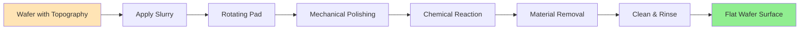

**CMP Components:**

1. **Slurry**: Mixture of abrasive particles and chemicals
   - Abrasives: Silica, alumina, ceria (particle size: 20-200nm)
   - Chemicals: pH adjusters, oxidizers, inhibitors
   - Different slurries for different materials (oxide, metal, poly)

2. **Polishing Pad**: Polyurethane pad with specific hardness and texture
   - Pad conditioning maintains consistent surface
   - Pad life: 50-200 wafers

3. **Process Parameters**:
   - Down force: 1-7 psi
   - Rotation speed: 50-150 RPM
   - Slurry flow rate: 100-300 ml/min
   - Polish time: 30-120 seconds

**CMP Types:**

| Type | Material Removed | Application |
|------|-----------------|-------------|
| **Oxide CMP** | SiO₂ | STI (Shallow Trench Isolation), ILD |
| **Metal CMP** | Cu, W, Al | Damascene interconnects |
| **Poly CMP** | Polysilicon | Gate planarization |

**CMP Challenges:**
- Dishing: Over-polishing in large features
- Erosion: Over-polishing in dense patterns
- Scratches: Defects from particles
- Non-uniformity: Variation across wafer

**IT Implications:**
- Real-time monitoring of removal rate
- End point detection
- Pad life tracking and replacement scheduling
- Defect detection and classification
- Metrology data integration (thickness, uniformity)

### 3.2 Ion Implantation and Diffusion

These processes introduce dopants (impurities) into silicon to control electrical properties.

#### Ion Implantation

High-energy ions are accelerated and implanted into wafer surface.

**Implantation Process:**


**Key Parameters:**

| Parameter | Purpose | Typical Range |
|-----------|---------|---------------|
| **Energy** | Control implant depth | 1-500 keV |
| **Dose** | Control dopant concentration | 10¹¹-10¹⁶ ions/cm² |
| **Angle** | Control implant profile | 0-7° |
| **Species** | Type of dopant | B, P, As, Sb |

**Common Dopants:**
- **N-type** (electron donors): Phosphorus (P), Arsenic (As)
- **P-type** (hole donors): Boron (B)

**Implant Applications:**
- Source/Drain formation
- Well formation
- Threshold voltage adjustment
- Halo implants

#### Thermal Diffusion and Annealing

Heat treatment activates implanted dopants and repairs crystal damage.

**Annealing Process:**
- **Rapid Thermal Anneal (RTA)**: 900-1100°C for 1-60 seconds
- **Spike Anneal**: Very short, high temperature
- **Laser Anneal**: Localized heating with laser

**Purpose:**
- Activate dopants (move to substitutional sites)
- Repair implant damage
- Redistribute dopants

**IT Implications:**
- Recipe management for dose and energy
- Beam current monitoring
- Wafer temperature control
- Dose uniformity tracking

### 3.3 Wet Processing

Wet processes use liquid chemicals for cleaning, etching, and surface preparation.

**Wet Clean Processes:**

#### RCA Clean (Standard Clean)

Industry-standard cleaning sequence:

1. **SC-1 (Standard Clean 1)**
   - Chemistry: NH₄OH + H₂O₂ + H₂O
   - Purpose: Remove particles and organic contaminants
   - Temperature: 70-80°C
   - Time: 10-15 minutes

2. **HF Dip**
   - Chemistry: Dilute HF (1-2%)
   - Purpose: Remove native oxide
   - Time: 30-60 seconds

3. **SC-2 (Standard Clean 2)**
   - Chemistry: HCl + H₂O₂ + H₂O
   - Purpose: Remove metallic contaminants
   - Temperature: 70-80°C
   - Time: 10-15 minutes

**Wet Etch Applications:**

| Etchant | Material Etched | Application |
|---------|----------------|-------------|
| **HF** | SiO₂ | Oxide removal |
| **H₃PO₄** | Si₃N₄ | Nitride removal |
| **KOH** | Silicon | Anisotropic silicon etch |
| **HNO₃/HF** | Silicon | Isotropic silicon etch |

**Wet Process Equipment:**

- **Batch Wet Benches**: Process multiple wafers simultaneously
- **Single Wafer Tools**: Process one wafer at a time (better control)
- **Spin Rinse Dryers (SRD)**: Rinse and dry wafers

**IT Implications:**
- Chemical concentration monitoring
- Temperature control
- Bath life tracking
- Particle count monitoring
- Chemical usage and replenishment

---

## 4. Equipment and Automation

### 4.1 Equipment Types and Functions

**Major Equipment Categories:**

| Category | Function | Examples |
|----------|----------|----------|
| **Lithography** | Pattern transfer | Steppers, Scanners |
| **Etch** | Material removal | Plasma etchers, Wet benches |
| **Deposition** | Film growth | CVD, PVD, ALD tools |
| **CMP** | Planarization | CMP tools |
| **Implant** | Doping | Ion implanters |
| **Thermal** | Heat treatment | Furnaces, RTP |
| **Metrology** | Measurement | CD-SEM, Ellipsometer, XRF |
| **Inspection** | Defect detection | Optical, E-beam inspection |

**Equipment States:**

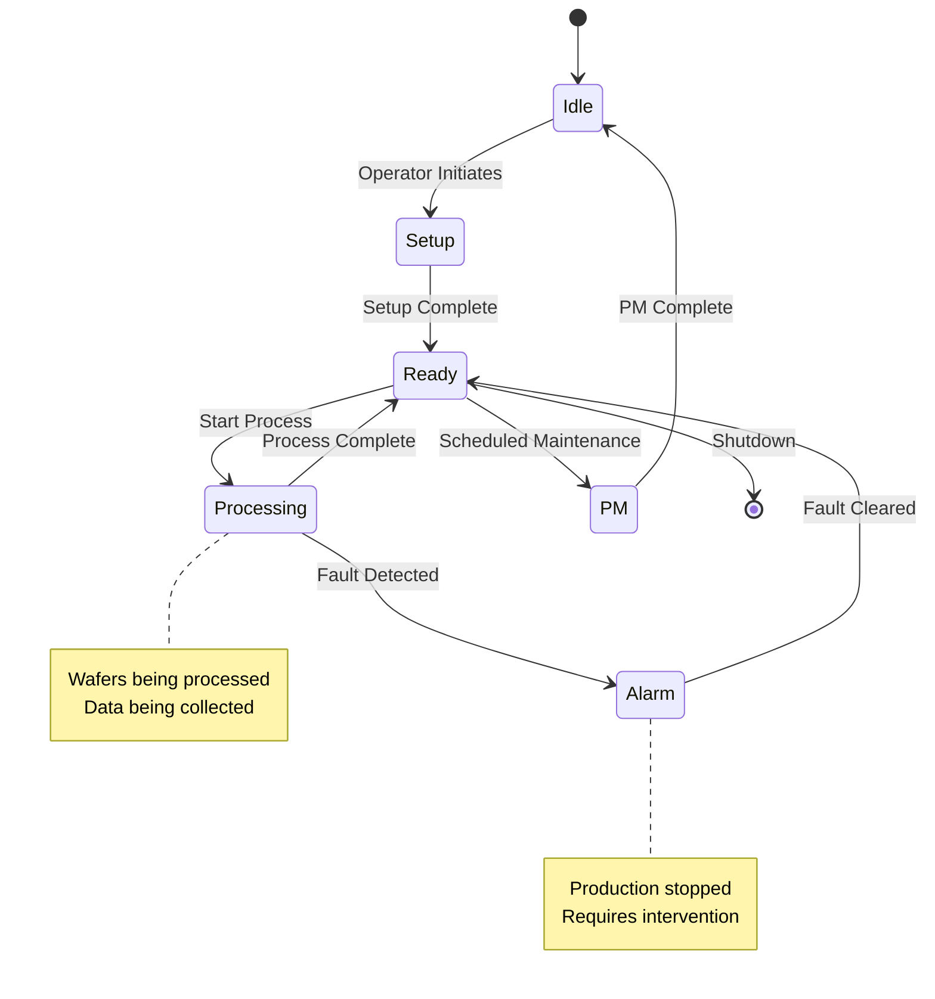

### 4.2 SECS/GEM Communication Protocol

SECS/GEM is the industry standard for equipment-to-host communication.

**SECS/GEM Standards:**

- **SEMI E4 (SECS-I)**: Physical layer - message transfer protocol
- **SEMI E5 (SECS-II)**: Application layer - message content and structure
- **SEMI E30 (GEM)**: Generic Equipment Model - standard behaviors

**Key Concepts:**

**Streams and Functions:**
- Messages organized by Stream (category) and Function (specific message)
- Example: S1F1 = Stream 1, Function 1 (Are You There request)

**Common SECS Messages:**

| Message | Name | Purpose |
|---------|------|---------|
| **S1F1/F2** | Are You There | Equipment status check |
| **S2F41/F42** | Host Command Send | Send command to equipment |
| **S6F11** | Event Report | Equipment event notification |
| **S7F1/F2** | Process Program Load | Recipe transfer |

**GEM States:**

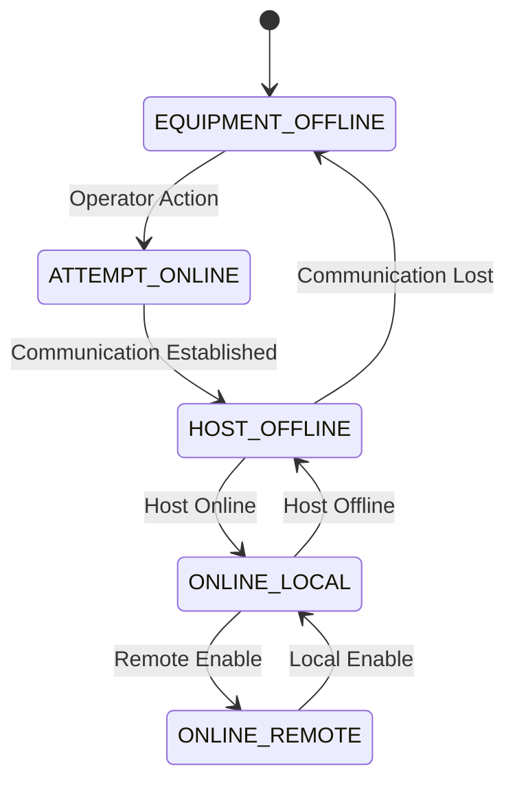

**Data Collection:**
- **Status Variables (SV)**: Equipment state, chamber pressure, temperature
- **Data Variables (DV)**: Process data, measurement results
- **Events**: State changes, alarms, process milestones
- **Alarms**: Error conditions requiring attention

**IT Implications:**
- Equipment integration requires SECS/GEM implementation
- Real-time data collection from hundreds of variables
- Event-driven architecture for equipment events
- Message queuing for reliability
- Protocol testing and validation

### 4.3 Equipment Automation Program (EAP)

EAP software controls equipment and manages communication with host systems.

**EAP Functions:**

1. **Equipment Control**
   - Execute recipes
   - Control hardware (motors, valves, heaters)
   - Monitor sensors
   - Safety interlocks

2. **Communication**
   - SECS/GEM messaging
   - Data collection and reporting
   - Alarm management
   - Remote control

3. **Recipe Management**
   - Store and execute recipes
   - Recipe versioning
   - Parameter validation

4. **Data Logging**
   - Process data
   - Equipment performance
   - Maintenance history

**EAP Architecture:**

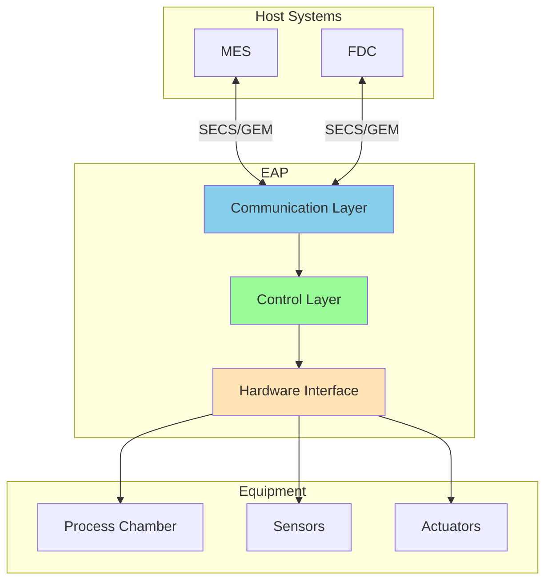

### 4.4 Automated Material Handling System (AMHS)

AMHS transports wafer lots between equipment and storage.

**AMHS Components:**

1. **Overhead Hoist Transport (OHT)**
   - Monorail system with robotic vehicles
   - Carries FOUPs (Front Opening Unified Pods)
   - Typical speed: 60-120 meters/minute

2. **Stockers**
   - Automated storage and retrieval systems
   - Store FOUPs between process steps
   - Capacity: 50-500 FOUPs

3. **Load Ports**
   - Interface between AMHS and equipment
   - Automated FOUP docking and undocking

**AMHS Benefits:**
- Reduced cycle time
- Minimized contamination (no human handling)
- Improved safety
- 24/7 operation
- Real-time lot tracking

**IT Implications:**
- Material Control System (MCS) manages AMHS
- Real-time lot location tracking
- Route optimization algorithms
- Integration with MES for dispatching
- Vehicle health monitoring

---

## 5. FAB Stakeholders and Roles

Understanding who you'll work with and what they care about.

### 5.1 Process Engineers

**Responsibilities:**
- Develop and optimize manufacturing processes
- Create and maintain process recipes
- Troubleshoot yield issues
- Conduct experiments (DOE - Design of Experiments)
- Drive continuous improvement

**What They Care About:**
- Yield and quality
- Process stability and repeatability
- Data for analysis and optimization
- Fast access to process data
- Root cause analysis tools

**How IT Supports Them:**
- SPC systems for process monitoring
- Data analytics and visualization
- Experiment tracking systems
- Recipe management systems
- Yield management systems

**Communication Tips:**
- Speak in terms of yield impact
- Understand process physics
- Provide data-driven insights
- Be responsive to production issues

### 5.2 Equipment Engineers

**Responsibilities:**
- Maintain and repair equipment
- Troubleshoot equipment problems
- Perform preventive maintenance (PM)
- Qualify new equipment
- Optimize equipment performance

**What They Care About:**
- Equipment uptime and availability
- Mean Time Between Failures (MTBF)
- Mean Time To Repair (MTTR)
- Predictive maintenance
- Spare parts management

**How IT Supports Them:**
- Equipment performance tracking (OEE)
- Fault Detection and Classification (FDC)
- Maintenance management systems
- Equipment health monitoring
- Predictive analytics

**Communication Tips:**
- Focus on equipment reliability
- Understand equipment subsystems
- Provide actionable alerts
- Support troubleshooting workflows

### 5.3 Operators

**Responsibilities:**
- Load and unload wafers
- Start equipment processes
- Monitor equipment status
- Respond to alarms
- Perform basic troubleshooting
- Document activities

**What They Care About:**
- Clear instructions
- Easy-to-use interfaces
- Quick problem resolution
- Minimal manual data entry
- Safety

**How IT Supports Them:**
- Intuitive user interfaces
- Work instruction systems
- Automated data collection
- Mobile alerts
- Digital checklists

**Communication Tips:**
- Keep interfaces simple
- Minimize clicks and steps
- Provide clear error messages
- Support 24/7 operations

### 5.4 Integration Engineers

**Responsibilities:**
- Integrate equipment with FAB systems
- Implement SECS/GEM communication
- Develop automation solutions
- Troubleshoot integration issues
- Maintain equipment interfaces

**What They Care About:**
- Standard protocols and interfaces
- Reliable communication
- Comprehensive documentation
- Testing and validation tools
- System interoperability

**How IT Supports Them:**
- SECS/GEM testing tools
- Integration frameworks
- API documentation
- Monitoring and diagnostics
- Version control

**Communication Tips:**
- Understand communication protocols
- Follow standards (SEMI, GEM300)
- Provide detailed specifications
- Support thorough testing

### 5.5 Stakeholder Interaction Map

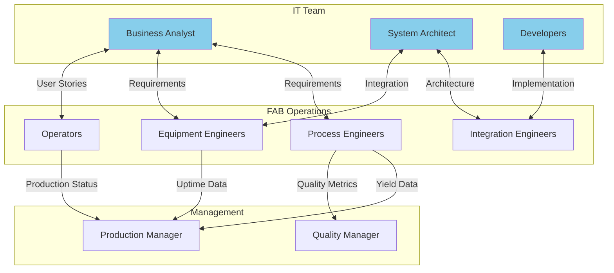

---


## 6. FAB IT Systems Landscape

Understanding the IT systems that support FAB operations.

### 6.1 Manufacturing Execution System (MES)

The central nervous system of the FAB.

**MES Core Functions:**

1. **Production Management**
   - Work order management
   - Lot dispatching and scheduling
   - Resource allocation
   - Production tracking

2. **Quality Management**
   - SPC monitoring
   - Defect tracking
   - Hold management
   - Rework tracking

3. **Material Management**
   - Lot tracking and genealogy
   - Inventory management
   - Material movement
   - Consumption tracking

4. **Equipment Management**
   - Equipment status monitoring
   - Recipe management
   - Equipment qualification
   - Capability tracking

**MES Architecture:**

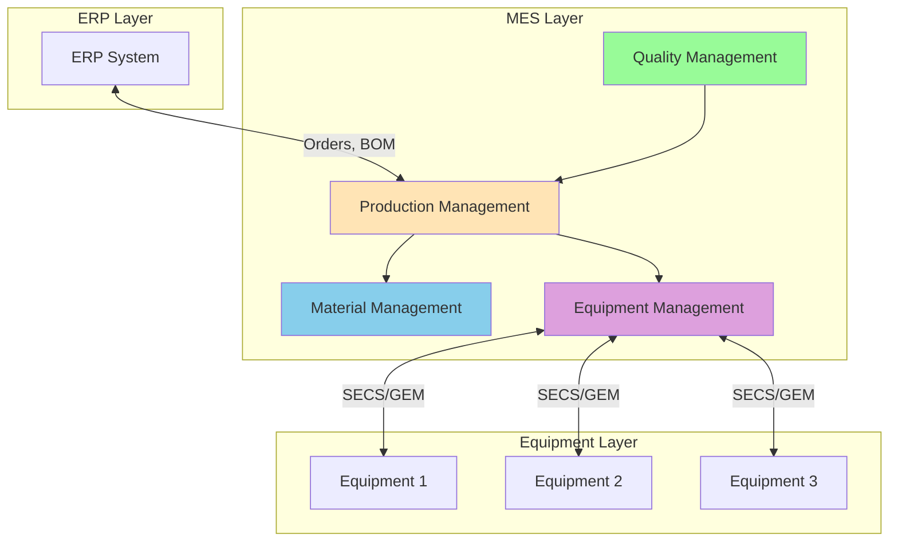

### 6.2 Statistical Process Control (SPC)

Monitors process stability and detects variations.

**SPC Functions:**
- Real-time data collection from equipment and metrology
- Control chart generation (X-bar, R, EWMA)
- Out-of-control detection
- Trend analysis
- Automated alerts

**Control Chart Example:**

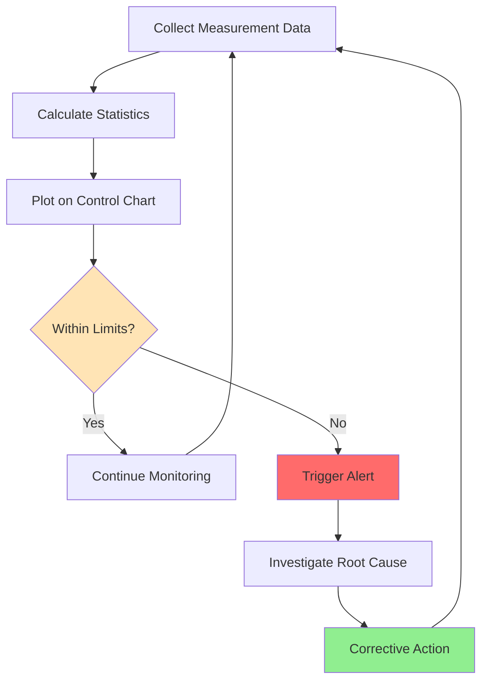

**SPC Rules (Western Electric Rules):**
1. One point beyond 3σ
2. Two out of three consecutive points beyond 2σ
3. Four out of five consecutive points beyond 1σ
4. Eight consecutive points on one side of center line

### 6.3 Fault Detection and Classification (FDC)

Predictive system that detects equipment faults before they impact product.

**FDC Approach:**

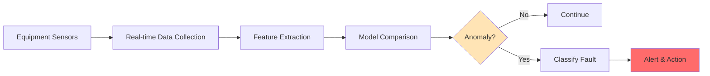

**FDC Benefits:**
- Early fault detection (before wafer damage)
- Reduced scrap and rework
- Improved equipment availability
- Predictive maintenance
- Root cause analysis

**FDC Techniques:**
- Univariate limits (simple thresholds)
- Multivariate analysis (PCA, PLS)
- Machine learning models
- Pattern recognition

### 6.4 Advanced Process Control (APC)

Automatically adjusts process parameters to maintain targets.

**APC Types:**

1. **Run-to-Run (R2R) Control**
   - Adjusts recipe between lots
   - Based on metrology feedback
   - Example: Adjust etch time based on previous lot thickness

2. **Real-time Control**
   - Adjusts during processing
   - Based on in-situ sensors
   - Example: Adjust RF power to maintain etch rate

**APC Control Loop:**


### 6.5 Equipment Engineering System (EES)

Manages equipment maintenance and performance.

**EES Functions:**
- Preventive maintenance scheduling
- Work order management
- Spare parts inventory
- Equipment history tracking
- OEE calculation and reporting

**OEE (Overall Equipment Effectiveness):**

```
OEE = Availability × Performance × Quality

Availability = Uptime / Planned Production Time
Performance = Actual Output / Theoretical Output
Quality = Good Units / Total Units
```

**Target OEE:** > 85% (world-class)

### 6.6 System Integration Overview

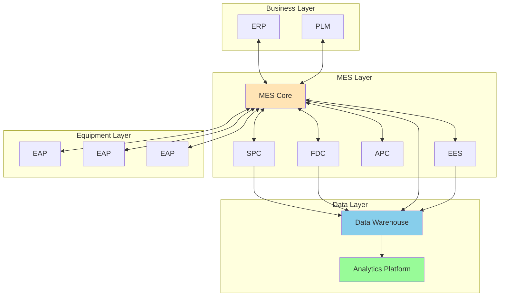

---

## 7. Recommended Reading Materials

### 7.1 Essential Books

1. **"Microchip Fabrication: A Practical Guide to Semiconductor Processing" by Peter Van Zant**
   - **Why Read It**: Best introductory book for understanding FAB processes
   - **Key Topics**: Complete process flow, equipment, clean room operations
   - **Level**: Beginner-friendly
   - **Pages**: ~600 pages
   - **Recommendation**: Read Chapters 1-5, 8-12 this week

2. **"Semiconductor Manufacturing Handbook" by Hwaiyu Geng (Editor)**
   - **Why Read It**: Comprehensive reference covering all aspects
   - **Key Topics**: Detailed process physics, equipment, automation
   - **Level**: Intermediate to Advanced
   - **Pages**: ~1200 pages (reference book)
   - **Recommendation**: Use as reference for specific topics

3. **"The Science and Engineering of Microelectronic Fabrication" by Stephen A. Campbell**
   - **Why Read It**: Strong technical foundation with physics explanations
   - **Key Topics**: Process physics, device structures, integration
   - **Level**: Intermediate (requires some physics background)
   - **Recommendation**: Read Chapters 1-3 for fundamentals

4. **"VLSI Fabrication Principles: Silicon and Gallium Arsenide" by Sorab K. Ghandhi**
   - **Why Read It**: Detailed coverage of individual processes
   - **Key Topics**: Oxidation, diffusion, ion implantation, lithography
   - **Level**: Advanced
   - **Recommendation**: Reference for deep dives

### 7.2 Industry Standards and Specifications

1. **SEMI Standards (www.semi.org)**
   - **SEMI E4**: SECS-I Message Transfer (Physical Layer)
   - **SEMI E5**: SECS-II Message Content (Application Layer)
   - **SEMI E30**: GEM (Generic Equipment Model)
   - **SEMI E10**: Equipment Reliability, Availability, Maintainability
   - **SEMI E40**: Processing Management
   - **SEMI E90**: Substrate Tracking
   - **Access**: Requires SEMI membership or purchase
   - **Recommendation**: Focus on E4, E5, E30 for equipment communication

2. **SEMATECH Publications**
   - **Website**: www.sematech.org
   - **Content**: Research reports, best practices, technology roadmaps
   - **Access**: Many documents publicly available
   - **Recommendation**: Browse technology transfer documents

### 7.3 Websites and Online Resources

1. **SEMI.org - Semiconductor Equipment and Materials International**
   - **URL**: www.semi.org
   - **Content**: Standards, industry news, events, training
   - **Why Visit**: Industry standards authority
   - **Recommendation**: Explore standards library and technical papers

2. **Semiconductor Engineering**
   - **URL**: www.semiengineering.com
   - **Content**: News, technical articles, industry trends
   - **Why Visit**: Stay current with technology developments
   - **Recommendation**: Subscribe to weekly newsletter

3. **EE Times - Semiconductor Section**
   - **URL**: www.eetimes.com
   - **Content**: Industry news, technical articles, analysis
   - **Why Visit**: Broader electronics industry perspective
   - **Recommendation**: Read semiconductor manufacturing articles

4. **Lithoguru.com**
   - **URL**: www.lithoguru.com
   - **Content**: Lithography fundamentals, tutorials, articles
   - **Why Visit**: Deep dive into lithography by industry expert Chris Mack
   - **Recommendation**: Read "Fundamental Principles of Optical Lithography"

5. **YouTube Channels**
   - **"Branch Education"**: Excellent animations of semiconductor processes
   - **"Asianometry"**: Semiconductor industry history and analysis
   - **"Applied Materials"**: Equipment vendor videos showing processes
   - **Recommendation**: Watch process visualization videos

### 7.4 Technical Papers and Journals

1. **IEEE Transactions on Semiconductor Manufacturing**
   - **Focus**: Manufacturing processes, equipment, automation
   - **Access**: IEEE Xplore (subscription or university access)
   - **Recommendation**: Search for "semiconductor manufacturing introduction"

2. **Journal of Vacuum Science & Technology**
   - **Focus**: Deposition, etch, surface science
   - **Access**: AIP Publishing
   - **Recommendation**: Read review articles on CVD and PVD

3. **Solid State Technology**
   - **Focus**: Practical manufacturing technology
   - **Access**: Free online articles
   - **Recommendation**: Browse process technology articles

### 7.5 Week 1 Reading Plan

**Priority 1 (Must Read This Week):**
- Van Zant "Microchip Fabrication" - Chapters 1-5 (FAB overview, clean room, processes)
- SEMI E30 GEM Standard - Overview sections
- Semiconductor Engineering - 3-5 recent articles on manufacturing

**Priority 2 (Recommended):**
- Van Zant - Chapters 8-12 (specific processes)
- YouTube: Branch Education semiconductor videos
- Lithoguru.com - Lithography basics

**Priority 3 (Optional/Reference):**
- Campbell "Science and Engineering" - Chapters 1-3
- IEEE papers on semiconductor manufacturing
- SEMATECH technology transfer documents

---

## 8. Week 1 Case Study

### Case Study: Lot Processing Flow Analysis

**Scenario:**

You are a new IT engineer at FabTech Semiconductor. The Process Engineering team has requested a new system to track lot processing in real-time and identify bottlenecks. Before you can design the system, you need to understand the complete lot processing flow.

**Your Assignment:**

Analyze the processing flow for Product "PROD-A" (a 28nm logic device) through the FAB. You will document the process flow, identify equipment interactions, and determine data collection points.

**Given Information:**

**Product: PROD-A (28nm Logic Device)**
- Technology Node: 28nm
- Wafer Size: 300mm
- Lot Size: 25 wafers
- Total Process Steps: 450 steps
- Number of Layers: 12 metal layers
- Cycle Time Target: 8 weeks

**Simplified Process Flow (First 20 Steps):**

| Step | Process | Equipment Type | Equipment ID | Recipe | Duration | Data Collected |
|------|---------|---------------|--------------|--------|----------|----------------|
| 1 | Initial Clean | Wet Bench | WET-01 | CLEAN_INIT | 15 min | Particle count |
| 2 | Oxidation | Furnace | FURN-03 | OX_GATE_28NM | 120 min | Thickness, uniformity |
| 3 | Litho Layer 1 | Scanner | LITHO-05 | GATE_PATTERN | 45 min | CD, overlay |
| 4 | Develop | Track | TRACK-02 | DEV_STD | 5 min | CD |
| 5 | Etch Poly | Dry Etch | ETCH-12 | POLY_ETCH_28 | 90 sec | CD, depth, EPD |
| 6 | Resist Strip | Asher | ASH-04 | STRIP_STD | 120 sec | Residue check |
| 7 | Clean | Wet Bench | WET-02 | CLEAN_POST_ETCH | 12 min | Particle count |
| 8 | Implant S/D | Implanter | IMP-01 | SD_PHOS_28NM | 30 min | Dose, energy |
| 9 | Anneal | RTP | RTP-03 | ANNEAL_SD | 60 sec | Temperature profile |
| 10 | Deposition ILD | PECVD | CVD-08 | ILD_OXIDE | 180 sec | Thickness, uniformity |
| 11 | CMP ILD | CMP | CMP-05 | ILD_CMP_28 | 90 sec | Thickness, uniformity |
| 12 | Inspection | Optical | INSP-02 | DEFECT_SCAN | 20 min | Defect count, map |
| 13 | Litho Via 1 | Scanner | LITHO-06 | VIA1_PATTERN | 45 min | CD, overlay |
| 14 | Develop | Track | TRACK-03 | DEV_STD | 5 min | CD |
| 15 | Etch Via | Dry Etch | ETCH-15 | VIA_ETCH_28 | 120 sec | CD, depth, EPD |
| 16 | Resist Strip | Asher | ASH-05 | STRIP_STD | 120 sec | Residue check |
| 17 | Clean | Wet Bench | WET-03 | CLEAN_POST_ETCH | 12 min | Particle count |
| 18 | Barrier PVD | PVD | PVD-04 | BARRIER_TA | 90 sec | Thickness, uniformity |
| 19 | Copper Seed | PVD | PVD-05 | CU_SEED | 60 sec | Thickness, uniformity |
| 20 | Metrology | XRF | MET-01 | THICKNESS_CU | 15 min | Thickness |

**Additional Information:**

- Equipment states: IDLE, SETUP, PROCESSING, PM (Preventive Maintenance), DOWN
- Each equipment communicates via SECS/GEM (SEMI E4/E5/E30)
- MES system dispatches lots to equipment
- SPC monitors critical parameters (CD, thickness, overlay)
- FDC monitors equipment health
- AMHS transports lots between equipment (5-10 min transport time)

**Your Deliverables:**

Using the System Analysis Document Template provided, create a comprehensive analysis that includes:

1. **Executive Summary** (Section 1)
   - Project overview: Real-time lot tracking system
   - Business objectives: Reduce cycle time, identify bottlenecks, improve visibility
   - Key stakeholders: Process Engineers, Production Manager, IT Team

2. **Current State Analysis** (Section 2)
   - Describe current manual tracking methods
   - Identify pain points (lack of real-time visibility, manual data entry, delayed bottleneck identification)
   - Document existing systems (MES, AMHS, Equipment)

3. **Process Flow Diagrams** (Section 5)
   - Create detailed process flow diagram using Mermaid showing all 20 steps
   - Include equipment, transport, and inspection steps
   - Show decision points (e.g., inspection pass/fail)

4. **System Context Diagram** (Section 6.1)
   - Show proposed tracking system and its interfaces
   - Include MES, Equipment (via SECS/GEM), AMHS, SPC, FDC
   - Show data flows

5. **Data Flow Diagrams** (Section 7.3)
   - Show how data flows from equipment through your system
   - Include real-time data collection points
   - Show data aggregation and reporting

6. **Interface Specifications** (Section 8.2)
   - Document SECS/GEM interface requirements
   - Specify data to be collected at each step
   - Define update frequency

7. **Glossary** (Section 11.1)
   - Define all FAB terms used in your document
   - Include process terms, equipment types, and acronyms

**Evaluation Criteria:**

Your deliverable will be evaluated on:

1. **Completeness** (30%)
   - All required sections included
   - Sufficient detail in each section
   - All 20 process steps documented

2. **Technical Accuracy** (25%)
   - Correct understanding of FAB processes
   - Accurate equipment types and functions
   - Proper use of terminology

3. **Diagram Quality** (25%)
   - Clear, well-organized Mermaid diagrams
   - Appropriate diagram types for each purpose
   - Proper notation and labeling

4. **Analysis Quality** (20%)
   - Identification of key data collection points
   - Understanding of system interfaces
   - Recognition of bottlenecks and challenges

**Submission:**
- Format: Markdown file using SA template
- Filename: `week1-case-study-[yourname].md`
- Due: End of Week 1 (Friday 5 PM)
- Submit via: [Training portal or email]

**Tips for Success:**

1. **Start with the template**: Use the SA document template as your starting point
2. **Focus on understanding**: Make sure you understand each process step before documenting
3. **Use diagrams effectively**: Visualize the flow—diagrams are more powerful than text
4. **Think like a user**: Consider what Process Engineers need to see
5. **Ask questions**: If anything is unclear, ask your instructor or peers
6. **Iterate**: Create a draft, review it, and refine

**Resources:**

- System Analysis Document Template (provided)
- Week 1 training materials
- Van Zant "Microchip Fabrication" - Chapters 1-5
- SEMI E30 GEM Standard
- Mermaid diagram documentation: https://mermaid.js.org/

---

## 9. Week 1 Summary and Next Steps

### What You've Learned

This week, you've built a foundation in semiconductor manufacturing:

✅ **Semiconductor Fundamentals**: Wafer fabrication process, clean room operations, lot and wafer concepts

✅ **Key Processes**: Lithography, etch, deposition (CVD/PVD/ALD), CMP, ion implantation, wet processing

✅ **Equipment & Automation**: Equipment types, SECS/GEM protocol, EAP, AMHS

✅ **FAB Stakeholders**: Process Engineers, Equipment Engineers, Operators, Integration Engineers

✅ **IT Systems**: MES, SPC, FDC, APC, EES and how they integrate

✅ **Industry Terminology**: You can now speak the language of the FAB

### Self-Assessment Questions

Test your understanding:

1. What is the purpose of photolithography in semiconductor manufacturing?
2. Explain the difference between CVD and PVD deposition.
3. Why is CMP necessary in the fabrication process?
4. What are the three main SECS/GEM standards and their purposes?
5. What is the role of MES in FAB operations?
6. Describe the difference between SPC and FDC.
7. What are the key responsibilities of a Process Engineer?
8. What is a recipe in the context of semiconductor manufacturing?
9. Explain what OEE measures and why it's important.
10. What is the purpose of AMHS in a FAB?

**Answer Key**: Review the relevant sections above if you're unsure about any answers.

### Preparing for Week 2

Next week, you'll learn Business Analysis methodologies to systematically gather and document requirements from FAB stakeholders.

**Pre-work for Week 2:**

1. **Complete Week 1 Case Study**: This is essential—Week 2 builds on this analysis
2. **Read**: "User Stories Applied" by Mike Cohn - Chapters 1-3
3. **Review**: Your case study and identify questions you'd ask stakeholders
4. **Reflect**: Think about how you would interview a Process Engineer about their needs

**What's Coming in Week 2:**

- Business Analysis Body of Knowledge (BABOK) framework
- Requirement elicitation techniques (interviews, workshops, observation)
- User story and use case creation
- Business process modeling (BPMN, swimlanes)
- FAB-specific BA considerations
- Case Study: Requirements analysis for Equipment Performance Monitoring system

### Additional Practice (Optional)

Want to deepen your understanding?

1. **Virtual FAB Tour**: Search YouTube for "semiconductor fab tour" or "chip manufacturing process"
2. **Equipment Videos**: Watch equipment vendor videos (Applied Materials, Lam Research, ASML)
3. **Process Simulations**: Explore online semiconductor process simulators
4. **Industry News**: Read 5 articles on Semiconductor Engineering about current manufacturing challenges
5. **Terminology Flashcards**: Create flashcards for key terms and review daily

### Feedback and Questions

We want to hear from you:

- What topics were most challenging?
- What would you like more detail on?
- How can we improve Week 1 content?
- What questions do you still have?

**Submit feedback**: [Feedback form or email]

---

## Congratulations!

You've completed Week 1 of the FAB IT Training Program. You now have the domain knowledge foundation to understand FAB operations and communicate with manufacturing professionals.

Next week, you'll learn how to systematically analyze their requirements and translate them into structured documentation.

**See you in Week 2!**

---

**Document Version**: 1.0  
**Last Updated**: January 2025  
**Author**: FAB IT Training Program  
**Questions**: [Contact information]
