# Week 2: Business Analysis Methodology

## Welcome to Week 2

Last week, you built a solid foundation in semiconductor manufacturing domain knowledge. You can now speak the language of the FAB and understand the operational context. This week, we shift focus to **how** you systematically gather, analyze, and document requirements from FAB stakeholders.

Business Analysis (BA) is both an art and a science. It requires structured methodologies combined with interpersonal skills, critical thinking, and domain knowledge. By the end of this week, you'll have a proven toolkit for transforming stakeholder needs into clear, actionable requirements.

### Why Business Analysis Matters

In FAB IT projects, poor requirements are the #1 cause of project failure:

- **Misunderstood Requirements**: Building the wrong solution
- **Incomplete Requirements**: Missing critical functionality
- **Ambiguous Requirements**: Different interpretations leading to rework
- **Unvalidated Requirements**: Solutions that don't meet actual needs

Good BA practices prevent these problems by:
- Systematically eliciting requirements from all stakeholders
- Documenting requirements in clear, testable formats
- Validating requirements with stakeholders
- Managing requirements throughout the project lifecycle

---

## Learning Objectives

By the end of Week 2, you will be able to:

1. **Apply** Business Analysis Body of Knowledge (BABOK) framework to FAB IT projects
2. **Conduct** effective requirement elicitation using multiple techniques (interviews, workshops, observation)
3. **Write** clear user stories and use cases for FAB scenarios
4. **Create** business process models using BPMN and swimlane diagrams
5. **Differentiate** between functional and non-functional requirements
6. **Document** requirements using EARS format for acceptance criteria
7. **Analyze** FAB-specific requirements (real-time data, equipment integration, quality control)
8. **Validate** requirements with stakeholders

---

## Week 2 Structure

| Day | Topic | Duration |
|-----|-------|----------|
| **Day 1** | BA Frameworks & Requirement Elicitation | 3 hours |
| **Day 2** | User Stories, Use Cases & Requirement Documentation | 3 hours |
| **Day 3** | Business Process Modeling | 3 hours |
| **Day 4** | FAB-Specific BA Considerations | 3 hours |
| **Day 5** | Case Study & Deliverable Workshop | 4 hours |

---

## 1. Business Analysis Frameworks

### 1.1 What is Business Analysis?

**Business Analysis** is the practice of enabling change in an organizational context by defining needs and recommending solutions that deliver value to stakeholders.

**Key BA Activities:**
1. **Understand** the business problem or opportunity
2. **Elicit** requirements from stakeholders
3. **Analyze** and model requirements
4. **Validate** requirements with stakeholders
5. **Manage** requirements throughout the project
6. **Facilitate** communication between business and IT

### 1.2 Business Analysis Body of Knowledge (BABOK)

BABOK is the international standard for business analysis, published by IIBA (International Institute of Business Analysis).

**BABOK Knowledge Areas:**

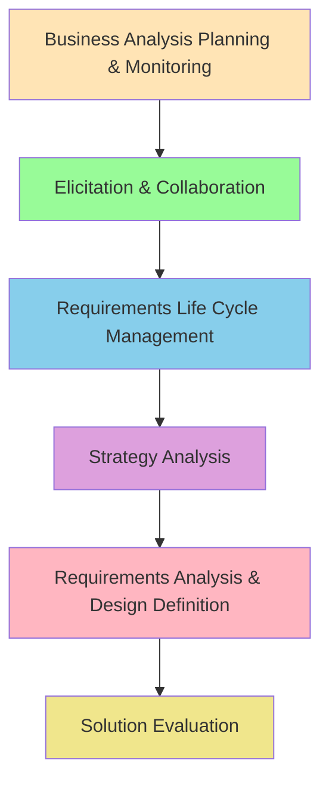

**Key Knowledge Areas for FAB IT:**

1. **Elicitation & Collaboration**
   - Techniques for gathering requirements
   - Stakeholder engagement
   - Communication strategies

2. **Requirements Analysis & Design Definition**
   - Modeling requirements
   - Defining solution options
   - Validating requirements

3. **Requirements Life Cycle Management**
   - Tracing requirements
   - Maintaining requirements
   - Managing changes

### 1.3 Agile Business Analysis

Agile BA adapts traditional BA practices for iterative development.

**Agile BA Principles:**

- **Collaboration over documentation**: Face-to-face communication preferred
- **Working software over comprehensive documentation**: Focus on just enough documentation
- **Customer collaboration over contract negotiation**: Continuous stakeholder involvement
- **Responding to change over following a plan**: Embrace changing requirements

**Agile BA Practices:**

| Practice | Description | FAB Application |
|----------|-------------|-----------------|
| **User Stories** | Short requirement descriptions | "As an operator, I want to see equipment status..." |
| **Story Mapping** | Visual arrangement of user stories | Map operator workflow through shift |
| **Backlog Refinement** | Continuous requirement elaboration | Weekly sessions with Process Engineers |
| **Acceptance Criteria** | Testable conditions for done | "WHEN alarm triggers THEN notification sent within 30 sec" |
| **Sprint Planning** | Iterative delivery planning | 2-week sprints for FAB system features |

### 1.4 Requirements Engineering Lifecycle

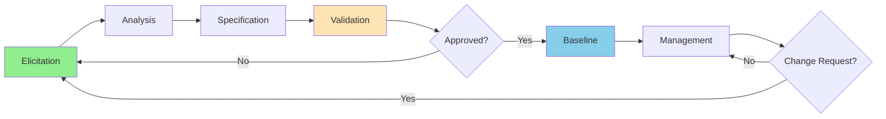

**Lifecycle Phases:**

1. **Elicitation**: Gather requirements from stakeholders
2. **Analysis**: Understand, model, and prioritize requirements
3. **Specification**: Document requirements clearly
4. **Validation**: Confirm requirements with stakeholders
5. **Baseline**: Establish approved requirement set
6. **Management**: Track and control changes

### 1.5 Stakeholder Analysis

Understanding your stakeholders is critical for successful BA.

**Stakeholder Analysis Matrix:**

| Stakeholder | Interest | Influence | Engagement Strategy |
|-------------|----------|-----------|---------------------|
| **Process Engineers** | High | High | Collaborate closely, frequent validation |
| **Equipment Engineers** | High | Medium | Consult regularly, technical reviews |
| **Operators** | High | Low | Inform, usability testing |
| **Production Manager** | High | High | Manage closely, executive updates |
| **IT Manager** | Medium | High | Manage closely, technical alignment |
| **Quality Manager** | Medium | Medium | Keep informed, quality reviews |

**Power/Interest Grid:**

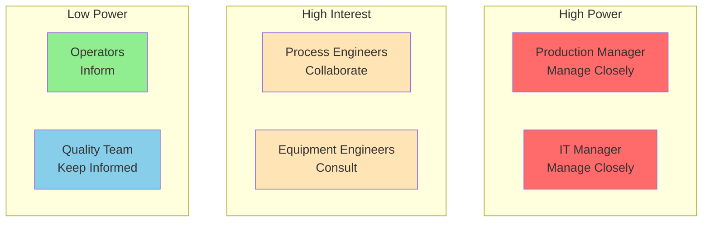

---

## 2. Requirement Elicitation Techniques

Elicitation is the process of discovering requirements from stakeholders and other sources.

### 2.1 Interviews

One-on-one or small group conversations to gather detailed requirements.

**Interview Types:**

1. **Structured**: Predefined questions, consistent across interviewees
2. **Unstructured**: Open-ended, exploratory conversation
3. **Semi-structured**: Mix of prepared questions and follow-up exploration

**Interview Best Practices:**

**Before the Interview:**
- Research the stakeholder's role and responsibilities
- Prepare questions based on domain knowledge
- Schedule adequate time (60-90 minutes)
- Send agenda in advance

**During the Interview:**
- Start with open-ended questions
- Listen actively, take notes
- Ask "why" to understand underlying needs
- Use domain terminology appropriately
- Confirm understanding by paraphrasing
- Avoid leading questions

**After the Interview:**
- Document findings immediately
- Identify gaps and follow-up questions
- Share notes with interviewee for validation
- Update requirements documentation

**Sample Interview Questions for FAB IT Projects:**

**Opening Questions:**
- "Can you walk me through your typical day/workflow?"
- "What are the biggest challenges you face in your role?"
- "What information do you need to make decisions?"

**Process Questions:**
- "How do you currently perform [specific task]?"
- "What happens when [exception scenario]?"
- "How long does [process] typically take?"

**Pain Point Questions:**
- "What frustrates you most about the current system?"
- "Where do you spend the most time on manual work?"
- "What causes delays in your workflow?"

**Solution Questions:**
- "If you could change one thing, what would it be?"
- "What would success look like for this project?"
- "How would you measure improvement?"

**FAB-Specific Questions:**
- "What equipment data do you need in real-time?"
- "How do you currently detect process excursions?"
- "What triggers you to investigate a lot?"

### 2.2 Workshops and Facilitated Sessions

Group sessions to gather requirements from multiple stakeholders simultaneously.

**Workshop Benefits:**
- Efficient use of time (multiple stakeholders)
- Build consensus and shared understanding
- Identify conflicts early
- Foster collaboration

**Workshop Types:**

1. **Requirements Workshop**: Elicit and prioritize requirements
2. **Process Mapping Workshop**: Document current and future processes
3. **Design Workshop**: Explore solution options
4. **Validation Workshop**: Review and approve requirements

**Workshop Structure:**

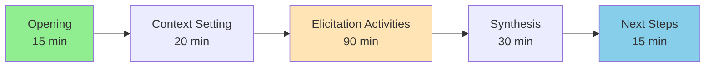

**Facilitation Techniques:**

- **Brainstorming**: Generate ideas without judgment
- **Affinity Grouping**: Organize ideas into themes
- **Dot Voting**: Prioritize items democratically
- **Round Robin**: Ensure everyone contributes
- **Parking Lot**: Capture off-topic items for later

**Workshop Best Practices:**

✅ **Do:**
- Set clear objectives and agenda
- Invite right stakeholders (6-12 people ideal)
- Use visual aids (whiteboards, sticky notes)
- Time-box activities
- Document decisions and action items
- Follow up promptly

❌ **Don't:**
- Let one person dominate
- Go off-topic without parking items
- Skip breaks (energy management)
- Leave without clear next steps

### 2.3 Observation and Job Shadowing

Watch stakeholders perform their work to understand actual practices.

**When to Use Observation:**
- Processes are complex or poorly documented
- Stakeholders struggle to articulate their work
- You need to understand context and environment
- Identifying inefficiencies and workarounds

**Observation Approach:**

1. **Passive Observation**: Watch without interrupting
2. **Active Observation**: Ask questions during the process
3. **Participant Observation**: Perform the task yourself (if possible)

**Observation in FAB Context:**

**Example: Observing Operator Workflow**

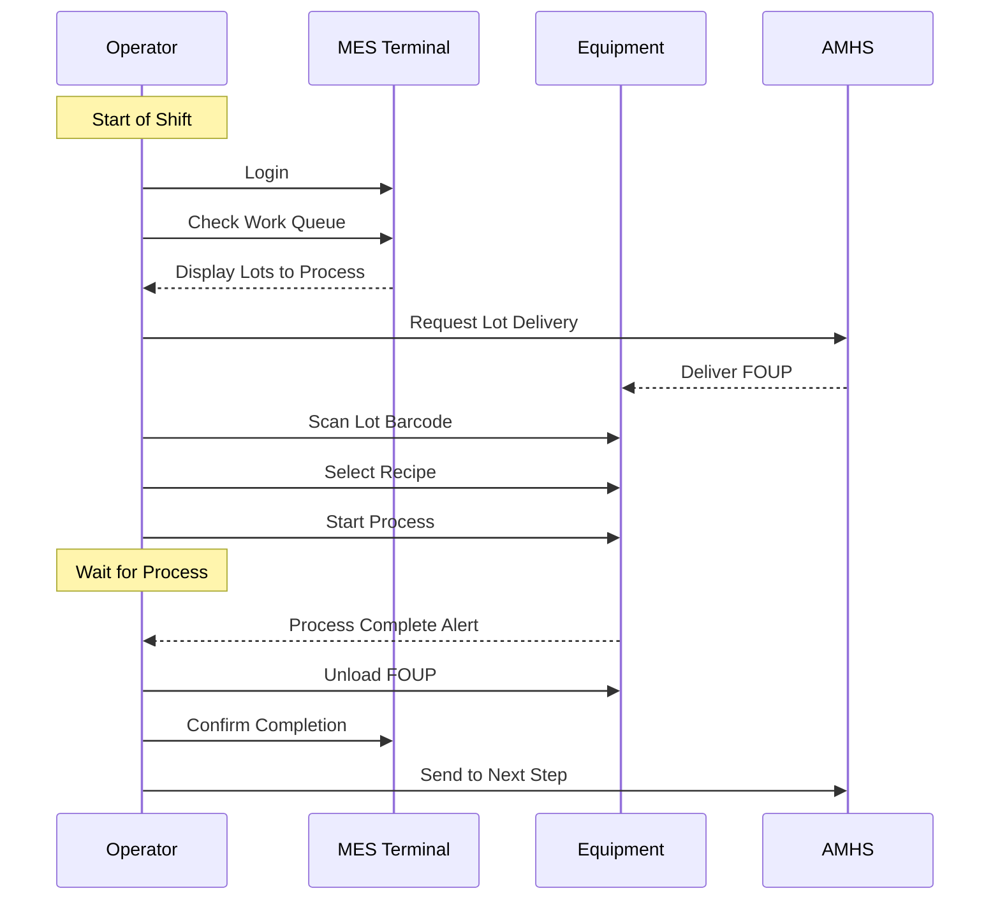

**Observation Notes Template:**

| Time | Activity | System Used | Pain Points | Opportunities |
|------|----------|-------------|-------------|---------------|
| 08:05 | Login to MES | MES Terminal | Slow login (30 sec) | Auto-login with badge |
| 08:06 | Check work queue | MES | Scrolling through long list | Filter by priority |
| 08:10 | Request lot | AMHS | Manual entry of lot ID | Barcode scan |

**Key Insights from Observation:**
- Actual process vs. documented process differences
- Workarounds and manual steps
- Time spent on each activity
- System usability issues
- Environmental constraints

### 2.4 Document Analysis

Review existing documentation to understand current state and requirements.

**Documents to Analyze in FAB:**

| Document Type | Information Gained | Where to Find |
|---------------|-------------------|---------------|
| **Process Specs** | Process parameters, tolerances | Engineering database |
| **Equipment Manuals** | Equipment capabilities, interfaces | Equipment vendor docs |
| **SOP (Standard Operating Procedures)** | Current workflows, responsibilities | Quality management system |
| **Incident Reports** | Problems, root causes | Incident tracking system |
| **Meeting Minutes** | Decisions, action items | SharePoint, email |
| **System Documentation** | Current system architecture | IT documentation |
| **Audit Reports** | Compliance requirements | Quality/compliance team |

**Document Analysis Process:**

1. **Collect**: Gather relevant documents
2. **Review**: Read and understand content
3. **Extract**: Identify requirements and constraints
4. **Validate**: Confirm with stakeholders (documents may be outdated)
5. **Document**: Record findings and sources

### 2.5 Questionnaires and Surveys

Structured data collection from many stakeholders.

**When to Use Surveys:**
- Large number of stakeholders
- Geographically distributed teams
- Quantitative data needed
- Initial broad assessment

**Survey Best Practices:**

✅ **Good Survey Design:**
- Clear, concise questions
- Mix of question types (multiple choice, rating scales, open-ended)
- Logical flow and grouping
- 10-15 minutes to complete
- Anonymous if seeking honest feedback

**Sample Survey Questions for FAB IT:**

**Rating Scale (1-5):**
- "How satisfied are you with current equipment monitoring tools?"
- "How important is real-time alert notification to your role?"

**Multiple Choice:**
- "Which equipment data is most critical for your decision-making?"
  - [ ] Temperature
  - [ ] Pressure
  - [ ] Gas flow rates
  - [ ] Chamber condition
  - [ ] Process time

**Open-Ended:**
- "What manual tasks consume most of your time?"
- "Describe a recent situation where you needed data that wasn't available."

### 2.6 Prototyping and Mockups

Visual representations to elicit feedback on solution concepts.

**Prototype Types:**

| Type | Fidelity | Effort | Use Case |
|------|----------|--------|----------|
| **Paper Sketch** | Low | Low | Initial concept exploration |
| **Wireframe** | Low-Medium | Low | Screen layout and navigation |
| **Clickable Prototype** | Medium | Medium | User flow validation |
| **Working Prototype** | High | High | Detailed interaction testing |

**Prototyping Benefits:**
- Makes abstract concepts concrete
- Identifies usability issues early
- Generates specific feedback
- Builds stakeholder buy-in

**Example: Equipment Dashboard Mockup**

```
+----------------------------------------------------------+
|  [Logo]  Equipment Monitoring Dashboard         [User ▼] |
+----------------------------------------------------------+
|                                                          |
|  Equipment Status Overview                    [Refresh]  |
|  +----------------+  +----------------+  +--------------+|
|  | 🟢 Running: 12 |  | 🟡 Idle: 5     |  | 🔴 Alarm: 2 ||
|  +----------------+  +----------------+  +--------------+|
|                                                          |
|  Critical Alerts                              [View All] |
|  +------------------------------------------------------+|
|  | 🔴 ETCH-12  Chamber pressure out of spec   [Details] ||
|  | 🔴 CVD-08   Temperature alarm              [Details] ||
|  +------------------------------------------------------+|
|                                                          |
|  Equipment List                    [Filter ▼] [Search]  |
|  +------------------------------------------------------+|
|  | ID      | Type  | Status  | Lot      | Utilization  ||
|  |---------|-------|---------|----------|---------------||
|  | LITHO-05| Scan  | Running | LOT-001  | ████████ 85% ||
|  | ETCH-12 | Etch  | Alarm   | LOT-003  | ████░░░░ 45% ||
|  | CVD-08  | Dep   | Alarm   | -        | ░░░░░░░░  0% ||
|  +------------------------------------------------------+|
+----------------------------------------------------------+
```

**Mockup Review Questions:**
- "Does this show the information you need?"
- "Is anything missing?"
- "What would you click first?"
- "How would you use this in your daily work?"

---


## 3. Requirement Documentation

### 3.1 User Stories

User stories are short, simple descriptions of a feature from the user's perspective.

**User Story Format:**

```
As a [role/persona]
I want [capability/feature]
So that [benefit/value]
```

**FAB IT User Story Examples:**

**Example 1: Process Engineer**
```
As a Process Engineer
I want to view real-time equipment parameter trends
So that I can quickly identify process excursions and take corrective action
```

**Example 2: Equipment Engineer**
```
As an Equipment Engineer
I want to receive predictive maintenance alerts
So that I can schedule maintenance before equipment failures occur
```

**Example 3: Operator**
```
As an Operator
I want to scan lot barcodes to automatically load recipes
So that I can reduce manual entry errors and save time
```

**INVEST Criteria for Good User Stories:**

- **I**ndependent: Can be developed separately
- **N**egotiable: Details can be discussed
- **V**aluable: Delivers value to users
- **E**stimable: Can estimate effort
- **S**mall: Completable in one sprint
- **T**estable: Clear acceptance criteria

### 3.2 Acceptance Criteria (EARS Format)

Acceptance criteria define when a user story is complete. EARS (Easy Approach to Requirements Syntax) provides structured templates.

**EARS Templates:**

1. **Ubiquitous (Always Active)**
   ```
   The [system] SHALL [action]
   ```
   Example: "The system SHALL log all user actions"

2. **Event-Driven**
   ```
   WHEN [trigger] THEN the [system] SHALL [action]
   ```
   Example: "WHEN equipment alarm triggers THEN the system SHALL send notification within 30 seconds"

3. **State-Driven**
   ```
   WHILE [state] the [system] SHALL [action]
   ```
   Example: "WHILE equipment is in PROCESSING state the system SHALL collect data every 1 second"

4. **Optional Feature**
   ```
   WHERE [feature is included] the [system] SHALL [action]
   ```
   Example: "WHERE advanced analytics is enabled the system SHALL calculate OEE"

5. **Unwanted Behavior**
   ```
   IF [condition] THEN the [system] SHALL [action]
   ```
   Example: "IF connection to equipment is lost THEN the system SHALL retry 3 times before alerting"

**Complete User Story with Acceptance Criteria:**

```markdown
### User Story: Real-Time Equipment Monitoring

**As a** Process Engineer
**I want** to view real-time equipment parameter trends
**So that** I can quickly identify process excursions and take corrective action

**Acceptance Criteria:**

1. WHEN I select an equipment THEN the system SHALL display parameter trends for the last 4 hours
2. WHEN a parameter exceeds control limits THEN the system SHALL highlight it in red
3. WHILE viewing trends the system SHALL update data every 5 seconds
4. The system SHALL display at minimum: temperature, pressure, gas flow rates, RF power
5. WHEN I hover over a data point THEN the system SHALL show exact value and timestamp
6. IF equipment is not currently processing THEN the system SHALL display "No active process"
7. The system SHALL allow zooming into specific time ranges
8. The system SHALL support exporting trend data to CSV format

**Priority:** High
**Story Points:** 5
**Dependencies:** Equipment SECS/GEM integration complete
```

### 3.3 Use Cases

Use cases describe system behavior from an actor's perspective, focusing on interactions.

**Use Case Template:**

| Field | Description |
|-------|-------------|
| **Use Case ID** | UC-001 |
| **Use Case Name** | Monitor Equipment Status |
| **Actor(s)** | Process Engineer (Primary), Equipment Engineer (Secondary) |
| **Preconditions** | User is logged in, Equipment is connected to system |
| **Trigger** | User navigates to equipment monitoring page |
| **Basic Flow** | 1. System displays list of all equipment<br/>2. User selects equipment from list<br/>3. System retrieves current status from equipment<br/>4. System displays equipment state, current lot, and key parameters<br/>5. User views real-time parameter trends<br/>6. System updates display every 5 seconds |
| **Alternative Flows** | **Alt 1 - Equipment Offline:**<br/>3a. System detects equipment is offline<br/>3b. System displays "Equipment Offline" message<br/>3c. System shows last known status with timestamp<br/><br/>**Alt 2 - Filter by Status:**<br/>2a. User applies status filter (Running, Idle, Alarm)<br/>2b. System displays only equipment matching filter |
| **Exception Flows** | **Exc 1 - Communication Error:**<br/>3a. System fails to retrieve status after 3 retries<br/>3b. System displays error message<br/>3c. System logs error for troubleshooting<br/>3d. Use case ends |
| **Postconditions** | User has current view of equipment status |
| **Business Rules** | BR-001: Only authorized users can view equipment data<br/>BR-002: Data must be refreshed at least every 10 seconds |
| **Non-Functional Requirements** | NFR-001: Response time < 2 seconds<br/>NFR-002: Support 50 concurrent users |

**Use Case Diagram:**

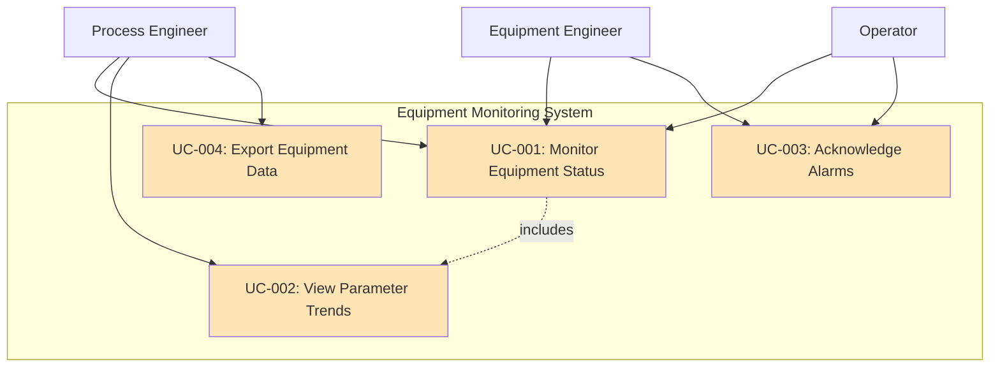

### 3.4 Functional vs. Non-Functional Requirements

**Functional Requirements (FR):** What the system must do

**Examples:**
- FR-001: The system SHALL display equipment status (Running, Idle, Alarm, PM, Down)
- FR-002: The system SHALL allow users to filter equipment by status
- FR-003: The system SHALL send email notifications when alarms occur
- FR-004: The system SHALL log all user actions for audit purposes

**Non-Functional Requirements (NFR):** How the system must perform

**Categories:**

| Category | Description | FAB Examples |
|----------|-------------|--------------|
| **Performance** | Speed, throughput, capacity | Response time < 2 sec, Support 1000 equipment |
| **Availability** | Uptime, reliability | 99.9% uptime (8.76 hours downtime/year) |
| **Scalability** | Growth capacity | Support 50% equipment growth without redesign |
| **Security** | Access control, data protection | Role-based access, encrypted communication |
| **Usability** | Ease of use, learnability | Operators can use with < 30 min training |
| **Maintainability** | Ease of updates, debugging | Modular design, comprehensive logging |
| **Compatibility** | Integration, standards | SECS/GEM compliant, SEMI E30 GEM300 |
| **Compliance** | Regulatory requirements | 21 CFR Part 11 for pharma FABs |

**NFR Examples:**

- NFR-001: The system SHALL respond to user requests within 2 seconds for 95% of transactions
- NFR-002: The system SHALL be available 99.9% of the time (excluding planned maintenance)
- NFR-003: The system SHALL support 100 concurrent users without performance degradation
- NFR-004: The system SHALL encrypt all data in transit using TLS 1.3
- NFR-005: The system SHALL comply with SEMI E30 GEM standard for equipment communication
- NFR-006: The system SHALL maintain audit logs for 7 years

### 3.5 Requirements Traceability

Traceability links requirements to their sources and to design/test artifacts.

**Traceability Matrix:**

| Req ID | Requirement | Source | User Story | Design Element | Test Case | Status |
|--------|-------------|--------|------------|----------------|-----------|--------|
| FR-001 | Display equipment status | Interview PE-01 | US-005 | Dashboard Component | TC-012 | Approved |
| FR-002 | Filter by status | Workshop 2024-01-15 | US-005 | Filter Service | TC-013 | Approved |
| NFR-001 | Response < 2 sec | SLA Document | US-005 | Caching Layer | TC-045 | Approved |

**Traceability Benefits:**
- Impact analysis for changes
- Verification that all requirements are addressed
- Test coverage validation
- Regulatory compliance (audit trail)

**Traceability Flow:**

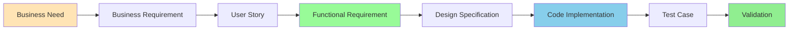

---

## 4. Business Process Modeling

### 4.1 Why Model Processes?

Process models visualize workflows, making them easier to understand, analyze, and improve.

**Benefits:**
- Shared understanding among stakeholders
- Identify inefficiencies and bottlenecks
- Document current state (As-Is)
- Design future state (To-Be)
- Training and onboarding
- Process improvement initiatives

### 4.2 Business Process Model and Notation (BPMN)

BPMN is the standard notation for process modeling.

**Core BPMN Elements:**

| Element | Symbol | Description |
|---------|--------|-------------|
| **Event** | ○ | Something that happens (start, end, intermediate) |
| **Activity** | ▭ | Work performed (task, subprocess) |
| **Gateway** | ◇ | Decision point or merge |
| **Sequence Flow** | → | Order of activities |
| **Message Flow** | ⇢ | Communication between participants |
| **Pool** | ▭▭▭ | Participant (organization, role) |
| **Lane** | ▭ | Sub-partition within pool |

**BPMN Gateway Types:**

- **Exclusive (XOR)**: One path taken based on condition
- **Parallel (AND)**: All paths taken simultaneously
- **Inclusive (OR)**: One or more paths taken

**Simple BPMN Example: Lot Processing**

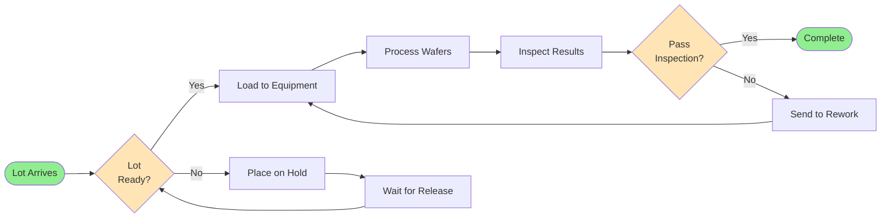

### 4.3 Swimlane Diagrams

Swimlanes show which participant performs each activity.

**Swimlane Example: Equipment Alarm Response**

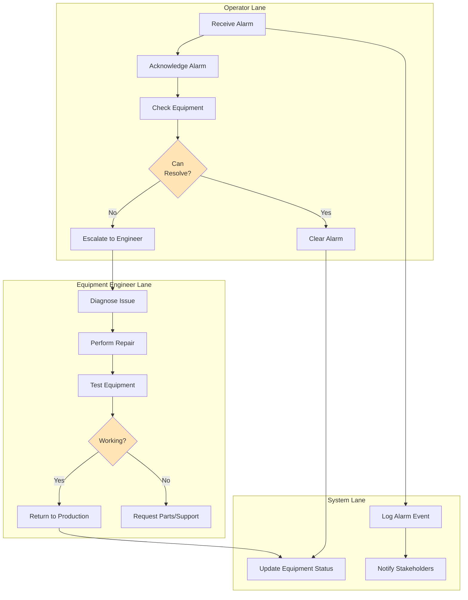

### 4.4 Value Stream Mapping

Value Stream Mapping identifies value-added and non-value-added activities.

**Value Stream Components:**

- **Process Steps**: Activities performed
- **Cycle Time**: Time to complete activity
- **Wait Time**: Time between activities
- **Value-Added Time**: Time that adds value to customer
- **Lead Time**: Total time from start to finish

**Example: Lot Processing Value Stream**

```
Process:     [Clean] → [Wait] → [Litho] → [Wait] → [Etch] → [Wait] → [Inspect]
Cycle Time:    15m      45m      60m      30m      90s      20m       20m
Value-Added:   15m       0       60m       0       90s       0        20m
Lead Time:    ←――――――――――――――――――――― 3h 11m ―――――――――――――――――――――→
VA Ratio:     95.5m / 191m = 50%
```

**Improvement Opportunities:**
- Reduce wait times (batch processing, AMHS optimization)
- Eliminate non-value-added steps
- Parallel processing where possible

### 4.5 As-Is vs. To-Be Process Modeling

**As-Is Process:** Current state with problems

**Example: Manual Equipment Status Checking**

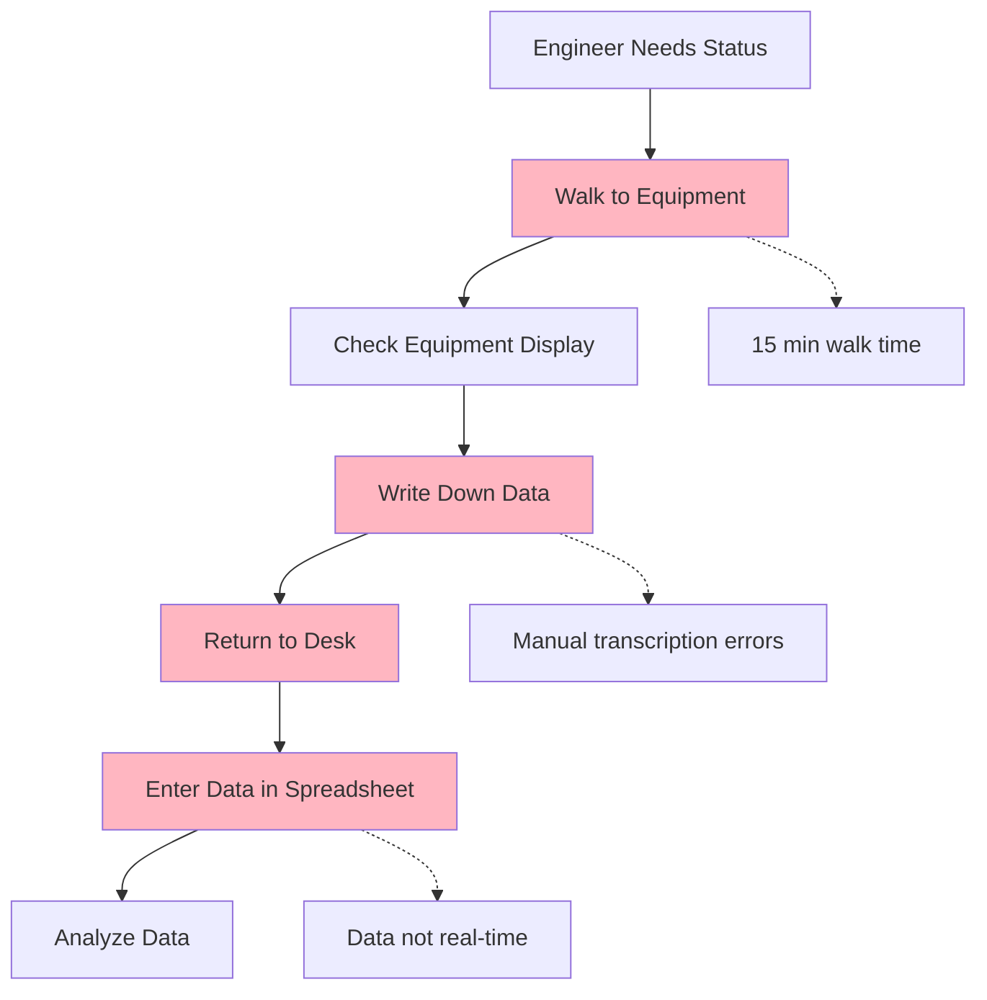

**To-Be Process:** Future state with improvements

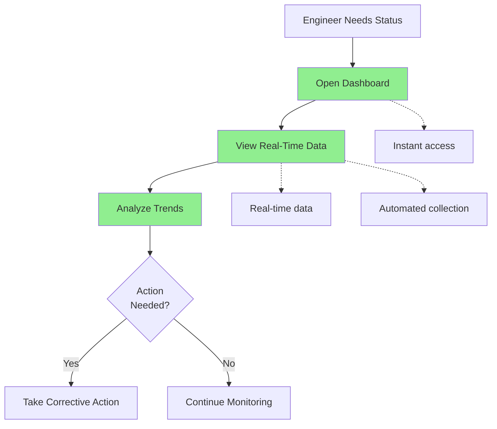

**Benefits Quantification:**

| Metric | As-Is | To-Be | Improvement |
|--------|-------|-------|-------------|
| Time to access data | 15 min | 10 sec | 99% reduction |
| Data accuracy | 95% (manual errors) | 99.9% (automated) | 5% improvement |
| Data freshness | 30+ min old | Real-time | Immediate |
| Engineer productivity | 10 checks/day | 50 checks/day | 5x increase |

---

## 5. FAB-Specific BA Considerations

### 5.1 Real-Time Data Requirements

FAB operations require real-time or near-real-time data for decision-making.

**Real-Time Scenarios:**

| Scenario | Latency Requirement | Rationale |
|----------|-------------------|-----------|
| **Equipment Alarm** | < 30 seconds | Immediate response needed to prevent scrap |
| **Process Parameter Monitoring** | 1-5 seconds | Detect excursions during processing |
| **Equipment Status** | 5-10 seconds | Dispatching and scheduling decisions |
| **Lot Location** | 10-30 seconds | Material tracking and flow management |
| **SPC Charting** | 1-5 minutes | Process control decisions |

**Requirements Documentation:**

```markdown
**NFR-010: Real-Time Data Collection**

WHILE equipment is in PROCESSING state the system SHALL collect process data every 1 second

**NFR-011: Alarm Notification Latency**

WHEN equipment alarm occurs THEN the system SHALL deliver notification to relevant users within 30 seconds

**NFR-012: Dashboard Refresh**

The system SHALL refresh equipment status displays every 5 seconds without user interaction
```

### 5.2 Equipment State Management

Equipment can be in various states, and state transitions must be tracked.

**Equipment State Model:**

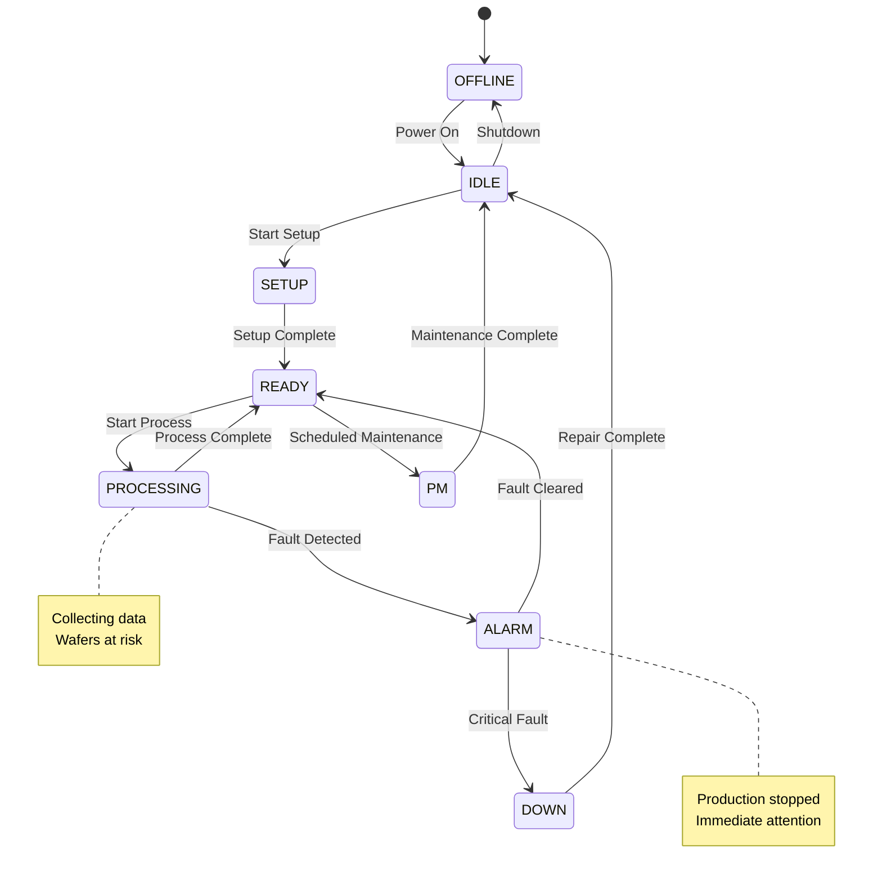

**State-Based Requirements:**

```markdown
**FR-015: Equipment State Tracking**

The system SHALL track and display equipment state (OFFLINE, IDLE, SETUP, READY, PROCESSING, ALARM, PM, DOWN)

**FR-016: State Transition Logging**

WHEN equipment state changes THEN the system SHALL log the transition with timestamp, previous state, new state, and reason

**FR-017: State-Based Alerts**

WHEN equipment transitions to ALARM or DOWN state THEN the system SHALL send immediate notification to Equipment Engineer and Operator

**BR-005: Processing State Data Collection**

WHILE equipment is in PROCESSING state the system SHALL collect all configured process parameters
```

### 5.3 Recipe and Process Control

Recipes define how equipment processes wafers and must be managed carefully.

**Recipe Management Requirements:**

```markdown
**FR-020: Recipe Storage**

The system SHALL store recipes with version control and change history

**FR-021: Recipe Distribution**

The system SHALL distribute recipes to equipment via SECS/GEM (S7F1/F2 messages)

**FR-022: Recipe Execution Tracking**

WHEN equipment executes a recipe THEN the system SHALL log recipe ID, version, start time, end time, and lot ID

**FR-023: Recipe Deviation Detection**

IF actual process parameters deviate from recipe by more than configured tolerance THEN the system SHALL trigger alarm

**BR-010: Recipe Approval**

Only Process Engineers with appropriate authorization SHALL approve recipe changes
```

**Recipe Lifecycle:**

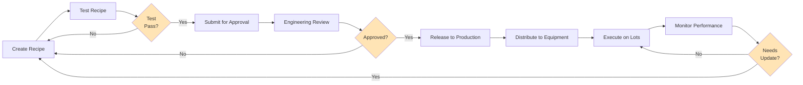

### 5.4 Lot Tracking and Genealogy

Complete traceability of wafer processing history is critical for quality and yield.

**Genealogy Requirements:**

```markdown
**FR-030: Lot Tracking**

The system SHALL track lot location and status throughout the FAB in real-time

**FR-031: Process History**

The system SHALL record complete process history for each lot including:
- Equipment used
- Recipe executed
- Process parameters
- Start and end times
- Operator ID
- Inspection results

**FR-032: Wafer-Level Tracking**

The system SHALL support wafer-level tracking within lots for critical processes

**FR-033: Material Genealogy Query**

The system SHALL allow users to query complete genealogy for any lot or wafer including:
- All process steps
- Equipment used
- Process parameters
- Inspection results
- Rework history

**NFR-020: Genealogy Data Retention**

The system SHALL retain genealogy data for minimum 7 years
```

**Genealogy Data Model:**

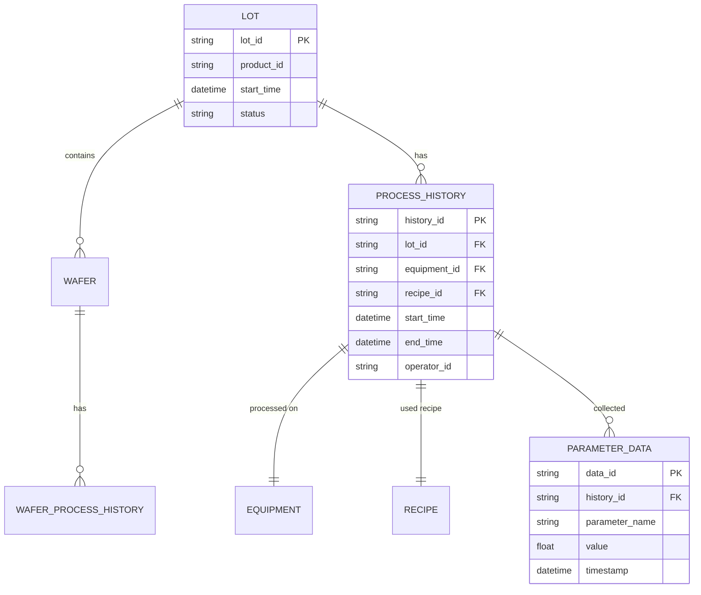

### 5.5 Quality and SPC Requirements

Statistical Process Control monitors process stability.

**SPC Requirements:**

```markdown
**FR-040: SPC Data Collection**

The system SHALL collect measurement data from metrology equipment and manual entry

**FR-041: Control Chart Generation**

The system SHALL generate control charts (X-bar, R, EWMA, CUSUM) for configured parameters

**FR-042: Out-of-Control Detection**

WHEN measurement violates control rules THEN the system SHALL:
- Highlight the violation on the chart
- Send alert to Process Engineer
- Log the event
- Optionally place lot on hold

**FR-043: Control Limit Calculation**

The system SHALL calculate control limits using configurable methods:
- Fixed limits (specification limits)
- Statistical limits (mean ± 3σ)
- Moving average limits

**BR-015: Western Electric Rules**

The system SHALL detect out-of-control conditions using Western Electric Rules:
- Rule 1: One point beyond 3σ
- Rule 2: Two out of three consecutive points beyond 2σ
- Rule 3: Four out of five consecutive points beyond 1σ
- Rule 4: Eight consecutive points on one side of center line
```

**SPC Workflow:**

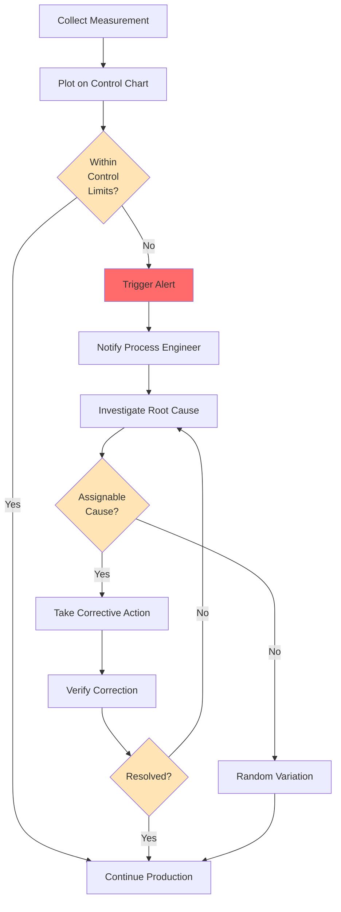

---


## 6. Recommended Reading Materials

### 6.1 Essential Books

1. **"A Guide to the Business Analysis Body of Knowledge (BABOK Guide)" - IIBA**
   - **Why Read It**: International standard for BA practice
   - **Key Topics**: All BA knowledge areas, techniques, competencies
   - **Level**: Intermediate
   - **Pages**: ~500 pages
   - **Recommendation**: Read Chapters on Elicitation, Requirements Analysis, and Requirements Life Cycle Management

2. **"User Stories Applied: For Agile Software Development" by Mike Cohn**
   - **Why Read It**: Definitive guide to user stories
   - **Key Topics**: Writing user stories, acceptance criteria, story splitting, estimation
   - **Level**: Beginner to Intermediate
   - **Pages**: ~300 pages
   - **Recommendation**: Read Chapters 1-6, 9-11 this week

3. **"Software Requirements" by Karl Wiegers and Joy Beatty**
   - **Why Read It**: Comprehensive requirements engineering reference
   - **Key Topics**: Elicitation, analysis, specification, validation, management
   - **Level**: Intermediate to Advanced
   - **Pages**: ~600 pages
   - **Recommendation**: Read Chapters 1-3, 7-9 for fundamentals

4. **"Business Analysis Techniques: 99 Essential Tools for Success" by James Cadle, Debra Paul, Paul Turner**
   - **Why Read It**: Practical toolkit of BA techniques
   - **Key Topics**: Elicitation, modeling, analysis techniques with examples
   - **Level**: Beginner to Intermediate
   - **Pages**: ~300 pages
   - **Recommendation**: Use as reference for specific techniques

5. **"Mastering the Requirements Process" by Suzanne Robertson and James Robertson**
   - **Why Read It**: Volere requirements process framework
   - **Key Topics**: Requirements discovery, specification, quality
   - **Level**: Intermediate
   - **Pages**: ~500 pages
   - **Recommendation**: Read Chapters on requirements discovery and specification

### 6.2 Agile and User Story Resources

1. **"Agile Estimating and Planning" by Mike Cohn**
   - **Focus**: Story points, velocity, release planning
   - **Recommendation**: Read Chapters 3-6 on user stories and estimation

2. **"User Story Mapping" by Jeff Patton**
   - **Focus**: Visual approach to organizing user stories
   - **Recommendation**: Read Chapters 1-4 on story mapping technique

3. **"Fifty Quick Ideas To Improve Your User Stories" by Gojko Adzic and David Evans**
   - **Focus**: Practical tips for better user stories
   - **Recommendation**: Quick read, actionable advice

### 6.3 Process Modeling Resources

1. **"BPMN Method and Style" by Bruce Silver**
   - **Focus**: BPMN notation and best practices
   - **Recommendation**: Read Chapters 1-5 for BPMN fundamentals

2. **"Business Process Modeling, Simulation and Design" by Manuel Laguna and Johan Marklund**
   - **Focus**: Process modeling techniques and analysis
   - **Recommendation**: Read Chapters on process mapping and analysis

### 6.4 Websites and Online Resources

1. **IIBA - International Institute of Business Analysis**
   - **URL**: www.iiba.org
   - **Content**: BABOK, certifications, webinars, articles
   - **Why Visit**: Professional BA association and standards body
   - **Recommendation**: Explore BABOK knowledge areas and techniques

2. **Modern Analyst**
   - **URL**: www.modernanalyst.com
   - **Content**: Articles, templates, community discussions
   - **Why Visit**: Practical BA resources and community
   - **Recommendation**: Browse article library and download templates

3. **BA Times**
   - **URL**: www.batimes.com
   - **Content**: Articles, case studies, best practices
   - **Why Visit**: Current BA trends and practices
   - **Recommendation**: Subscribe to newsletter

4. **Mountain Goat Software (Mike Cohn's site)**
   - **URL**: www.mountaingoatsoftware.com
   - **Content**: Agile and user story resources, blog
   - **Why Visit**: Excellent user story and agile BA content
   - **Recommendation**: Read blog posts on user stories

5. **Bridging the Gap**
   - **URL**: www.bridging-the-gap.com
   - **Content**: BA training, templates, articles
   - **Why Visit**: Practical BA skills development
   - **Recommendation**: Download requirements templates

6. **BPMN.org**
   - **URL**: www.bpmn.org
   - **Content**: BPMN specification, examples, tools
   - **Why Visit**: Official BPMN standard and resources
   - **Recommendation**: Review BPMN 2.0 specification

### 6.5 Tools and Templates

1. **Requirements Documentation Templates**
   - User story template
   - Use case template
   - Requirements specification template
   - Traceability matrix template
   - Available at: Modern Analyst, Bridging the Gap

2. **Process Modeling Tools**
   - **Lucidchart**: Web-based diagramming (BPMN, flowcharts)
   - **Draw.io**: Free diagramming tool
   - **Mermaid**: Text-based diagrams (what we use in this course)
   - **Visio**: Microsoft diagramming tool
   - **Bizagi Modeler**: Free BPMN tool

3. **Collaboration Tools**
   - **Miro**: Online whiteboard for workshops
   - **Mural**: Digital workspace for collaboration
   - **Confluence**: Documentation and collaboration
   - **Jira**: User story and requirement management

### 6.6 Week 2 Reading Plan

**Priority 1 (Must Read This Week):**
- Mike Cohn "User Stories Applied" - Chapters 1-6 (user story fundamentals)
- BABOK Guide - Elicitation & Collaboration chapter
- Modern Analyst - 3-5 articles on requirement elicitation

**Priority 2 (Recommended):**
- Wiegers "Software Requirements" - Chapters 1-3
- BPMN.org - BPMN basics tutorial
- Mountain Goat Software - User story blog posts

**Priority 3 (Optional/Reference):**
- Cadle "Business Analysis Techniques" - Relevant technique chapters
- Robertson "Mastering the Requirements Process" - Discovery chapters
- BA Times - Recent case studies

---

## 7. Week 2 Case Study

### Case Study: Equipment Performance Monitoring System - Requirements Analysis

**Scenario:**

Building on your Week 1 understanding of FAB processes, you're now tasked with gathering and documenting requirements for a new Equipment Performance Monitoring System. The Process Engineering team has requested this system to improve their ability to monitor equipment health and predict failures.

**Background:**

FabTech Semiconductor currently has 150 pieces of production equipment across various process types (Lithography, Etch, Deposition, CMP, etc.). Process Engineers and Equipment Engineers spend significant time manually checking equipment status, reviewing logs, and responding to alarms. They want a centralized system that provides:

- Real-time equipment status visibility
- Predictive maintenance alerts
- Performance trending and analytics
- Automated alarm management

**Your Assignment:**

Conduct a comprehensive requirements analysis and produce a Requirements Specification Document using the SA template.

**Stakeholder Information:**

You have access to the following stakeholders:

1. **Sarah Chen - Senior Process Engineer**
   - 10 years experience
   - Responsible for etch and deposition processes
   - Pain points: Spends 2 hours/day checking equipment, reactive to problems
   - Wants: Proactive alerts, trend analysis, mobile access

2. **Mike Rodriguez - Equipment Engineering Manager**
   - 15 years experience
   - Manages team of 8 equipment engineers
   - Pain points: Unplanned downtime, inefficient maintenance scheduling
   - Wants: Predictive maintenance, equipment health scoring, maintenance tracking

3. **Lisa Wang - Operator (Day Shift Lead)**
   - 5 years experience
   - Operates lithography and track equipment
   - Pain points: Unclear alarm priorities, manual data entry
   - Wants: Simple interface, clear instructions, quick alarm acknowledgment

4. **David Kim - IT Manager**
   - Constraints: Must integrate with existing MES, limited budget
   - Requirements: Secure, scalable, maintainable, SEMI standards compliant

**Simulated Interview Transcripts:**

**Interview with Sarah Chen (Process Engineer):**

*Q: Can you walk me through how you currently monitor equipment?*

"I start my day by walking through the FAB, checking each piece of equipment. I look at the equipment displays, check if there are any alarms, and review the process logs. This takes about an hour. Then throughout the day, I get calls from operators about issues, and I have to go investigate. I also check our MES system, but it doesn't show real-time data—there's usually a 15-30 minute delay. By the time I see a problem in MES, it's already impacted several wafers."

*Q: What information do you need to make decisions?*

"I need to see equipment state, current process parameters, and trends over time. For example, if I see chamber pressure drifting upward over the past week, I know we need to schedule a chamber clean before it causes defects. I also need to know which lot is currently processing on each tool, so I can assess the impact if there's a problem."

*Q: What would success look like for this new system?*

"I should be able to open a dashboard on my computer or phone and immediately see the status of all my equipment. If something is trending toward a problem, I want an alert before it impacts product. I want to be able to drill down into parameter trends for the past 24 hours, week, or month. And I want to export data for analysis in Excel or JMP."

**Interview with Mike Rodriguez (Equipment Engineer):**

*Q: What are your biggest challenges with equipment maintenance?*

"We're too reactive. Equipment breaks down, we fix it, repeat. We don't have good visibility into equipment health, so we can't predict failures. We do preventive maintenance on a fixed schedule, but that's not optimal—some equipment needs more frequent PM, others less. We also don't have a good system for tracking maintenance history and correlating it with equipment performance."

*Q: What data would help you predict failures?*

"We need to track equipment health indicators over time—things like pump current, RF hours, chamber condition sensors. When these start trending out of normal range, it's a sign that failure is coming. We also need to track Mean Time Between Failures (MTBF) and Mean Time To Repair (MTTR) by equipment and subsystem. And we need to correlate equipment performance with process results—if yield drops on a specific tool, we need to investigate."

*Q: How would you use predictive maintenance alerts?*

"If the system alerts me that a pump is showing signs of failure, I can schedule maintenance during the next planned downtime window instead of having an unplanned failure during production. This reduces downtime and prevents scrap. I'd want the alert to include the specific issue, severity, recommended action, and estimated time until failure."

**Workshop Notes (Requirements Workshop - Jan 15, 2025):**

Attendees: Sarah Chen, Mike Rodriguez, Lisa Wang, Tom Johnson (Process Engineer), Amy Lee (Equipment Engineer)

**Brainstorming - Key Features:**
- Real-time equipment status dashboard
- Equipment health scoring (0-100)
- Predictive maintenance alerts
- Parameter trend visualization
- Alarm management (acknowledge, escalate, resolve)
- Mobile app for on-the-go monitoring
- Automated reports (daily, weekly)
- Integration with MES and maintenance system
- Historical data analysis
- Equipment comparison (chamber matching)

**Prioritization (Dot Voting Results):**
1. Real-time status dashboard (15 votes)
2. Predictive maintenance alerts (12 votes)
3. Parameter trend visualization (10 votes)
4. Alarm management (8 votes)
5. Equipment health scoring (7 votes)

**Pain Points Identified:**
- Manual equipment checking wastes 2-3 hours/day per engineer
- Reactive maintenance causes unplanned downtime (avg 5 hours/week)
- Delayed data visibility (15-30 min lag)
- Alarm fatigue (too many low-priority alarms)
- No mobile access (engineers tied to desks)
- Difficult to correlate equipment data with process results

**Success Metrics:**
- Reduce equipment checking time by 80%
- Reduce unplanned downtime by 50%
- Increase equipment availability from 92% to 95%
- Detect 80% of failures before they occur
- Reduce mean time to respond to alarms from 15 min to 5 min

**Your Deliverables:**

Using the System Analysis Document Template, create a comprehensive Requirements Specification that includes:

1. **Executive Summary** (Section 1)
   - Project overview and objectives
   - Key stakeholders and their interests
   - Expected business value

2. **Current State Analysis** (Section 2)
   - As-Is process for equipment monitoring
   - Pain points and challenges (quantified where possible)
   - Existing systems and their limitations

3. **Requirements** (Section 3)
   - **Business Requirements**: High-level business needs
   - **Functional Requirements**: Specific system capabilities (minimum 20 FRs)
   - **Non-Functional Requirements**: Performance, availability, security, etc. (minimum 10 NFRs)
   - **Constraints and Assumptions**

4. **Use Cases and Scenarios** (Section 4)
   - Actor identification
   - Use case diagram showing major use cases
   - Detailed use case descriptions (minimum 3 use cases):
     - UC-001: Monitor Equipment Status
     - UC-002: Respond to Predictive Maintenance Alert
     - UC-003: Analyze Equipment Performance Trends

5. **User Stories** (Create separate section)
   - Write user stories for each stakeholder type (minimum 15 user stories)
   - Include acceptance criteria in EARS format for each story
   - Prioritize stories (High/Medium/Low)
   - Estimate story points (1, 2, 3, 5, 8, 13)

6. **Business Process Models** (Section 5)
   - As-Is process: Current equipment monitoring workflow
   - To-Be process: Future state with new system
   - Swimlane diagram showing interactions between Operator, Engineer, and System
   - Quantify improvements (time savings, efficiency gains)

7. **Requirements Traceability Matrix**
   - Link requirements to stakeholder sources
   - Link requirements to user stories
   - Show priority and status


## 8. Week 2 Summary and Next Steps

### What You've Learned

This week, you've built a comprehensive BA toolkit:

✅ **BA Frameworks**: BABOK knowledge areas, Agile BA practices, requirements lifecycle

✅ **Elicitation Techniques**: Interviews, workshops, observation, document analysis, surveys, prototyping

✅ **Requirement Documentation**: User stories, use cases, acceptance criteria (EARS), functional vs. non-functional requirements

✅ **Process Modeling**: BPMN, swimlanes, value stream mapping, As-Is vs. To-Be

✅ **FAB-Specific BA**: Real-time requirements, equipment state management, recipe control, lot tracking, SPC

✅ **Practical Skills**: How to interview stakeholders, facilitate workshops, write clear requirements

### Self-Assessment Questions

Test your understanding:

1. What are the six BABOK knowledge areas?
2. Explain the difference between structured and unstructured interviews.
3. Write a user story for a FAB operator using proper format.
4. What does EARS stand for and what are the five templates?
5. What is the difference between functional and non-functional requirements?
6. Draw the basic BPMN symbols for event, activity, and gateway.
7. What is a swimlane diagram and when would you use it?
8. Why are real-time requirements critical in FAB operations?
9. What is requirements traceability and why is it important?
10. How would you prioritize conflicting requirements from different stakeholders?

### Preparing for Week 3

Next week, you'll learn System Analysis and IT Architecture—how to translate requirements into technical designs.

**Pre-work for Week 3:**

1. **Complete Week 2 Case Study**: Your requirements will become the design input for Week 3
2. **Read**: "Software Architecture in Practice" by Len Bass - Chapters 1-2
3. **Review**: Your requirements and think about how you would implement them
4. **Explore**: Look at architecture diagrams for systems you use daily

**What's Coming in Week 3:**

- System analysis fundamentals
- IT architecture patterns (layered, microservices, event-driven)
- Design patterns (creational, structural, behavioral)
- FAB IT system landscape (MES, EAP, SPC, FDC integration)
- Technology stack selection
- Information flow modeling
- Case Study: Design the Equipment Performance Monitoring System architecture

### Additional Practice (Optional)

Want to sharpen your BA skills?

1. **Practice Interviews**: Interview a colleague about their work process
2. **Create User Stories**: Write user stories for a system you use daily
3. **Model a Process**: Create a BPMN diagram for a familiar process (e.g., morning routine, ordering food)
4. **Analyze Requirements**: Find a product requirements document online and critique it
5. **Join BA Community**: Participate in Modern Analyst or IIBA forums

### Feedback and Questions

We want to hear from you:

- Which elicitation technique do you find most valuable?
- What aspects of requirement documentation are most challenging?
- How can we improve Week 2 content?
- What questions do you still have?

**Submit feedback**: [Feedback form or email]

---

## Congratulations!

You've completed Week 2 of the FAB IT Training Program. You now have a systematic approach to gathering and documenting requirements from FAB stakeholders.

Next week, you'll learn how to transform these requirements into technical system designs and architectures.

**See you in Week 3!**

---

**Document Version**: 1.0  
**Last Updated**: January 2025  
**Author**: FAB IT Training Program  
**Questions**: [Contact information]
