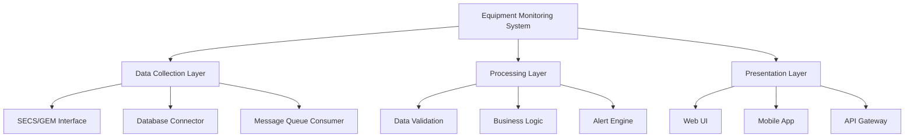
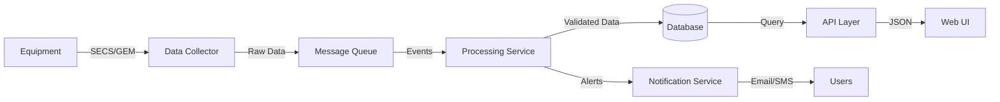
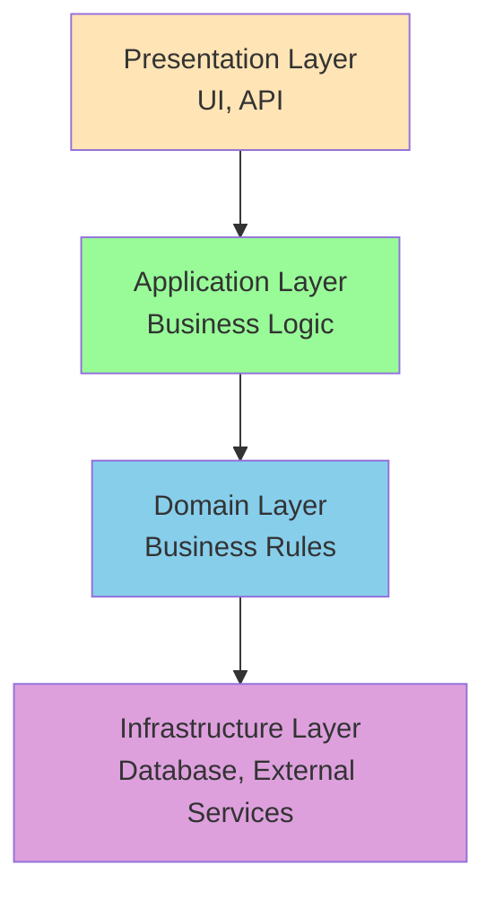
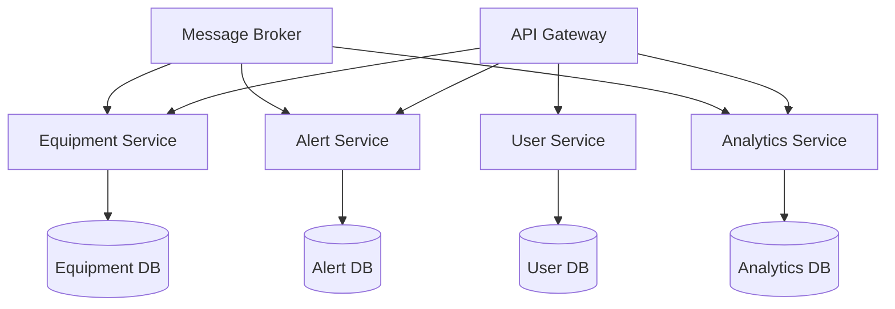
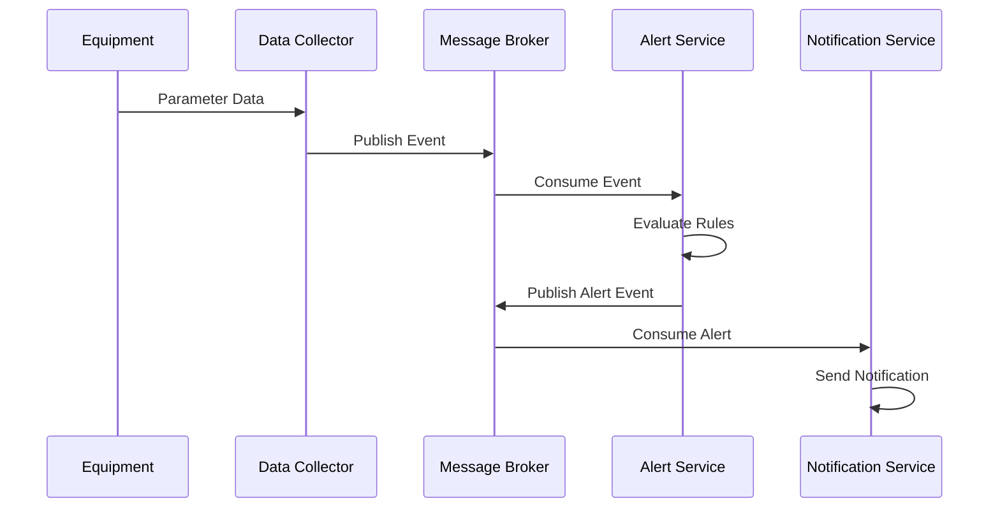
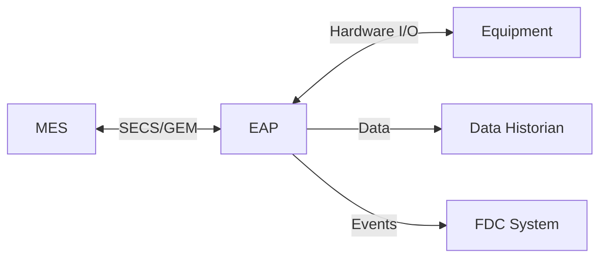
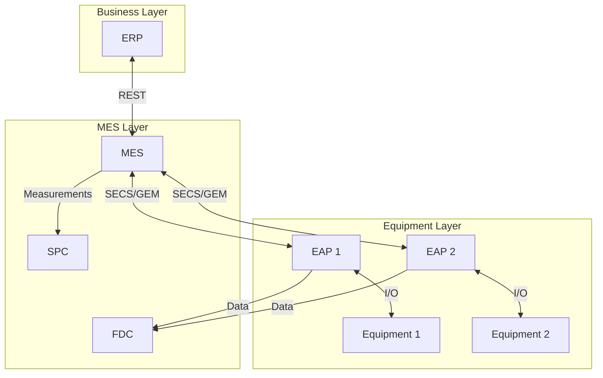
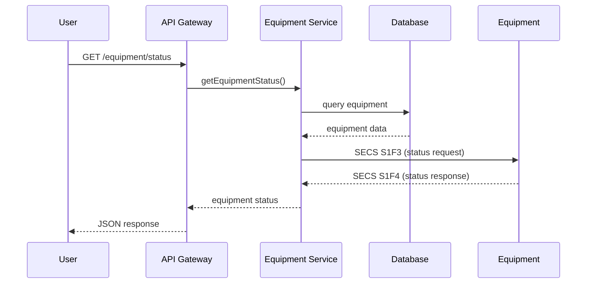
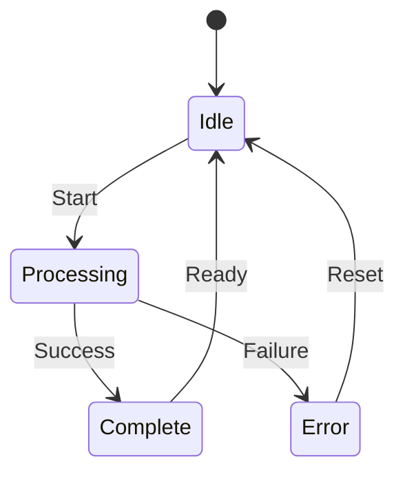
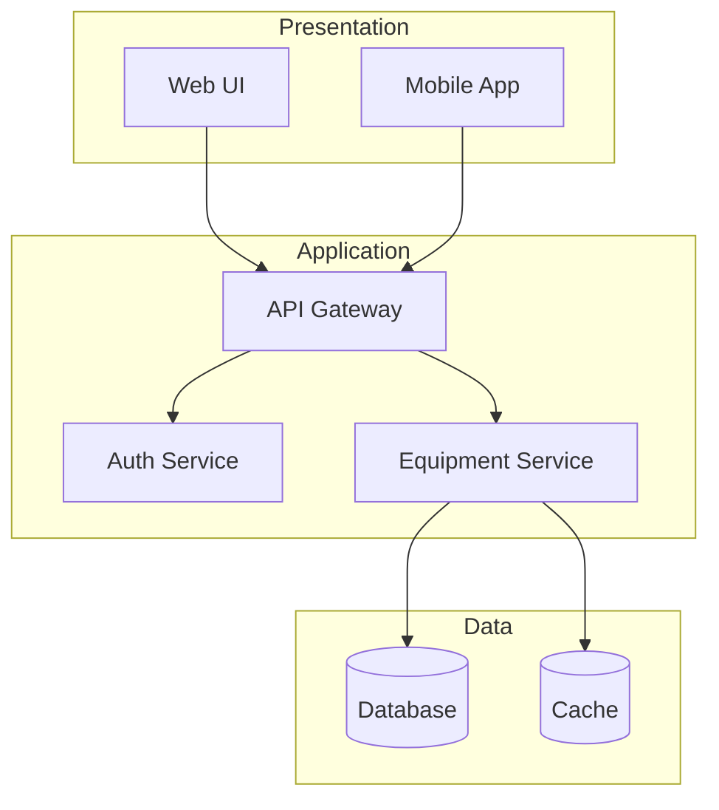

# Week 3: System Analysis & IT Architecture

## Welcome to Week 3

You've built domain knowledge (Week 1) and learned to gather requirements (Week 2). Now comes the exciting part—translating those requirements into technical system designs. This week, you'll learn how to architect IT solutions that meet FAB operational needs while being scalable, maintainable, and integrated with existing systems.

System Analysis and IT Architecture is where business needs meet technical reality. You'll learn to make informed decisions about system structure, technology choices, and integration patterns that will determine the success of your FAB IT projects.

### Why Architecture Matters

Good architecture is invisible—systems just work. Bad architecture is painfully obvious—systems are slow, unreliable, difficult to change, and expensive to maintain.

In FAB environments, architecture decisions have amplified consequences:
- **24/7 Operations**: Downtime costs millions per hour
- **Real-Time Requirements**: Milliseconds matter for process control
- **Integration Complexity**: 100+ systems must work together seamlessly
- **Data Volume**: Terabytes of equipment data daily
- **Longevity**: Systems must operate for 10+ years

By the end of this week, you'll be able to design architectures that address these challenges.

---

## Learning Objectives

By the end of Week 3, you will be able to:

1. **Apply** system analysis techniques to decompose complex problems
2. **Design** IT architectures using appropriate patterns (layered, microservices, event-driven)
3. **Select** design patterns for common problems (Factory, Observer, Adapter, etc.)
4. **Model** information flows using sequence diagrams, data flow diagrams, and state machines
5. **Integrate** with FAB systems (MES, EAP, SPC, FDC) using appropriate patterns
6. **Choose** technology stacks based on requirements and constraints
7. **Document** architectures using multiple diagram types
8. **Evaluate** architecture trade-offs and make justified decisions

---

## Week 3 Structure

| Day | Topic | Duration |
|-----|-------|----------|
| **Day 1** | System Analysis Fundamentals & Architecture Patterns | 3 hours |
| **Day 2** | Design Patterns & FAB System Integration | 3 hours |
| **Day 3** | Technology Stack Selection & Information Flow Modeling | 3 hours |
| **Day 4** | Architecture Documentation & Trade-off Analysis | 3 hours |
| **Day 5** | Case Study & Deliverable Workshop | 4 hours |

---

## 1. System Analysis Fundamentals

### 1.1 System Thinking

System thinking views problems holistically, understanding components and their interactions.

**Key Principles:**
- **Holistic View**: See the whole, not just parts
- **Interconnections**: Understand relationships between components
- **Feedback Loops**: Recognize how outputs influence inputs
- **Emergence**: System behavior emerges from component interactions

### 1.2 Functional Decomposition

Break complex systems into manageable components.

**Decomposition Process:**



### 1.3 Interface Identification

Identify all system boundaries and interaction points.

**Interface Types:**
- **User Interfaces**: Human-system interaction
- **System Interfaces**: System-to-system communication
- **Hardware Interfaces**: Software-hardware interaction
- **Network Interfaces**: Communication protocols

### 1.4 Data Flow Analysis

Understand how data moves through the system.



---

## 2. IT Architecture Patterns

### 2.1 Layered Architecture

Organize system into horizontal layers with specific responsibilities.

**Typical Layers:**



**Benefits:**
- Clear separation of concerns
- Easy to understand and maintain
- Testable layers independently
- Standard pattern, familiar to developers

**Drawbacks:**
- Can become monolithic
- Performance overhead from layer traversal
- Tight coupling between layers

**FAB Application**: Traditional MES systems often use layered architecture.

### 2.2 Microservices Architecture

Decompose system into small, independent services.



**Benefits:**
- Independent deployment and scaling
- Technology diversity (different languages/frameworks per service)
- Fault isolation
- Team autonomy

**Drawbacks:**
- Increased complexity (distributed system)
- Network latency
- Data consistency challenges
- Operational overhead

**FAB Application**: Modern cloud-based FAB analytics platforms.

### 2.3 Event-Driven Architecture

System reacts to events asynchronously.



**Benefits:**
- Loose coupling
- Scalability
- Real-time responsiveness
- Flexibility (add consumers without changing producers)

**Drawbacks:**
- Complexity in debugging
- Event ordering challenges
- Eventual consistency

**FAB Application**: Real-time equipment monitoring, FDC systems.

### 2.4 Service-Oriented Architecture (SOA)

Organize functionality as reusable services.

**Key Concepts:**
- **Service**: Self-contained business functionality
- **Contract**: Well-defined interface
- **Loose Coupling**: Services independent
- **Reusability**: Services used by multiple consumers

**FAB Application**: Enterprise integration (MES, ERP, WMS).

---

## 3. Design Patterns

### 3.1 Creational Patterns

**Factory Pattern**: Create objects without specifying exact class.

```
Use Case: Create different equipment interface implementations based on equipment type
- LithographyEquipmentInterface
- EtchEquipmentInterface
- DepositionEquipmentInterface
```

**Singleton Pattern**: Ensure only one instance exists.

```
Use Case: Database connection pool, configuration manager
```

**Builder Pattern**: Construct complex objects step by step.

```
Use Case: Build complex SECS messages with multiple parameters
```

### 3.2 Structural Patterns

**Adapter Pattern**: Make incompatible interfaces work together.

```
Use Case: Adapt legacy equipment protocol to modern REST API
```

**Facade Pattern**: Provide simplified interface to complex subsystem.

```
Use Case: Simple API for complex SECS/GEM communication
```

**Proxy Pattern**: Control access to an object.

```
Use Case: Cache equipment data, control access to equipment
```

### 3.3 Behavioral Patterns

**Observer Pattern**: Notify multiple objects of state changes.

```
Use Case: Multiple dashboards subscribe to equipment status updates
```

**Strategy Pattern**: Select algorithm at runtime.

```
Use Case: Different alert strategies based on severity
```

**Command Pattern**: Encapsulate requests as objects.

```
Use Case: Queue equipment commands for execution
```

---

## 4. FAB IT System Landscape

### 4.1 Manufacturing Execution System (MES)

**Core Functions:**
- Production scheduling and dispatching
- Material tracking
- Quality management
- Equipment management

**Integration Points:**
- Equipment (SECS/GEM)
- ERP (orders, inventory)
- WMS (material movement)
- SPC (quality data)

### 4.2 Equipment Automation Program (EAP)

**Functions:**
- Equipment control
- Recipe execution
- Data collection
- SECS/GEM communication

**Integration Pattern:**



### 4.3 Statistical Process Control (SPC)

**Functions:**
- Control chart generation
- Out-of-control detection
- Trend analysis

**Data Sources:**
- Metrology equipment
- In-line inspection
- Manual measurements

### 4.4 Fault Detection and Classification (FDC)

**Functions:**
- Real-time monitoring
- Anomaly detection
- Predictive maintenance

**Techniques:**
- Statistical models
- Machine learning
- Pattern recognition

### 4.5 Integration Architecture



---

## 5. Technology Stack Selection

### 5.1 Programming Languages

| Language | Strengths | FAB Use Cases |
|----------|-----------|---------------|
| **Java** | Enterprise, robust, SECS/GEM libraries | MES, EAP, integration |
| **C#/.NET** | Windows integration, performance | Equipment control, desktop apps |
| **Python** | Data analysis, ML, rapid development | Analytics, FDC, scripting |
| **JavaScript/TypeScript** | Web UIs, full-stack | Dashboards, web apps |
| **C/C++** | Performance, hardware control | Real-time control, drivers |

### 5.2 Databases

| Type | Examples | FAB Use Cases |
|------|----------|---------------|
| **Relational** | PostgreSQL, Oracle, SQL Server | Transactional data, genealogy |
| **Time-Series** | InfluxDB, TimescaleDB | Equipment sensor data |
| **NoSQL** | MongoDB, Cassandra | Flexible schema, high write throughput |
| **In-Memory** | Redis, Memcached | Caching, real-time data |

### 5.3 Message Brokers

| Technology | Strengths | FAB Use Cases |
|------------|-----------|---------------|
| **Apache Kafka** | High throughput, durability | Equipment data streaming |
| **RabbitMQ** | Flexible routing, reliability | Command/control messages |
| **MQTT** | Lightweight, IoT-focused | Sensor data collection |

### 5.4 API Technologies

| Technology | Characteristics | FAB Use Cases |
|------------|----------------|---------------|
| **REST** | Simple, stateless, HTTP-based | Web services, mobile apps |
| **GraphQL** | Flexible queries, single endpoint | Complex data requirements |
| **gRPC** | High performance, binary protocol | Service-to-service communication |

---

## 6. Information Flow Modeling

### 6.1 Sequence Diagrams

Show interactions over time.



### 6.2 State Diagrams

Model system states and transitions.



### 6.3 Component Diagrams

Show system structure.



---

## 7. Recommended Reading Materials

### 7.1 Essential Books

1. **"Software Architecture in Practice" by Len Bass, Paul Clements, Rick Kazman**
   - Comprehensive architecture fundamentals
   - Read Chapters 1-5, 13-15

2. **"Design Patterns: Elements of Reusable Object-Oriented Software" by Gang of Four**
   - Classic design patterns reference
   - Read Chapters 1-3, then reference specific patterns

3. **"Enterprise Integration Patterns" by Gregor Hohpe**
   - Integration and messaging patterns
   - Essential for FAB system integration

4. **"Building Microservices" by Sam Newman**
   - Modern microservices architecture
   - Read Chapters 1-4, 7-8

5. **"Clean Architecture" by Robert C. Martin**
   - Architecture principles and practices
   - Read Chapters 1-6, 15-22

### 7.2 Websites

1. **Martin Fowler's Blog** (martinfowler.com)
   - Architecture patterns and practices
   - Read articles on microservices, event-driven architecture

2. **Microsoft Architecture Center**
   - Reference architectures and best practices

3. **AWS Architecture Center**
   - Cloud architecture patterns

4. **C4 Model** (c4model.com)
   - Architecture documentation approach

---

## 8. Week 3 Case Study

### Equipment Performance Monitoring System - Architecture Design

**Scenario:**

Using your Week 2 requirements, design the complete system architecture for the Equipment Performance Monitoring System.

**Your Deliverables:**

Create a System Design Specification including:

1. **System Context Diagram**: Show system boundaries and external interfaces
2. **Component Architecture**: Identify major components and their responsibilities
3. **Deployment Architecture**: Show how components are deployed
4. **Integration Architecture**: Detail integration with MES, equipment, etc.
5. **Data Models**: Entity-relationship diagrams
6. **Sequence Diagrams**: Key interaction flows
7. **Technology Stack**: Justified technology selections
8. **Architecture Decision Records**: Document key decisions and trade-offs

**Evaluation Criteria:**
- Architecture addresses all requirements
- Appropriate patterns selected
- Clear, professional diagrams
- Justified technology choices
- Consideration of FAB constraints

**Submission:**
- Format: Markdown using SA template
- Filename: `week3-case-study-[yourname].md`
- Due: End of Week 3 (Friday 5 PM)

---

## 9. Week 3 Summary

### What You've Learned

✅ System analysis and decomposition
✅ Architecture patterns (layered, microservices, event-driven)
✅ Design patterns for common problems
✅ FAB system integration
✅ Technology stack selection
✅ Information flow modeling

### Preparing for Week 4

Next week: Implementation planning and project management.

**Pre-work:**
- Complete Week 3 case study
- Read PMBOK Guide - Chapters 1-3
- Review your architecture and think about implementation phases

---

**Document Version**: 1.0  
**Last Updated**: January 2025  
**Author**: FAB IT Training Program
