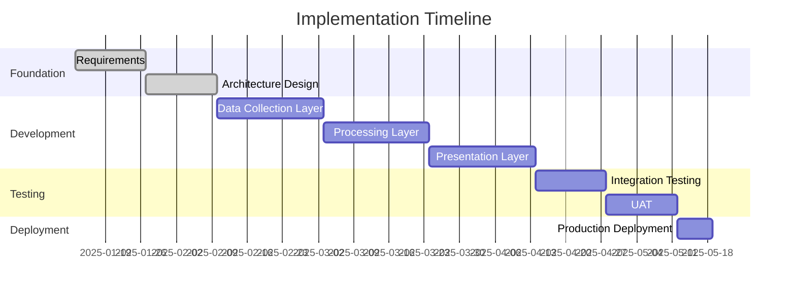
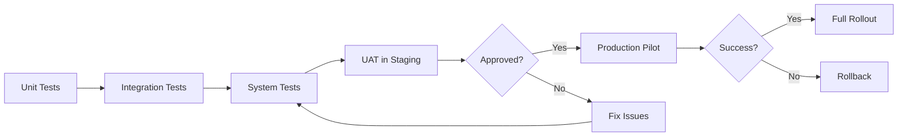

# Week 4: Implementation Planning & Project Management

## Welcome to Week 4

This is the final week of your training—where everything comes together. You've learned domain knowledge, requirements analysis, and system architecture. Now you'll learn how to plan and manage the implementation of your designs.

Project management in FAB IT is unique. You're not just managing software development—you're coordinating with production operations, managing risk in 24/7 environments, and ensuring zero disruption to manufacturing.

---

## Learning Objectives

By the end of Week 4, you will be able to:

1. **Create** detailed implementation plans with work breakdown structures
2. **Estimate** effort using multiple techniques (story points, function points, three-point)
3. **Develop** project schedules with dependencies and critical paths
4. **Identify** and manage risks specific to FAB IT projects
5. **Create** comprehensive project management plans
6. **Plan** phased rollouts for production environments
7. **Develop** testing strategies for FAB systems
8. **Manage** stakeholder communication and expectations

---

## Week 4 Structure

| Day | Topic | Duration |
|-----|-------|----------|
| **Day 1** | Implementation Planning & Estimation | 3 hours |
| **Day 2** | Project Scheduling & Resource Management | 3 hours |
| **Day 3** | Risk Management & FAB-Specific Considerations | 3 hours |
| **Day 4** | Project Management Plan Development | 3 hours |
| **Day 5** | Final Case Study & Program Wrap-up | 4 hours |

---

## 1. Implementation Planning

### 1.1 Work Breakdown Structure (WBS)

Decompose project into manageable work packages.

**WBS Example: Equipment Monitoring System**

```
1.0 Equipment Monitoring System
  1.1 Project Management
    1.1.1 Project planning
    1.1.2 Status reporting
    1.1.3 Stakeholder management
  1.2 Requirements & Design
    1.2.1 Requirements documentation
    1.2.2 Architecture design
    1.2.3 Design reviews
  1.3 Development
    1.3.1 Data collection layer
      1.3.1.1 SECS/GEM interface
      1.3.1.2 Database connector
      1.3.1.3 Message queue integration
    1.3.2 Processing layer
      1.3.2.1 Business logic
      1.3.2.2 Alert engine
      1.3.2.3 Analytics engine
    1.3.3 Presentation layer
      1.3.3.1 Web UI
      1.3.3.2 Mobile app
      1.3.3.3 API gateway
  1.4 Testing
    1.4.1 Unit testing
    1.4.2 Integration testing
    1.4.3 System testing
    1.4.4 UAT
  1.5 Deployment
    1.5.1 Environment setup
    1.5.2 Data migration
    1.5.3 Production deployment
    1.5.4 Training
```

### 1.2 Task Sequencing

Identify dependencies and order tasks.



### 1.3 Critical Path Analysis

Identify tasks that determine project duration.

**Critical Path**: Requirements → Architecture → Data Layer → Processing → Presentation → Testing → Deployment

**Float/Slack**: Non-critical tasks can be delayed without impacting project end date.

---

## 2. Estimation Techniques

### 2.1 Story Points and Velocity

**Story Points**: Relative measure of effort (Fibonacci: 1, 2, 3, 5, 8, 13, 21)

**Velocity**: Story points completed per sprint

**Example:**
- Team velocity: 40 points/sprint (2 weeks)
- Total project: 320 points
- Estimated duration: 8 sprints = 16 weeks

### 2.2 Three-Point Estimation

Calculate estimate using optimistic, most likely, and pessimistic scenarios.

**Formula**: Expected = (Optimistic + 4×Most Likely + Pessimistic) / 6

**Example:**
- Optimistic: 2 weeks
- Most Likely: 4 weeks
- Pessimistic: 8 weeks
- Expected: (2 + 4×4 + 8) / 6 = 4.7 weeks

### 2.3 Bottom-Up Estimation

Estimate each task and sum for total.

**Example:**
| Task | Hours |
|------|-------|
| SECS/GEM interface | 80 |
| Database design | 40 |
| API development | 120 |
| UI development | 160 |
| Testing | 100 |
| **Total** | **500 hours** |

---

## 3. Risk Management

### 3.1 Risk Identification

**Common FAB IT Project Risks:**

| Risk | Probability | Impact | Mitigation |
|------|-------------|--------|------------|
| Equipment integration issues | High | High | Early prototyping, vendor support |
| Production disruption | Medium | Critical | Phased rollout, rollback plan |
| Performance issues | Medium | High | Load testing, performance monitoring |
| Scope creep | High | Medium | Change control process |
| Resource availability | Medium | Medium | Cross-training, backup resources |

### 3.2 Risk Assessment Matrix

```
Impact →
↓ Probability

           Low      Medium    High      Critical
High       Medium   High      High      Critical
Medium     Low      Medium    High      High
Low        Low      Low       Medium    Medium
```

### 3.3 Risk Response Strategies

- **Avoid**: Eliminate the risk
- **Mitigate**: Reduce probability or impact
- **Transfer**: Shift risk to third party
- **Accept**: Acknowledge and monitor

---

## 4. FAB-Specific Considerations

### 4.1 Production Environment Constraints

**Challenges:**
- 24/7 operations (limited maintenance windows)
- Zero tolerance for unplanned downtime
- Strict change control processes
- Validation and qualification requirements

**Strategies:**
- Schedule changes during planned maintenance
- Implement comprehensive rollback procedures
- Conduct thorough testing in non-production environments
- Use blue-green or canary deployments

### 4.2 Testing in FAB Environments

**Test Environments:**

1. **Development**: Developer testing
2. **Integration**: Component integration testing
3. **Staging**: Production-like environment for final testing
4. **Production**: Live FAB environment

**Testing Strategy:**



### 4.3 Phased Rollout Strategy

**Phase 1: Pilot (1-2 equipment)**
- Validate functionality
- Identify issues
- Gather user feedback

**Phase 2: Limited Rollout (10-20 equipment)**
- Expand to multiple process areas
- Monitor performance
- Refine based on feedback

**Phase 3: Full Rollout (All equipment)**
- Deploy to entire FAB
- Provide training
- Establish support processes

### 4.4 Change Management

**Change Control Process:**

1. **Submit Change Request**: Document proposed change
2. **Impact Assessment**: Analyze risks and benefits
3. **Approval**: Change Control Board reviews
4. **Implementation**: Execute change during approved window
5. **Verification**: Confirm change successful
6. **Documentation**: Update documentation

---

## 5. Project Management Plan

### 5.1 PMP Components

**Complete Project Management Plan includes:**

1. **Scope Management Plan**: How scope is defined and controlled
2. **Schedule Management Plan**: How schedule is developed and managed
3. **Cost Management Plan**: Budget and cost control
4. **Quality Management Plan**: Quality standards and processes
5. **Resource Management Plan**: Team structure and responsibilities
6. **Communication Plan**: Stakeholder communication strategy
7. **Risk Management Plan**: Risk identification and response
8. **Procurement Management Plan**: Vendor and contract management
9. **Stakeholder Engagement Plan**: Stakeholder analysis and engagement

### 5.2 Communication Plan

| Stakeholder | Information Needs | Frequency | Method |
|-------------|------------------|-----------|--------|
| Sponsor | Status, risks, decisions | Weekly | Email report |
| Process Engineers | Progress, UAT schedule | Bi-weekly | Team meeting |
| IT Management | Technical status, issues | Weekly | Status meeting |
| Project Team | Tasks, blockers | Daily | Stand-up |

### 5.3 Success Metrics

**Project Success Criteria:**

- **Schedule**: Deliver within 16 weeks
- **Budget**: Stay within $500K budget
- **Quality**: < 10 defects in production first month
- **Adoption**: 90% user adoption within 3 months
- **Performance**: Meet all NFRs (response time, availability)

**Business Value Metrics:**

- Reduce equipment checking time by 80%
- Reduce unplanned downtime by 50%
- Increase equipment availability from 92% to 95%
- Detect 80% of failures before they occur

---

## 6. Recommended Reading Materials

### 6.1 Essential Books

1. **"A Guide to the Project Management Body of Knowledge (PMBOK Guide)" - PMI**
   - PM standard and best practices
   - Read Chapters 1-4, 6-7, 11

2. **"Agile Estimating and Planning" by Mike Cohn**
   - Agile planning techniques
   - Read Chapters 1-6, 12-15

3. **"The Lean Startup" by Eric Ries**
   - Iterative development and validation
   - Read Chapters 1-5, 8-10

4. **"Scrum Guide" by Ken Schwaber and Jeff Sutherland**
   - Agile framework fundamentals
   - Read entire guide (short)

### 6.2 Websites

1. **Project Management Institute (PMI)** - www.pmi.org
2. **Scrum.org** - Agile framework resources
3. **Atlassian Agile Coach** - Practical agile guidance

---

## 7. Final Case Study

### Complete Project Plan for Equipment Monitoring System

**Assignment:**

Create a comprehensive Project Management Plan for implementing the Equipment Monitoring System you've designed.

**Deliverables:**

1. **Work Breakdown Structure**: Complete WBS to work package level
2. **Project Schedule**: Gantt chart with dependencies and critical path
3. **Resource Plan**: Team structure, roles, and allocation
4. **Risk Register**: Identified risks with mitigation strategies
5. **Communication Plan**: Stakeholder communication strategy
6. **Quality Plan**: Testing strategy and acceptance criteria
7. **Deployment Plan**: Phased rollout approach
8. **Budget**: Cost estimate and breakdown

**Evaluation Criteria:**
- Comprehensive and realistic plan
- Appropriate estimation techniques
- Thorough risk analysis
- Clear communication strategy
- FAB-specific considerations addressed

**Submission:**
- Format: Markdown using SA template
- Filename: `week4-case-study-[yourname].md`
- Due: End of Week 4 (Friday 5 PM)

---

## 8. Program Wrap-Up

### What You've Accomplished

Over 4 weeks, you've transformed from IT engineers with no FAB knowledge into capable business analysts and system architects for semiconductor manufacturing.

**Week 1**: Semiconductor domain knowledge
**Week 2**: Business analysis methodology
**Week 3**: System analysis and IT architecture
**Week 4**: Implementation planning and project management

### Your Capabilities Now

You can now:
✅ Communicate effectively with FAB stakeholders
✅ Analyze user requirements systematically
✅ Design IT system architectures
✅ Create implementation plans
✅ Manage FAB IT projects

### Next Steps

**Immediate:**
1. Complete final case study
2. Review all deliverables
3. Prepare capstone presentation

**Ongoing:**
1. Apply learning to real projects
2. Continue reading recommended books
3. Join professional communities (IIBA, PMI)
4. Seek mentorship from experienced FAB IT professionals
5. Stay current with industry trends

### Capstone Project

Present your complete Equipment Monitoring System analysis:
- Requirements (Week 2)
- Architecture (Week 3)
- Project Plan (Week 4)

**Presentation**: 30 minutes + 15 minutes Q&A
**Audience**: Senior engineers, management
**Format**: Professional slides with diagrams

---

## Congratulations!

You've completed the FAB IT Training Program. You now have the knowledge, methodology, and skills to excel as a business analyst and system architect in semiconductor manufacturing.

**Welcome to the world of FAB IT!**

---

**Document Version**: 1.0  
**Last Updated**: January 2025  
**Author**: FAB IT Training Program  
**Questions**: [Contact information]
